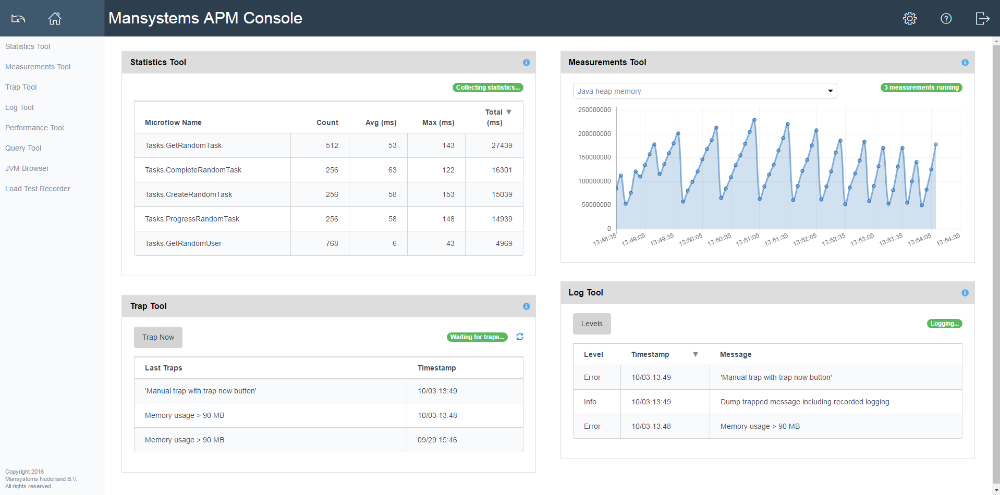
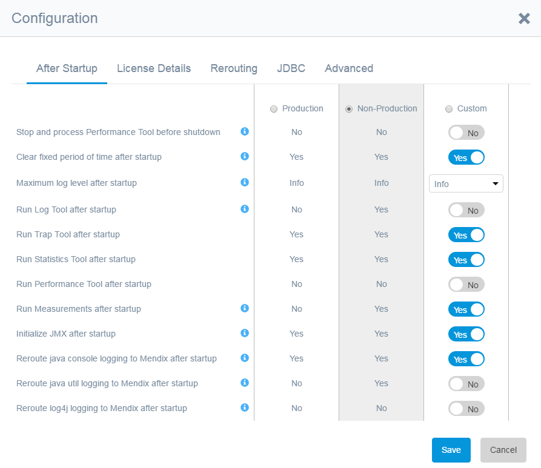
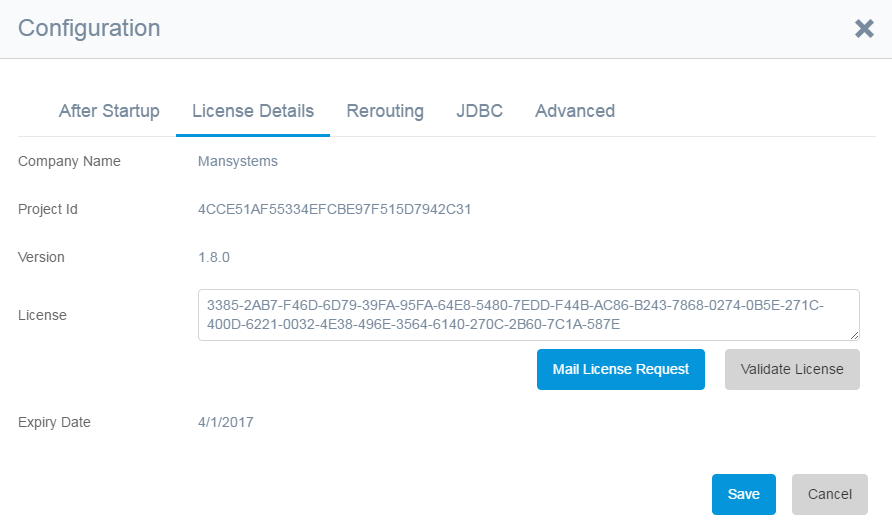
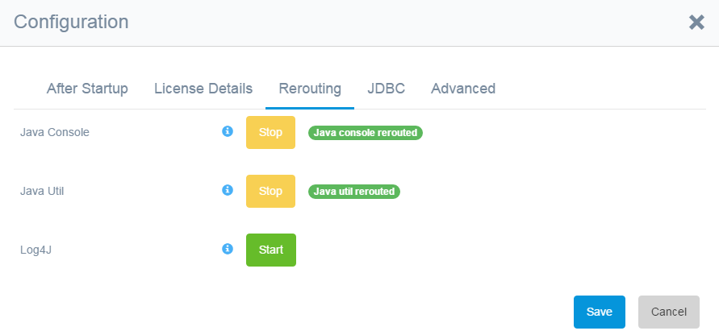
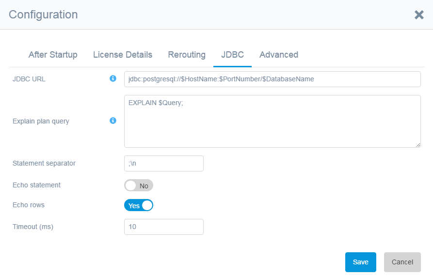
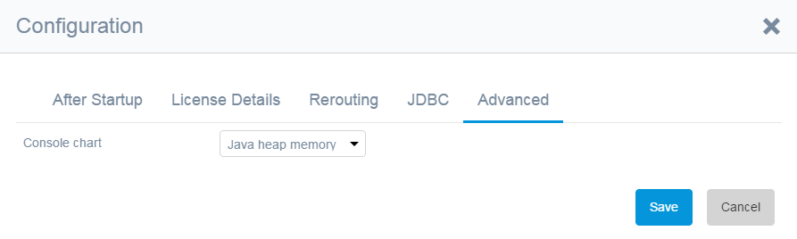

This chapter describes the APM Tool console. This is the home screen of the APM tool. The following screenshot shows the APM Tool Console.

 

The console shows recent information from the statistics, measurements, trap and log tools. 
The individual tools can be selected from the menu on the left side of the page.
These tools are described in separate chapters. In this chapter the overall tool configuration is described.

## After Startup Configuration

Here you determine which tools should run _after startup_. 
There is also a safety constant (in the Mendix Modeler) which overrules these after startup settings and
 enables the admin to take control of these settings.

As a protection, you can set a _Maximum log level after startup_ if the Log Tool is run after startup. 
This can avoid the Log Tool running on an unexpectedly high level after startup.

You can configure what should happen with the Performance Tool before shutdown. 
Default it will cancel a running recording, 
but you can choose to _Stop and process the Performance Tool before shutdown_. 
If you have proper protection settings like thresholds and maximum number of microflows 
(see Performance Tool options) you can run the performance tool in a production environment.

In some cases, tools are run for a fixed period of time. 
However running after startup usually means you want to run a specific tool all the time. 
With the option _Clear fixed period of time after startup_ you can make sure 
the tools will keep on running after startup.

## License Detail Configuration

The APM Tool requires an application license that can be requested via mail using the button in the settings dialog on the second tab.

A license is required per App. Every license has an end date.

The license code goes in the license field. The _Expiry date_ field is automatically filled.

## Log Rerouting Configuration

                       

This option adds log messages from other sources to the Mendix logging, 
so all log information is combined and available in the log and trap tool.

An example: javax.mail sends debug output to the console(system.out). 
With the [Java Console Rerouting] option enabled the debug output is catched and provided to the Mendix logging.

You can manually start/stop the rerouting options. Rerouted are:
* Java standard output (system.out) and standard error (system.err) messages,
* Java Util logging
* Log4j messages

## JDBC Configuration

                       

A JDBC URL is automatically set during installation. For special cases this URL can be changed.
The URL can contain variables that are replaced on executing a JDBC statement.
You can use $HostName, $PortNumber,$DatabaseName, $UserName and $Password. 
They will be replaced with the current one on execution. 
This allows for production database dumps to be used without the risk of connection to the production database from a test environment after the load of a production dump.

The explain plan query is also automatically set during installation. 
This query is used with the explain plan option in the performance tool.

The next 4 options are used in the query tool to determine the output and set a timeout.

## Advanced Configuration

                       

A default measurement graph can be chosen for the console.

