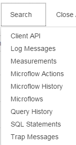

This chapter describes the APM Tool console. This is the home screen of the APM tool. The following screenshot shows the APM Tool Console.

 

The console shows the primary APM tools, allows you to start and stop them and shows counters to see what these tools are currently doing. You also see some badges indicating if additional tools are running. These badges can be clicked to jump directly to their respective tools. You can refresh counters on the console to keep track of what is happening by clicking the [Refresh All Counters] button.

All tools, including those under the tools menu are described in a separate chapter. This chapter describes the _Settings, including licensing, _the _Search menu and the rerouting dialog:_

## Settings

From the console, you can change the application wide settings:

 

Here you determine which tools should run _after startup_. There is also a safety constant (in the Mendix Modeler) which overrules these after startup settings and enables the admin to take control of these settings.

As a protection, you can set a _Maximum log level after startup_ if the Log Tool is run after startup. This can avoid the Log Tool running on an unexpectedly high level after startup.

You can configure what should happen with the Performance Tool before shutdown. Default it will cancel a running measurement, but you can choose to _Stop and process the Performance Tool before shutdown_. If you have proper protection settings like thresholds and maximum number of microflows (see Performance Tool options) you can run the performance tool in a production environment.

In some cases, tools are run for a fixed period of time. However running after startup usually means you want to run a specific tool all the time. With the option _Clear fixed period of time after startup_ you can make sure the tools will keep on running after startup.

## License Information

The APM Tool requires an application license that can be requested via mail using the button in the settings dialog on the second tab.

A license is required per App. Every license has an end date.

The license code goes in the license field. The _Expiry date_ field can be used to store the license expiration date.

## Advanced Configuration

 A JDBC URL and explain plan query are added to the global settings. These are automatically filled during the installation.

This URL is used for explain plan and in the query tool. You can use $HostName, $PortNumber,$DatabaseName, $UserName and $Password. They will be replaced with the current one on execution. This allows for production database dumps to be used without the risk of connection to the production database from a test environment after the load of a production dump.

## Search Menu

The search menu allows you to search through data- and statistics recorded by the different tools provided by APM.

 

_Search Microflows_ allows you to browse through microflows including the calling tree (microflow > microflow) which can help find bottlenecks in long running microflows/actions.

Runtime requestscan be triggered by the client API to execute a microflow, retrieve-, change-, delete data and more. Scheduled events and web services also trigger runtime requests. _Search Runtime Requests_ allows you to investigate these application runtime requests coming from different entry points.

## The Log Rerouting

The Java standard output(system.out) and standard error(system.err) messages, the Java Util logging and Log4j messages are not visible and not recorded for a Mendix application. Using the Log Rerouting function the log messages generated by these logging mechanism can be rerouted to the Mendix logging mechanism(Core.logger).

The dialog to manage these options can be opened from the console rerouting button and looks like this:

                       

An example: javax.mail sends debug output to the console(system.out). With the [Java Console Rerouting] option enabled the debug output is catched and provided to the Mendix logging mechanism and as such made available to the Log Tool and Trap Tool.
