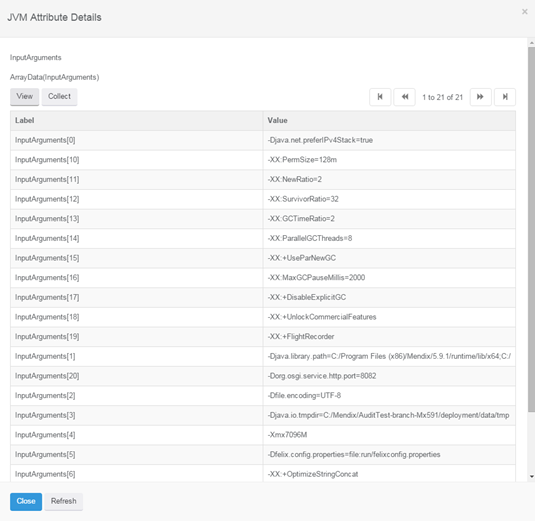
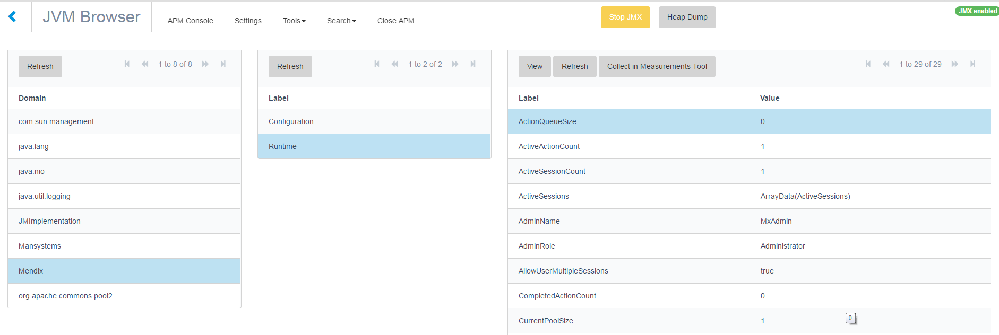

A JVM Browser shows information similar to JConsole or JVisualVM tools provided with the Java JDK. Using the [Refresh] button refreshes an individual item.

                 

Double clicking an items drills down shows its details.

 

You can start collecting statistics on individual items using the [Collect] button. These statistics can be viewed in the Measurements Tool.

## Additional JMX exposed statistics

The statistics of the tools, measurements as well as Mendix statistics are made available through JMX when clicking the JMX button or if Activate JMX after startup is configured.

An example of Mendix runtime statistics is show in the image below

 
