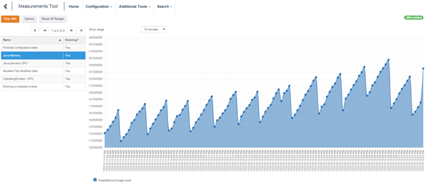
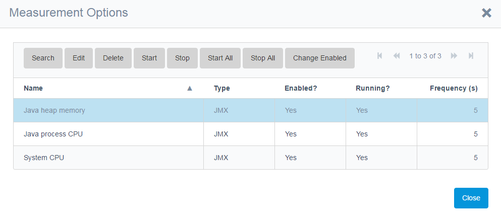
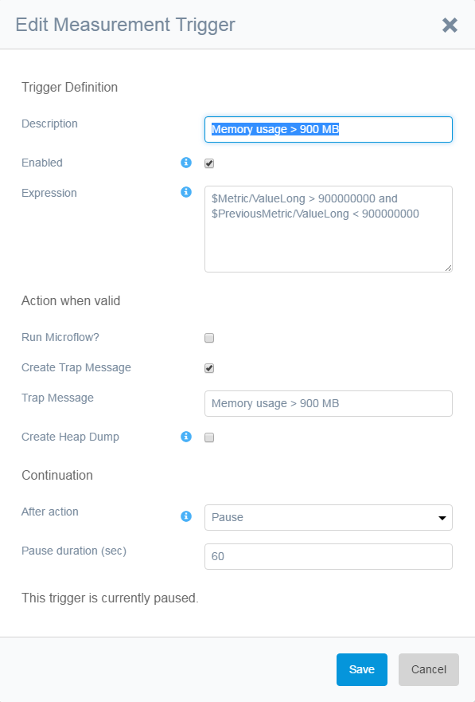

This chapter describes the measurements tool. Measurements are created via a [Collect] button in the JVM Browser or in the query tool. The collected measurements can be stored in the database and used for generating graphs or for triggering events.

The following screenshot shows an example of a running Measurements Tool.

 

## Options

Measurements can be started and stopped in the options dialog as shown in the image below.

                       

Double clicking or selecting and clicking the [Edit] button shows the Measurement detail screen. Here the selected measurement can be configured as shown in the image below.

 

The Measurment detail screen allows you to:

*   Change the name when the measurement is not running
*   enable/disable a measurement
*   set the frequency that the measurement is executed in seconds
*   expose a measurement to JMX makes it visible inside other Java management consoles. This is only useful for query measurements, since JVM Browser measurements are already available there.
*   store the measurement results in the database. You cannot use $PreviousMetric if the measurement is not stored.
*   configure triggers.

## Multiple value queries

You can define queries that return multiple rows and multiple columns. In that case the first column is seen as part of the name of the query. Additionally you can edit triggers for each individual column 

## Triggers

Triggers are used to check measurements for a specific value. If the Expression in a trigger is fulfilled, the configured Action is taken. This can consist of running a microflow, creating a trap message and even generating a heap dump (USE WITH CAUTION: creating a heap dump pauses the system for a certain period of time depending on the amount of heap space assigned to the java process running the Mendix server).

                  

The expression is an expression as in an exclusive split in a microflow with $Metric as the parameter and ValueLong, ValueFloat, ValueString, ValueDate or ValueBoolean as the attributes. You can also use $PreviousMetric, so you could fire a CPU threshold on both $Metric and $PreviousMetric being above a certain value.

You can define the following actions:

*   Run microflow
*   Create Trap Message
*   Create Heap Dump          

***Notes***

1. *The create heap dump freezes the JVM. Use with care.*
2. *In the cloud you need additional permissions to use the JVM features, see the installation manual.*
3. *Use the template microflow APMCustom.SampleTriggerMicroflow_LogMessage.*

 The _After action_ determines what to do after a trigger was executed:

*   **Nothing** means just keep on checking and executing
*   **Stop** means that the trigger will fire once
*  **Pause** means you can define a period in which the trigger will not fire again. This is to prevent a large amount of emails when the CPU usage is high for example
