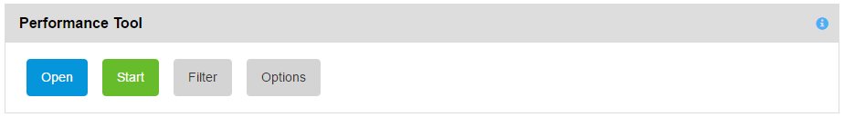
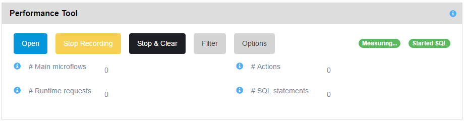
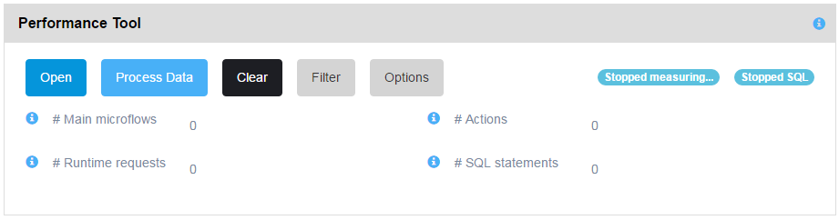

The Performance Tool can be enabled/disabled by using the Start/Stop buttons.

The following screenshot shows the Performance Tool when stopped:

 

 The [Process Trap memory] button is not on the console. If the trap tool is running and the performance tool is not you can process the recorded microflow messages that are memory. In a development environment you can configure the Trap Tool to record for example the last 5 minutes. Then its possible to use the Performance Tool on data recorded by the Trap Tool in memory while using a specific function in the application where APM was integrated.

The following screenshot shows the Performance Tool when started:

The following screenshot shows the Performance Tool when recording has been stopped:

 Tool specific counters:

*   Number of main microflows recorded
*   Number of actions recorded
*   Number of runtime requests recorded when the SQL statements are included
*   Number of SQL statements recorded when the SQL statements are included

The Performance Tool shows if it is recording SQL statements. Also when recording is stopped but processing needs to be done this is shown as [Stopped measuring] and [Stopped recording SQL statements]. At this point memory usage by the Performance Tool no longer increases.

You can filter out microflows or SQL statements by increasing the thresholds and using the [Filter] button in the filter dialog. This can be done while running and even during recording. Changing these options in the _Options_ dialog has the same effect.

When the [Stop & Clear] button is used the Performance Tool is stopped and the recorded data is removed from memory. If the [Stop Recording] button is used a subsequently the [Process Data] buttn is used the recorded data in memory is processed and stored in the database.
