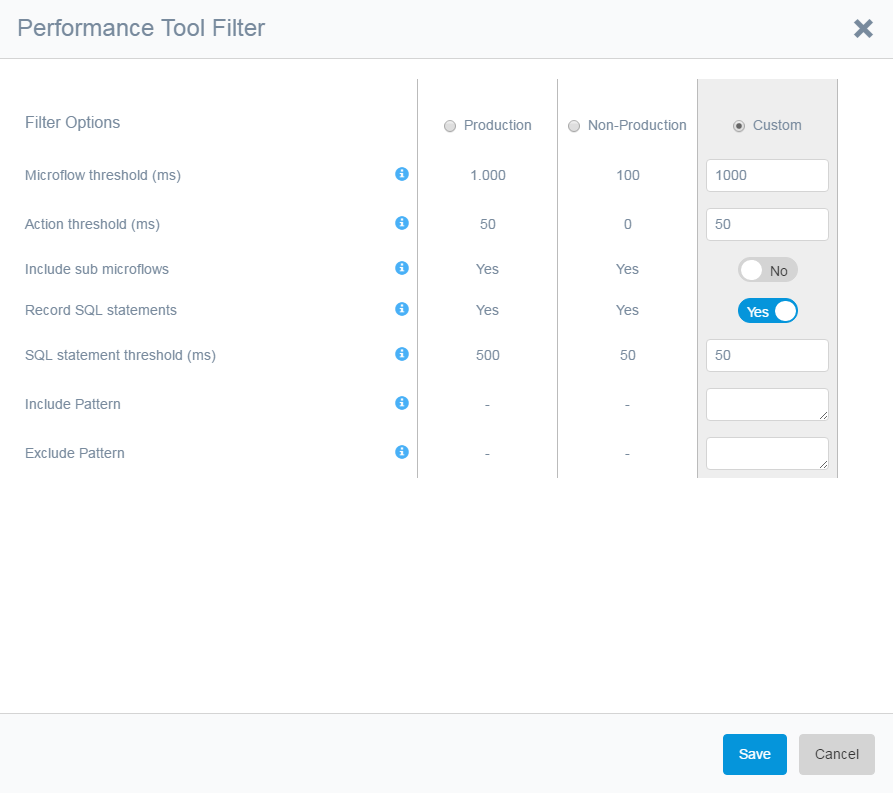
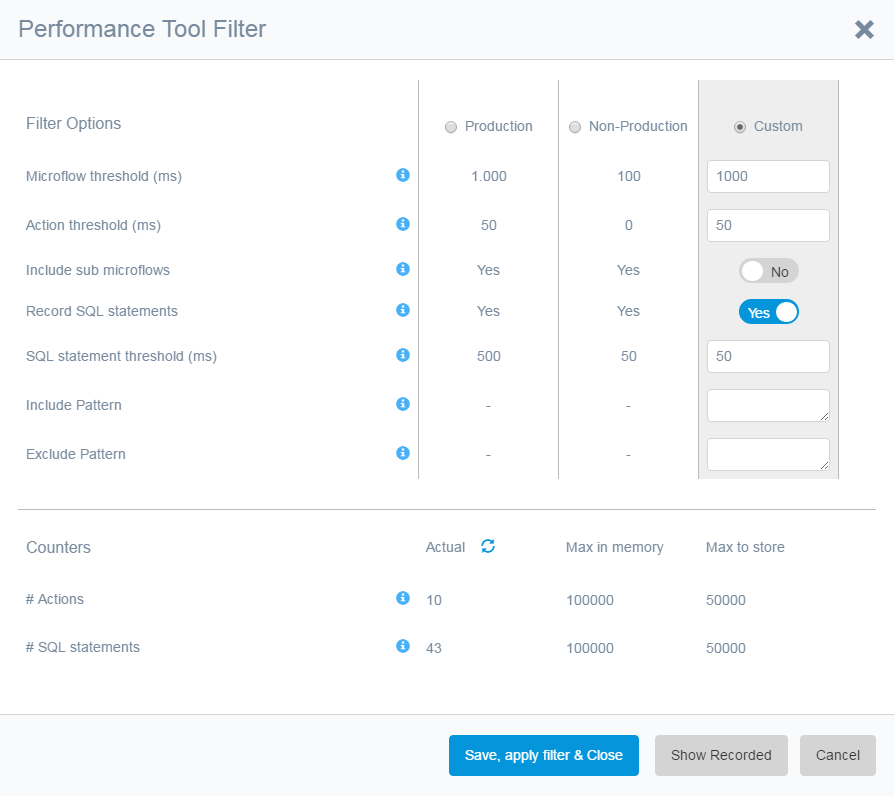

The following screenshot shows the filter options of the Performance Tool when the performance tool is not running:

 

 And when the performance tool is running:

 

The thresholds are used to filter recorded microflows, actions or SQL statements and not store them in/remove them from memory if they have an execution duration less than the threshold.

You can see what has been recorded in memory with the [Show Recorded ](Show+Recorded+Dialog)button

The option [Include sub-microflows] can be used to keep sub-microflows called from a long running microflow in memory.

When [Record SQL statements] is enabled SQL statements are recorded by the Mendix profiler and the runtime requests the profiler outputs are filtered with the microflow threshold. The SQL statements are filtered by the SQL statement threshold.

During processing of recorded data SQL statements are linked to actions or if that fails to the complete microflow. Not every SQL statement can be traced back to a microflow and/or action. Heuristics is applied to improve on this.

Changes to the options are applied to the Performance Tool if the button [Filter] is used.

*   If record SQL statements is unchecked while running, recording of SQL statements is cancelled.
*   If the record SQL statements is checked while running, recording of SQL statements is started.
*   If the thresholds are increased, the already recorded microflows and/or SQL statements are filtered to match the new threshold
