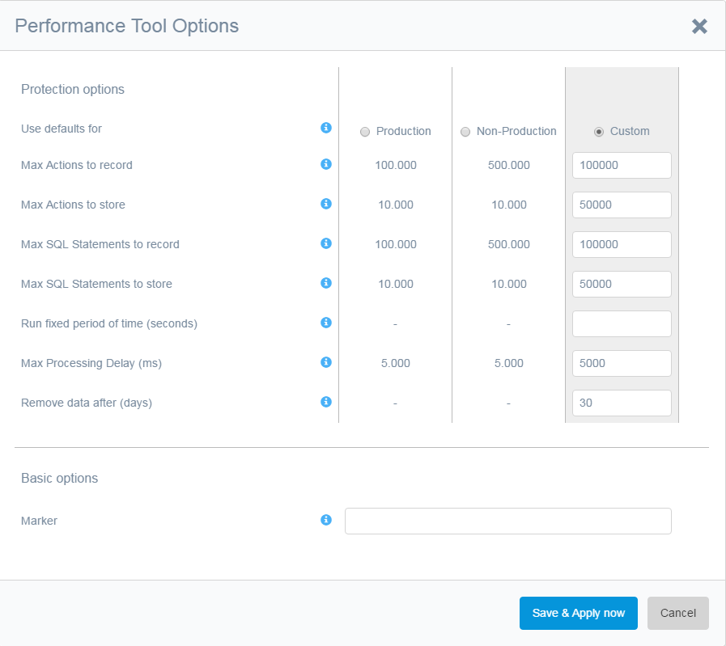

The following screenshot shows the options of the Performance Tool:

 

 The Marker is used to mark microflows with a certain label. This is useful for example when analysing a specific functionality before and after making changes. This way its possible to quickly see to which recording a microflow belongs.

The max actions to record, max SQL statements to record and fixed duration offer some protection in production environments to prevent that the Performance Tool runs and fills up memory. If any of the maximum thresholds is reached the Performance Tool is placed on hold. The Performance Tool can still be stopped or canceled or even increase the thresholds to remove part of the recorded data.

The max actions and SQL statements to store are introduced to prevent large recordings being processed and stored in the database. Using these settings allows for filtering or increasing the amount of data being recorded and processed.

You can run the Performance Tool for a fixed duration. At the end the Performance Tool stops recording and you can still filter data and choose to cancel or stop.

You can define a [Max Processing Delay (ms)]. When the processing delay is higher than this value the Performance Tool stops recording. You can still filter data and choose to cancel or stop. 

Changes to the options are applied to the Performance Tool if the button [Save & Propagate] is used.

*   If record SQL statements is unchecked while running, recording of SQL statements is cancelled.
*   If the record SQL statements is checked while running, recording of SQL statements is started.
*   If the thresholds are increased, the already recorded microflows and/or SQL statements are filtered to match the new threshold
