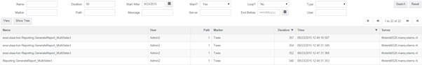
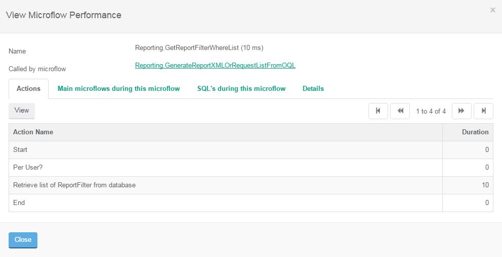
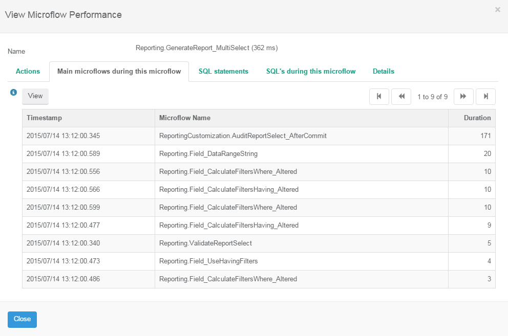
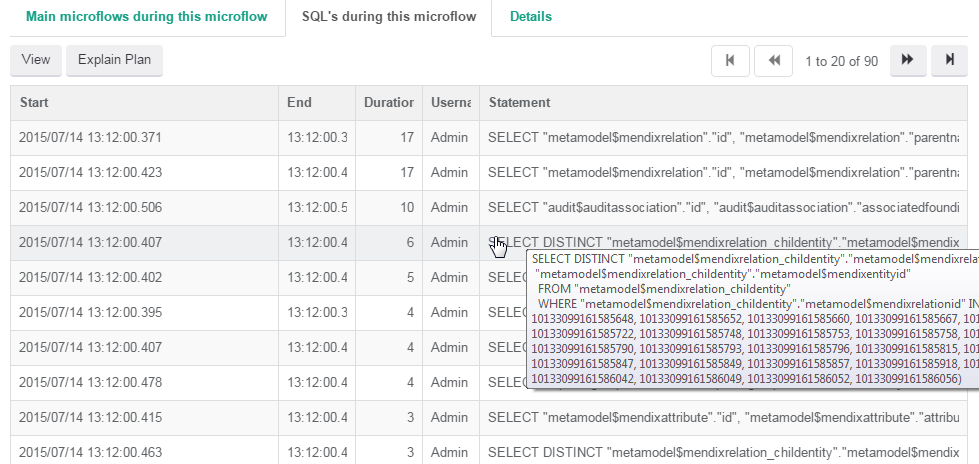
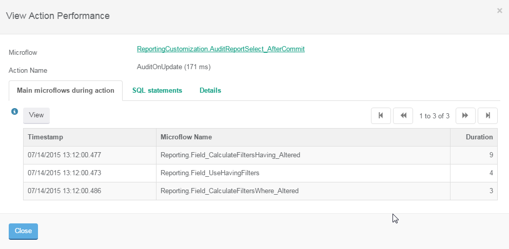
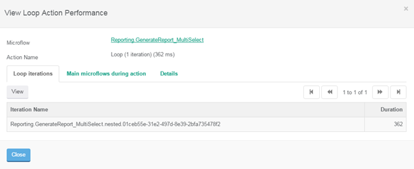
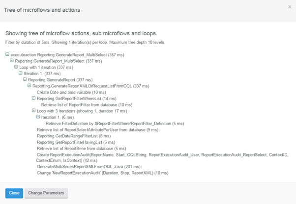

The performance tool results has a search grid with the ability to search the fields that are stored with a ‘microflow performance’ record. By default the grid only shows main microflows(Main? = Yes). These are microflow that were not called by other microflows during recording.

 

Calculated attributes and domain model event microflows are also seen as main microflow since they cannot be linked to the microflow that is causing them other than the fact that they run inside the action start and stop times.

The user column is only populated for Client API messages and when the profiler was running for actions triggered by a user. Scheduled events and domain model microflows logically do not have a user.

You can delete individual rows using the Search Microflows option from the Search menu. This can lead to inconsistent data when using the drill down functionality through a recorded microflow stack.

You can view a microflow and drill down on called microflows and loops.

 

The tab with the main microflows during this microflow shows domain model microflows and calculated attributes. Mind you that other microflows occurring in the same interval might appear here as well.

 

Tab _SQL’s during this microflow_ shows SQL statements of the currently viewed microflow:

 

The explain plan button opens a query tool window with this query inside an explain plan statement (database specific, see [installation](file:///C:/Users/langea/Documents/Projecten/APM/Internal%20APM%20Doc%20Word%20versions/APM%20Tool%20Manual%20v1.5.7%202016-01-22.docx#_JDBC_Settings)).

To configure the explain plan functionality do the following:

1.  Configure [JDBC settings](file:///C:/Users/langea/Documents/Projecten/APM/Internal%20APM%20Doc%20Word%20versions/APM%20Tool%20Manual%20v1.5.7%202016-01-22.docx#_JDBC_Settings_1) by copying the template for your database and entering the details
2.  Modify the explain plan query template for you database in the query tool to use the new JDBC setting
3.  In the [Global Settings](file:///C:/Users/langea/Documents/Projecten/APM/Internal%20APM%20Doc%20Word%20versions/APM%20Tool%20Manual%20v1.5.7%202016-01-22.docx#_Global_settings) choose this explain plan query

If the microflow is a main microflow - which consists of its own runtime request - all SQL statements that are not linked to an individual action are linked here.

Actions will show a dialog with details to allow you to see SQL statements generated by the action (if recorded) or microflows running during the action to see potentially triggered microflows.

 

When seeing a loop you drill down to the action with a special grid for each iteration. From there you can proceed to drill down.

 

You can also show a tree of the microflow with actions, loops and call microflows:

 

In the parameters dialog you can change the filter by duration, the number of iterations shown for a loop and some more advanced properties (show/hide actions, show/hide start/end actions, maximum depth and an option to include a warning in the node if the maximum depth has been reached).
