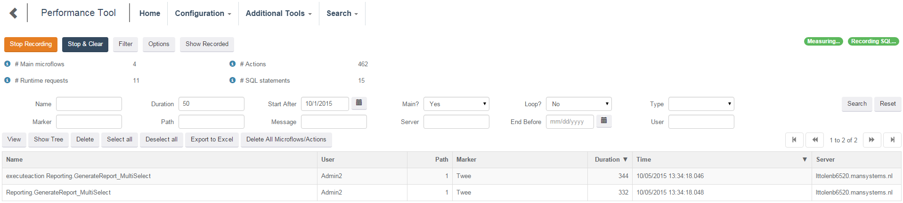

This chapter gives an overview of the Performance Tool. Use the Performance Tool to measure individual microflows and break them up into actions, loop iterations and sub-microflows. Optionally it is possible to run the Mendix profiler and link SQL statements to actions.

The screenshot below shows the Performance Tool in a running state.

 

The [Recorded] button is used to see what has been recorded to assist in filtering and also to allow you to store individually recorded microflows. This button is also visible in the filter dialog and not visible on the console.

The performance tool is described in the following articles:

*   [Performance Tool Control](Performance+Tool+Control)
*   [Performance Tool Filter](Performance+Tool+Filter)
*   [Performance Tool Options](Performance+Tool+Options)
*   [Performance Tool Results](Performance+Tool+Results)
*   [Inserting context information](Inserting+context+information)
