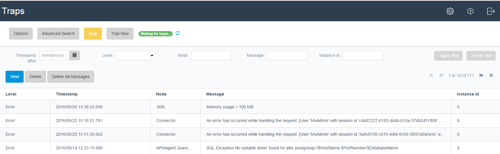
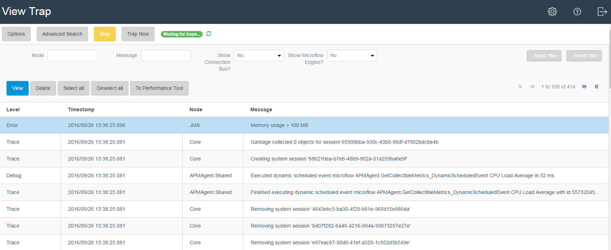
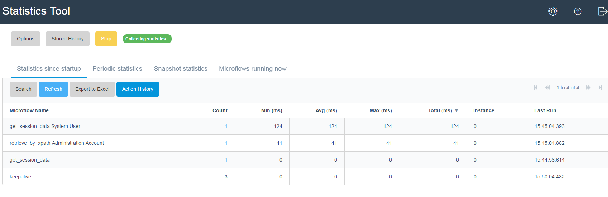

The theme for this version is a tool summary on dashboard and improved styling.

## GUI Makeover to match style with Mansystems ATS
The new console is more about presenting information and no more stop/start buttons or navigation.

## 

The new console has 4 parts:
* For the console the statistics of the last 10 minutes are taken. Off course this is configurable.
* For the measurements you can pick your favourite to show on the console.
* The trap tool shows the last traps
* The log tool shows the last messages.

## Traptool separation of trap and messages
So it is more clear which messages belong the which trap and to show a list of traps without messages in the GUI.

## 

## 

## Gathering statistics over more periods
The statistics tool now gathers statistics over different time periods:
* Since startup
* Periodic (daily by default)
* Snapshot for manual periods
* Last 10 minutes for the console. Configurable off course.
* For measurement triggers (between once and twice the console frequency to prevent that the statistics are just reset when a trigger fires). These statistics are saved in the stored statistics when a trigger fires and is configured to store statistics.

## 

## Bug fixes and minor changes
* Replaced Mansystems customized String Formatter widget by AppStore FormatString widget to reduce the number of custom widget and keep the APM tool maintainable.
* Made custom ‘APM’ versions of standard AppStore widgets to prevent conflicts with other versions of the widget at customers.
* Moved JDBC Settings from query tool to global settings to simplify and separate configuration from usage.
* ChartJS customized to show horizontal scale of type time and to auto refresh so it looks better and automatically updates the screen.
* Automatically populating the expiry date, so the user can see the duration of the license and does not have to manually enter it.
* Trap tool exclusions are now also tested against log messages. This to verify existing exclusions and also when configuring the traptool it can help to run the logtool for a day and exclude any know error before starting the traptool.
* Measurement columns now have an alias that is editable. This shows in the chart legend.
* You can double click on measurements to quickly go to the options.
* Bug fix for the situation that a new measurement being defined has no real measurements yet. You could not define triggers, for they depend on the automatically generated column records.
* Measurements tool has measurements in collapsible container, so if you have many measurements and some have multiple columns, you see the 2nd grid appear.

## Known issues
* The JDBC query and explain plan functionality against MySQL has not been tested.
* The JDBC query and explain plan functionality for the built-in database work only after starting the database viewer in the modeler from the console advanced menu.
* The performance tool can run out of memory when recording. The advised protection options for the performance tool still expect 1 GB of memory available, so for small implementations the protection options should be stricter.
* When the before shutdown microflow is not configured and some tools are running the shutdown of the Mendix application can seem to hang for about a minute.
* In Mendix 5 and above the microflow names are taken from the action caption. So if the action caption is changed in the modeler the call microflow action in the performance tool does not drill down. Also the caption only contains the microflow name, not the module name, so if multiple microflows exist with the same name, but in different modules the performance tool cannot pick the right one.
* On load balanced environments without sticky sessions the APM tool is randomly connected to instances and this does not work! For 1.6.1 you need access to specific servers to use the APM Tool!
* ChartJS sometimes is not responsive enough and a refresh of the page might be needed.
* When the runtime stops and the APM console is open errors appear due to the auto-refresh of grids and ChartJS.
