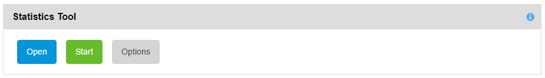
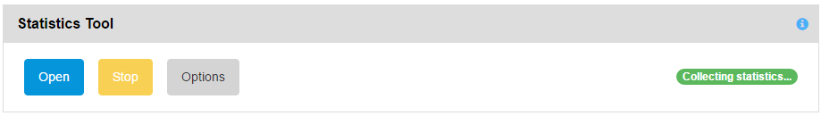
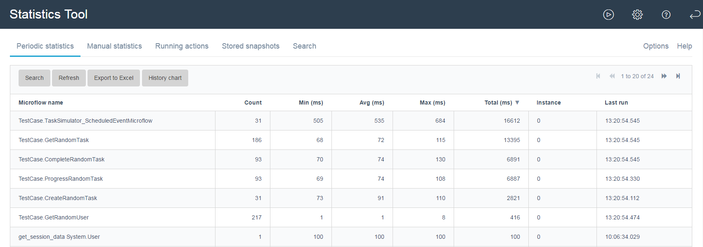

This chapter gives an overview of the Statistics Tool. The Statistics Tool measures durations of microflows and browser client requests and gathers statistics like number of executions, minimum-, maximum- and average duration. The Statistics Tool is used as the first step in gaining insight in what a system is doing when it doesn’t perform optimally.

The Statistics Tool has an interactive part as shown below. Additionally statistics are stored periodically to be able to determine potential trends.

 

For a generic description of layout parts see the description in the Log Tool chapter.

The Statistics tool has the bottom part split into two sections; one showing the statistics and one showing the currently running microflows.

## Statistics Tool Control

You enable/disable the Statistics Tool using the Start/Stop buttons.

The following screenshot shows the Statistics Tool when its stopped:

 

 and the screenshot below shows the Statistics Tool when its started:

Tool specific functionality:

*   Use the options Search Stored Statistics from the Search menu to see the history of the statistics recorded

## Statistics Tool Options

The following screenshot shows the options of the Statistics Tool:

 

The statistics tool will measure all microflow statistics all the time. The statistics tool can exclude certain microflows while presenting from memory or storing to the database.

You can configure the frequency of the statistics tool snapshots that are stored, for example daily or hourly. You also configure the top N statistics to be stored and an exclude pattern. The APM tools itself are excluded via a constant as configured by an administrator.

The top N is both for maximum duration and total duration, so between N and 2 times N records are presented or stored in the database. When the top N value is empty or 0 all microflows are retrieved.

The GUI options include also a top N and an exclude pattern to interactively filter with these options.

You can run the Statistics Tool for a fixed amount of time. The Statistics Tool is intended to always be active or running. This option is available if you want to measure statistics for short periods, say during busy hours and compare that to statistics during less busy hours.

The Statistics Tool is also protected with a [Max Processing Delay (ms)]. The statistics tool acts differently when the processing delay is too large. It will pause handling messages until the processing delay is below 50ms. Therefore, choosing a value below 100ms is not allowed. The reason each tool has its own max processing delay is that you might want the log tool to stop first, then the performance tool and last the trap or statistics tool.

Changes to the options are applied to the currently running Statistics Tool session if the button [Save & Apply] is used.

## Statistics Tool Results

The statistics tool results has a search grid with the ability to search on the running statistics output.

The Statistics Tool shows the running statistics output. Several search fields are available to search through and filter these statistics.

 

You can sort on last execution to see what microflows have been executed recently. There are continuous statistics and you can use snapshot statistics. The snapshot can be reset to be able to capture a short period of time.

You can select a microflow an press the history button to see a graph with history statistics:

_Running microflows_ show a list of microflows that have been started but have not yet ended. The duration is the time between the start and n when the refresh button was hit.

When the server generates a lot of log messages and the server is running at a high CPU and all tools are running it can happen a queue builds up in the Mendix thread that sends the log messages to the subscribers. As a consequence it can look like running microflows take 10 seconds and the maximum in the statistics is 1 second. This is caused by the fact that the running time is calculated on the refresh date and the duration of a microflow is calculated by the message date. When this happens the debug running counter for message delay shows a high number, say 10000 milliseconds. The Statistics Tool pauses collecting- and handling messages if the processing delay is above the configured [Max Processing Delay (ms)].
