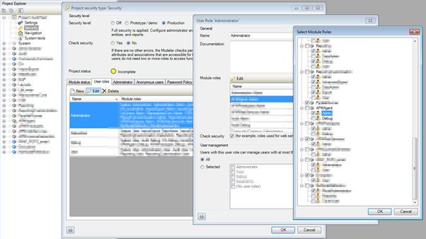
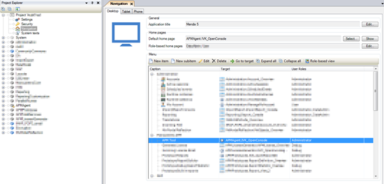

This chapter describes the uninstallation of the APM tool. The optional in this chapter means you need to verify if this option was chosen during the install before undoing it.

# Backup

Did you commit your work to the team server? And did you make a database backup?

If you don't have installed an SVN client like Tortoise SVN make a copy of the widgets folder in your project.

# Delete Module APMAgent

Import the module APMAgent in the modeler.

# Optional: revert overwritten widgets

If you want your original widgets back either take them from a backup.
AppStore widgets used by APM Tool:
\widgets\CustomString.mpk
\widgets\ChartJS.mpk
\widgets\BootstrapTreeViewWidget.mpk
\widgets\BooleanSlider.mpk

# Delete Mansystems customized widgets

Mansystems customized versions of AppStore widgets
\widgets\ManTooltip.mpk
\widgets\StringFormatter.mpk
\widgets\ CssSelectorHelperBoolean.mpk
\widgets\StyleSheetSwap

# Delete permissions

Delete permissions APMAgent.Admin from project security / user roles tab to a selected administrator role. On Edit of the last dialog Mendix will remove the permissions for you.

**_Note._** _If you added the Debug role, remove it now._

# Delete from navigation

Delete the APM Tools item that calls "APMAgent/USE_ME/IVK_OpenConsole" from navigation.

# Optional: Revert After startup and before shutdown

Remove the call microflow action to APMAgent\USE_ME\AfterStartup from an after startup microflow. This feature is runtime configurable and by default none of the tools are started.
Remove the call microflow action to APMAgent\USE_ME\BeforeShutdown from a before shutdown microflow.
You can find the AfterStartup and BeforeShutdown microflows in the project settings.

# Optional: Undo request permissions for the Mendix cloud or on premise runtime

For a Mendix Cloud slot you send an email to Mendix support requesting to undo the added permissions

# Remove JDBC user libraries

Remove the library in the project folder 'userlib':

*   com.mendix.ojdbc6.jar
*   com.mendix.postgresql.jdbc4.jar
*   com.mendix.sqljdbc4.jar
*   org.hsqldb.hsqldb.jar
*   org.mariadb.jdbc.jar

# Start the Modeler or the Runtime

Clean deployment and startup.
