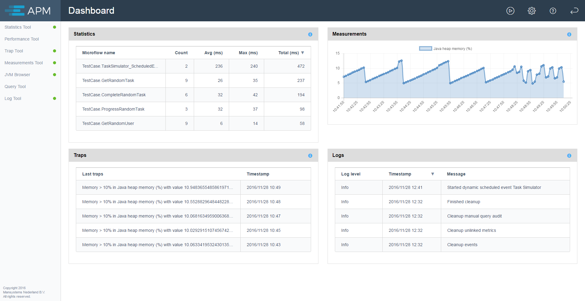
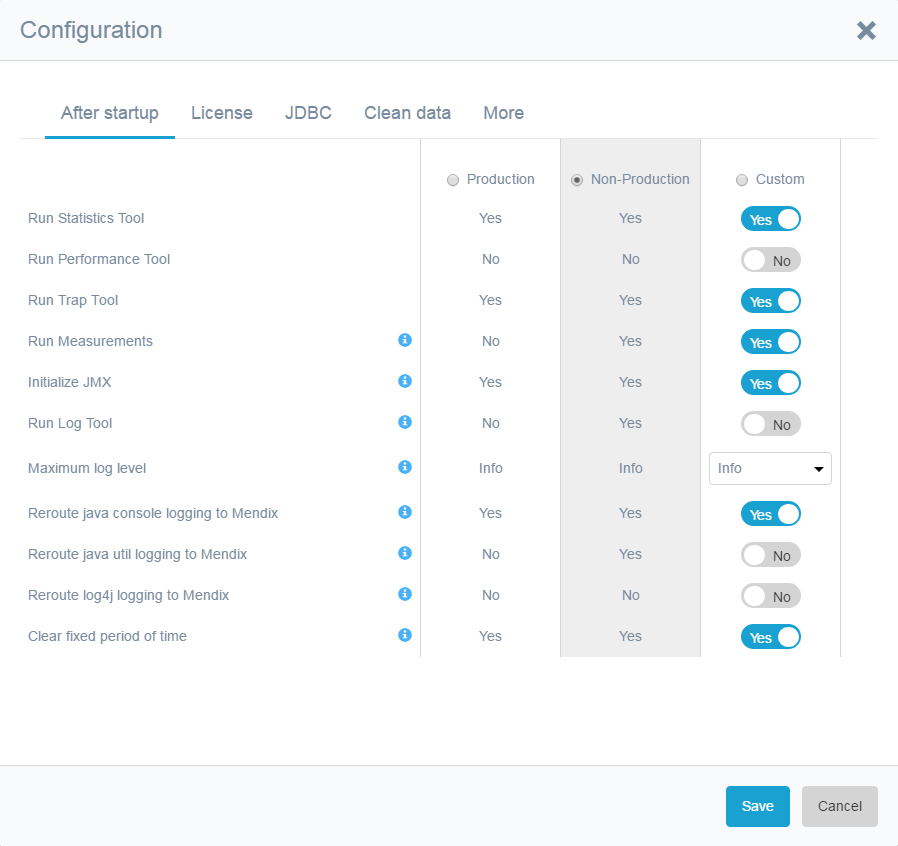
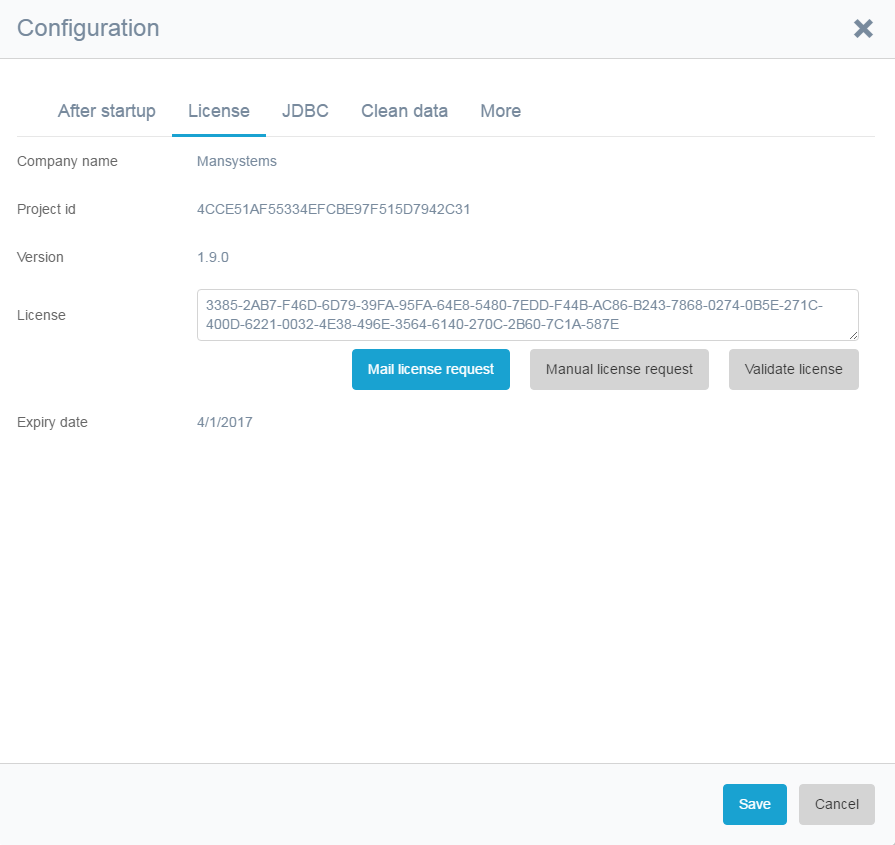
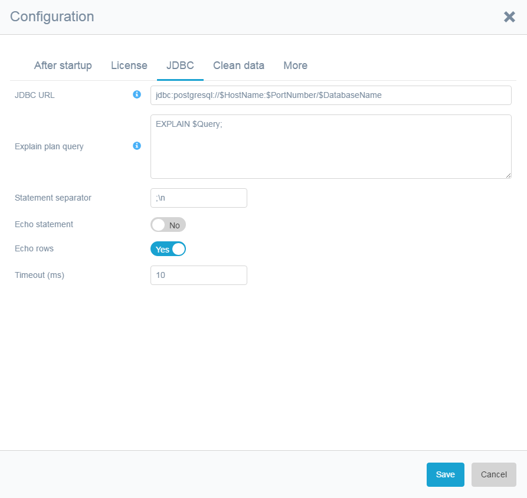
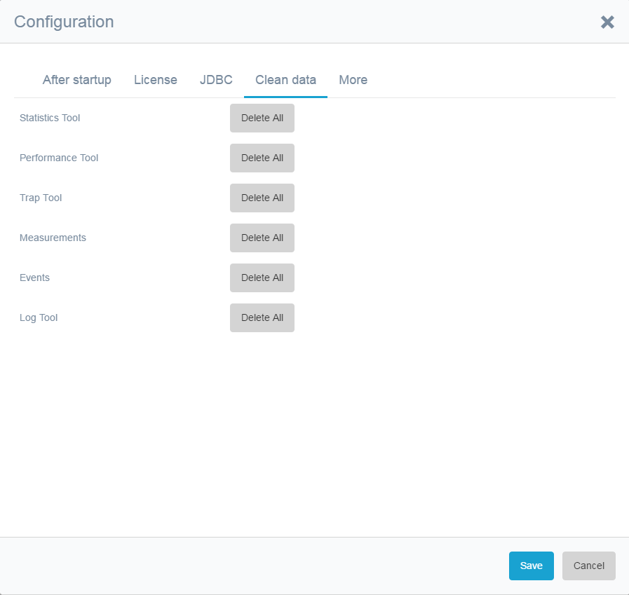
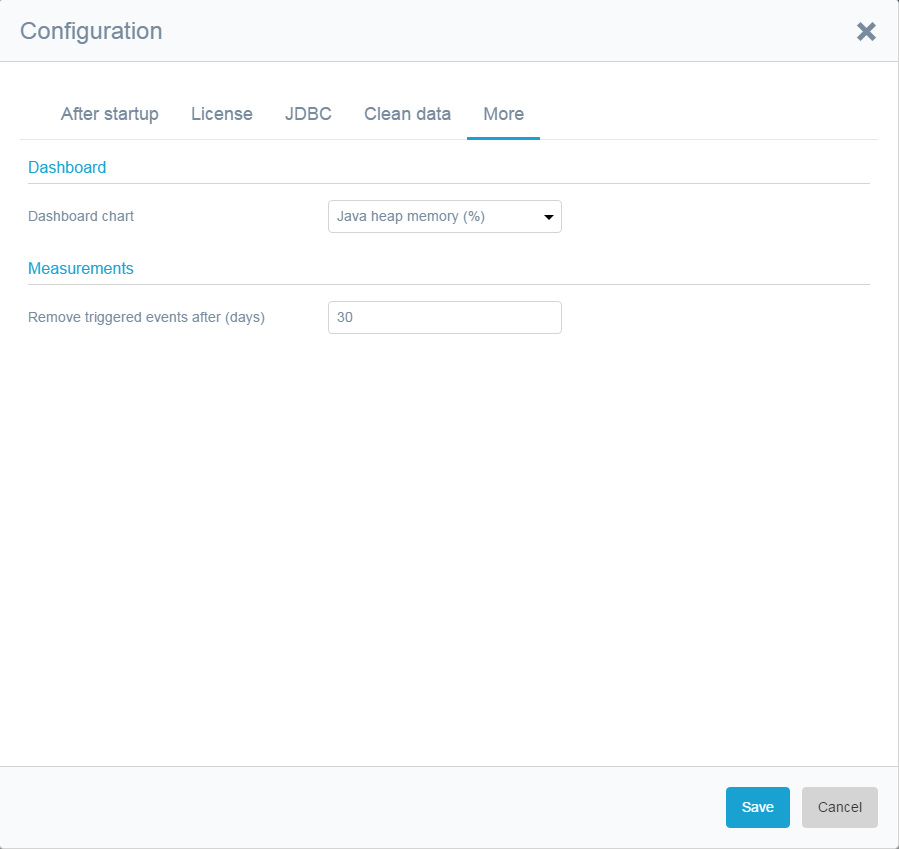
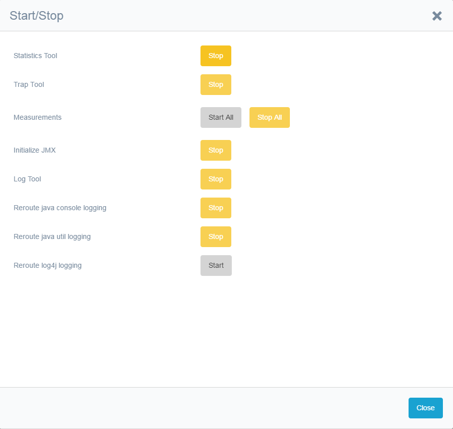

The Application Performance Monitor (APM) dashboard is the home screen of APM:

 

The dashboard shows recent information from the statistics tool, measurements tool, trap tool and log tool.

The individual tools can be selected from the menu on the left side of the page.
These tools are described in separate chapters. 

This chapter describes the global configuration and the start/stop dialog. Both can be selected from the 
header. The header also has a button that opens the documentation and a button that return to the home page
of the App to which the APM tool has been added. 

# After Startup Configuration

This tab lets you determine which tools should run _after startup_.
*The Mendix Modeler contains a safety constant which overrules these after startup settings and enables the 
admin to take control of these settings.*

As a protection, you can set a _Maximum log level after startup_ if the Log Tool is run after startup.
This can prevent the Log Tool running on an unexpectedly high level after startup.

In some cases, tools are run for a fixed period of time. However, running after startup usually means you 
want to run a specific tool all the time. With the option _Clear fixed period of time after startup_ 
you can make sure the tools will keep on running after startup.

# License
APM requires an application license that can be requested via email using the button in the configuration
 dialog. If the email client is not configured you can use the _manual license request_ button and copy-
 paste the text in an email to [apmtool@mansystems.nl](mailto://apmtool@mansystems.nl). 
 
 A license is required per app. Every license has an end date.

The license code goes in the _License_ field. The _Expiry Date_ field is automatically filled.

# JDBC
The JDBC settings are to execute queries in the query tool and to use the explain plan query in the 
performance tool. Usually these settings are correctly determined during installation and can stay
unchanged.

                       

A JDBC URL is automatically set during installation. For special cases this URL can be changed.
The URL can contain variables that are replaced on executing a JDBC statement.
You can use _$HostName_, _$PortNumber_,_$DatabaseName_, _$UserName_ and _$Password_.
They will be replaced with the current one on execution.
This allows for production database dumps to be used without the risk of connection to the production database from a test environment after the load of a production dump.

The _Explain plan query_ is also automatically set during installation.
This query is used with the explain plan option in the performance tool.

The remaining four options are used in the query tool to determine the output and set a timeout.

# Clean data
To quickly remove all data that is collected by and stored in the APM tool you can use the buttons on 
the clean data tab.

                       

# More
Some other settings are collected here.

                       

A default measurement graph can be selected for the dashboard.

Automatic cleanup for the triggered event data in the measurements tool is configured here.

# Start/stop
A dialog has been added to manually start/stop tools.

                       

The reroute buttons add log messages from other sources to the Mendix logging,
so that all log information is combined and available in the log and trap tool.
For example: javax.mail sends debug output to the console(system.out).
With the _Java Console_ option enabled, the debug output is caught and provided to the Mendix logging.
