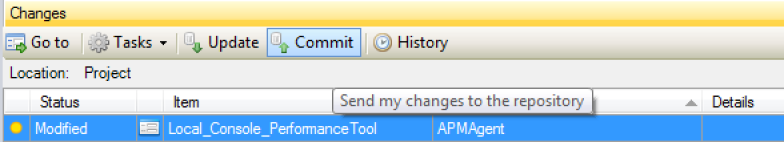
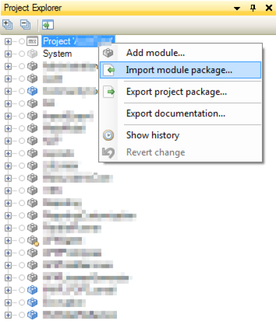
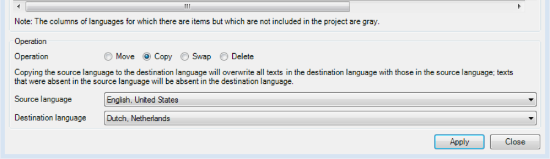
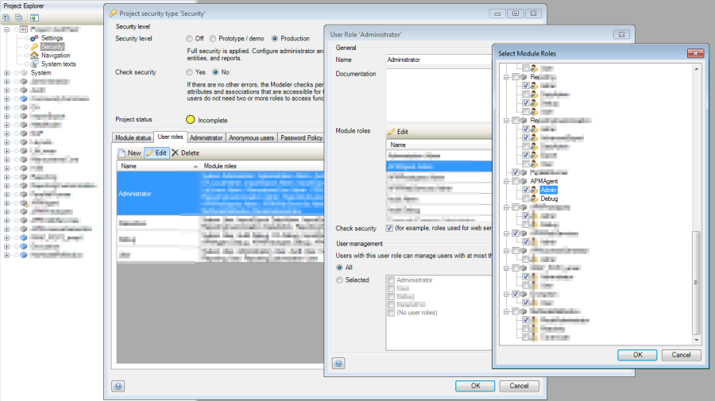
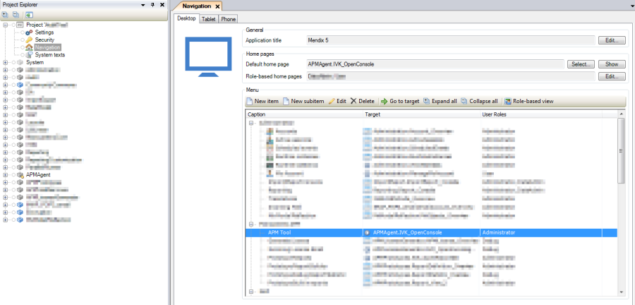
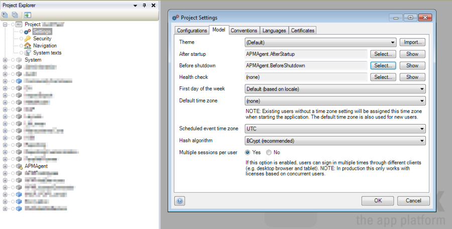
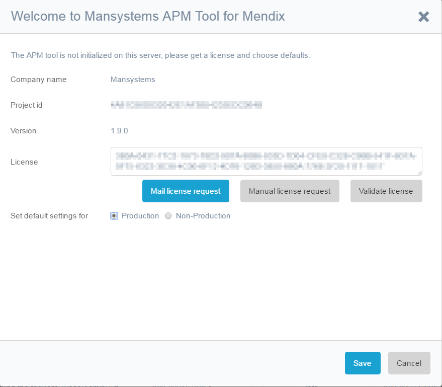

This chapter describes the installation of the APM tool.

# Backup

Did you commit your work to the team server? And did you make a database backup?

If you don't have installed an SVN client like Tortoise SVN make a copy of the widgets folder in your project.

# Import Module APMAgent

Import the module APMAgent in the modeler.

Write down the widgets in the warning dialog that are overwritten to be able to revert these changes.

# Copy Language if other than English US is used

If you are not using only English, United States copy the English, United States language for the APMAgent module to all the languages using Tools\Language Operations in the modeller:

# Add permissions

Add permissions APMAgent.Admin to project security / user roles tab to a selected administrator role.

**_Note._** _Do not use the Debug role. This is for developer of the APM tool to test certain features._ 

**_Note._** _You can choose to add the HeapDump role if you want to make heap dumps in java. In the cloud you need additional permissions to be requested at Mendix support._

**_Note._** _If you want to get rid of the warnings about security introduce Debug, HeapDump, Load test recorder and OData user roles 
and give these user roles the corresponding permissions from the APM module: APMAgent.Debug, APMAgent.HeapDump, APMAgent.OData and APMAgent.LoadTestRecorder._

# Add to navigation

To use the APM Tools you need to call the APM Tool user interface (UI). Use the "APMAgent/USE_ME/IVK_OpenConsole" microflow for this. Add a navigation menu item for example.

# Optional: Add to After startup and before shutdown

**_Note._** _It is advised to use the AfterStartup and BeforeShutdown_ _microflows. If you do not use them and the tool is running, shutting down your Mendix application will take some time waiting for timeouts._

Call APMAgent\USE_ME\AfterStartup from an after startup microflow. This feature is runtime configurable and by default none of the tools are started.

Call APMAgent\USE_ME\BeforeShutdown from a before shutdown microflow.

You can find the AfterStartup and BeforeShutdown microflows in the project settings.

# Configure APMAgent.CompanyName constant
Set the name of you company in the constant. Do not change the constant in the model. Use the Modeler settings or
the runtime settings for constants. After an upgrade the model constant gets overwritten.

# Start the Modeler or the Runtime

You can now startup.

If an error appears check [here](/APM/after-startup-error).

Otherwise login as Admin and navigate to the APM Tool.

# Welcome dialog

After startup for the first time a small wizard is started:

*   Use button to send mail with license request. One buttons tries to open your mail client. The other opens 
a dialog, so you can copy-paste text for the email to be sent at [apmtool@mansystems.nl](mailto://apmtool@mansystems.nl).
*   Upon receiving the license, copy-paste
*   Select production / non-production
*   Save
