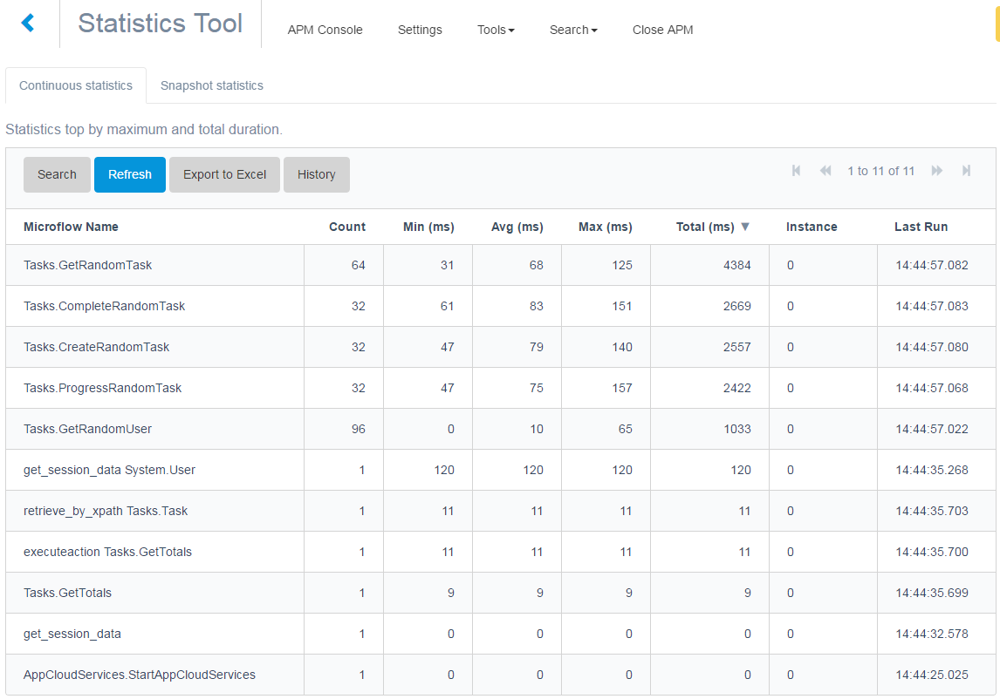
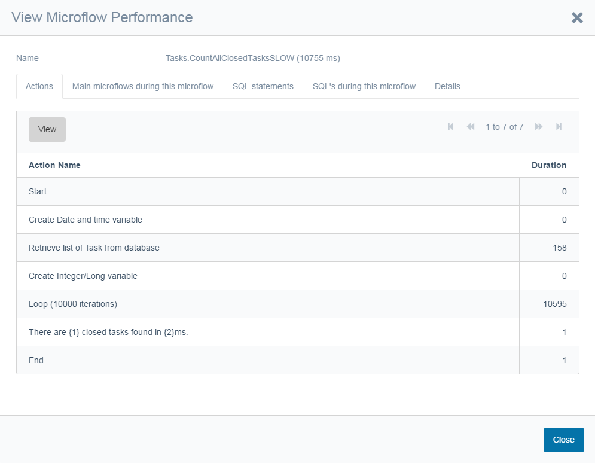
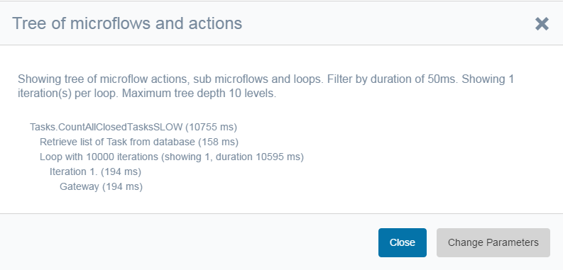
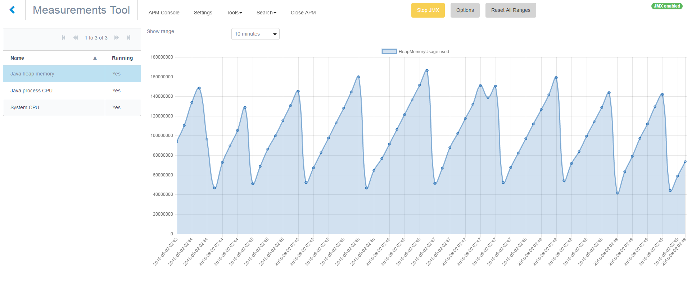

This introduction gives an explanation in short what APM is, which tools are in the APM suite and what they
 are used for. APM Tool consists of the following tools:
* Statistics Tool
* Performance Tool
* Trap Tool
* Measurements Tool
* JVM Browser
* Query Tool
* Log Tool

# Definition of APM

On Wikipedia, you can read a nice definition of [Application Performance Management](http://en.wikipedia.org/wiki/Application_performance_management).

APM is the monitoring and management of performance and availability of software applications. 
APM strives to detect and diagnose application performance problems to maintain an expected level of service. 
APM is “the translation of IT metrics into business meaning ([i.e.] value)”.

Of course you need the basic infra-structure probes to measure you hardware parts like CPU, memory and 
disk as well as your components like the database and the web server. However for higher quality support you should also look at the application and how it is performing especially linking this to the end-user’s business perspective.

We all know software contains bugs, and of course we all test before we bring something into production. 
For the end-users, an error is a sign that the application is not functioning. If the error appears 
unexpected, the user loses his trust in the system. The standard reaction of support was always to 
ask questions, including whether the customer can reproduce the issue, to turn on logging and to ask for
 a database dump, so support can investigate the issue in a safe environment.

The APM tools give valuable information for analyzing the behavior and performance of an application 
in production. Of course a tool can and should also be used during development and test phases.

# The Statistics Tool to see performance issues coming

We know that performance in applications is difficult to test in the initial stage. The data set is 
small and the exact usage of, for example search behavior of end-users is unknown. Therefore even if all
good performance practices are applied in building a Mendix application, some issues still appear in 
production. Usually they appear over time, so the question is how to see them coming.

The APM Statistics tool collects statistical data on microflows and client API requests. These statistics
 are stored periodically (usually daily, configurable) and from these statistics you can see a trend long 
 before the users are ringing the bell. Also, as a good habit, support frequently checks the longest 
 and most often running microflows to see if they can be improved.

This is the statistics tool (or load balanced environments you see the server where the microflow 
runs):

# The Performance Tool to record microflows

When support wants to investigate a performance issue, either pro-actively coming from the statistics
 tool or reactively when a customer reports an issue they use the APM Performance tool. With this tool 
 they can see on the action level the duration of the steps in the microflow. They can drill down and see
  individual SQL statements. They can even ask the database for an explain plan that tells you how the 
  database processes the query, which indexes it uses and more. This tool quickly helps to pinpoint where
   the issue is.

This is the call tree, which gives you an overview of what happens, showing the called microflows and one iteration 
of a loop, filtered by duration:

Below is the performance tool output. You can double-click on all actions and in the case of a microflow call, you can browse to the next microflow and in the case of loops you will see the individual iterations.

This is the SQL statements during an action:

# The Trap Tool is your flight data recorder

The APM Trap tool is always listening on all levels of logging up to the highest TRACE level and remembers 
the last several seconds (configurable!). When an error occurs the last few seconds of logging leading up
 to the error are saved in the database. The APM Measurements tool can also monitor memory usage or CPU and 
 trap logging when a threshold is reached. In this way, the information is collected the first time 
 something occurs and this speeds up the problem resolution considerably.

# The Measurements Tool to collect even more information and trigger an alarm when needed

The APM Measurements tool is measurements to linking business logic and is bridging the gap between the
 model and the infrastructure metrics, like CPU measurements. The APM Measurements get information from
  several different sources. First a simple APM JVM browser to present similar information as shown in
   the standard java management tool like JConsole, VisualVM and JMC. Second the APM query tool to perform
    business and database queries to monitor database specific meta information and/or business values.
     Third the internal metrics of Mendix and the APM tool are available as well via the APM JVM Browser
      or other Java JVM management platforms.

The measurements can be used to trigger events on thresholds. For example if more than 80% if memory is used
 or if more than 80% of the CPU is used a trigger fires. At some customers, support has configured a 
 trigger on a model change so they are informed when a new deployment is done.

The trigger can be to trap logging, to execute a microflow, for example to send an email or to make a 
heap dump.

# JVM Browser

The JVM browser can be used to see JVM information similar to tools like JConsole, JVisualVM or JMC.
 This gives the information to more functional people without the need for specialists and technical access
  to the machines running the Mendix application.
  
# Query Tool

The query tool enables performing XPath, OQL and JDBC queries to collect either business statistics
 (report like), application statistics (number of scheduled events running at the same time) or database 
 specific statistics like the number of sessions. This module is also used for the explain plan functionality 
  the performance tool.
  
# Log Tool

The log tool is used to collect Mendix Runtime log messages and store them in the database. 
This gives remote access to log information, makes it available to consultants, and allows for easy 
searching and analyzing.

The log rerouting makes sure that java messages that are sent to the Java console, to the 
java util library or to the log4j library are rerouted to the Mendix log. For example javamail sends 
debug output to the console and with this option you can collect that information and make it visible 
in the Mendix log as well as in the APM Log Tool and APM Trap Tool. This helped support a lot
 in solving email issues and issues with web services security and certificates.

 
