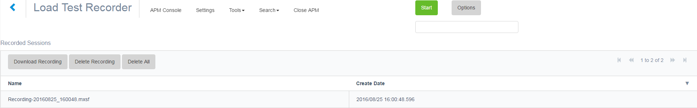
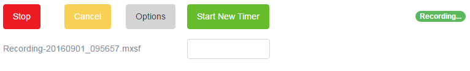
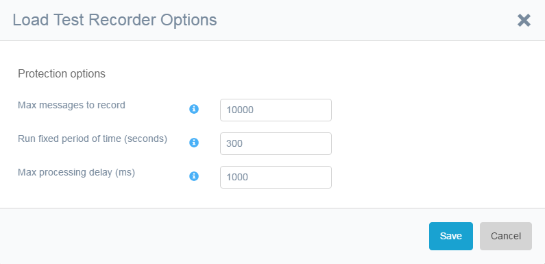

This chapter gives an overview of the load test recorder. Mansystems has a load test tool that can be used in projects by our consultants. The tool is likely to be productized in the future and is NOT INCLUDED in the APM Tool. This tool needs a recorder to record sessions. These sessions can then be scripted/parametrized for usage in the load test. 

The APM Tool includes the load test recorder, so APM Tool users are immediately ready for a load test and need not again add a module to their App. Load test customers will need the APM Tool for measurements and hence also benefit from the addition. 

## Load Test Recorder Control

You can start and stop the Load Test Recorder. The followingscreenshot below shows the Log Tool when started:

You can Start and stop timers to mark individual functionality in the session. This helps the load tool to measure those functions.

## Load Test Recorder Options

The following screenshot shows the Load Test Recorder Options:

The [Max messages to record] can limit the amount of records in memory. The recording stops when the maximum is reached.

The option _Run fixed period of time (seconds)_ can be used to predetermine the amount of time a Load Test Recorder runs.

You can configure the Load Test Recorder to stop if a queue builds up with too many messages. This is controlled by a parameter called the [Max Processing Delay (ms)] that measures the delay between the moment the log record is logged in the queue and the moment the log record is processed by the Load Test Recorder.
