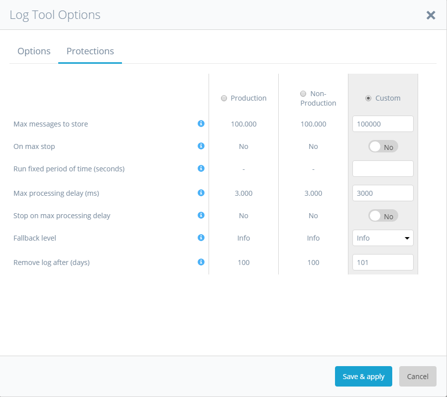

This chapter gives an overview of the log tool. The Log Tool is used to collect Mendix Runtime log messages and store them in the database. This gives access to log information without the requiring looking into log files. Additionally, the log information can be browsed, searched, and sorted for analysis.

## Logs
Logging consists of a log node, a level and the logging message itself. For the Log Tool to record logging
for a specific log node and level, this combination needs to be configured.

### Overview
The logs tab shows the stored logs in the database.

 

You can start and stop the Log Tool via the play button in the header.

Double clicking a log message shows its details.

 

If the message has level WARNING, ERROR or CRITICAL, the extra button 
**Exclude in TrapTool** is shown. This configures an exclusion in the Trap Tool and 
allows you to run the Log Tool for a period of time to collect the WARNING, ERROR, or
CRITICAL messages that are often occuring and make sure the Trap Tool does not store
huge amounts of irrelevant data when started.

## Log Tool options

The following screenshot shows the Log Tool Options dialog:

Log nodes are created when the first log message has occurred for this node in Mendix. 
The options **Level for new nodes** determines the initial log level in the Log Tool 
for these new log nodes.

### Log Tool options, protections tab

The **Max messages to store** can limit the amount of records in the database. There
are two things that can happen when the maximum is reached:

1.  The Log Tool can stop if the checkbox **On max stop?** is checked.
2.  The Log Tool can start removing the oldest records (comparable to a log file that 
rotates / is rolling over).

**Notes:**

1. *The removal of the oldest records is done by a private thread that only runs when 
the Log Tool is running.*
2. *Log Tool counts the messages it writes and counts on start up the messages in the 
database. When the **Max messages to store** + 10% amount is reached, the oldest 10% is 
deleted. This can be deleted in small batches.*
3. *To handle a load balancing situation only the records per server are counted and 
removed.*

The option **Run fixed period of time (seconds)** can be used to predetermine the amount 
of time a Log tool session runs.

You can configure the Log Tool to stop if a queue builds up with too many messages. This 
is controlled by a parameter called the **Max Processing Delay (ms)** that measures the 
delay between the moment the log record is logged in the queue and the moment the log 
record is processed by the Log Tool. If all settings are set to level trace in a high 
loaded system the processing delay might go up and the protection will 
most probably kick in to protect application performance from degrading.

You can configure the Log Tool to stop or to fall back to a different level of logging 
in case the processing delay becomes to long.

### Save & apply
When the tool is running you can Save & apply the options which means the settings will 
immediately take effect in the running session.

## Log Tool Levels

When it connects, the Log Tool reads log levels from the Log tool options to determine 
what messages are to be logged to the database. If the log node of a message that is 
generated by the Mendix runtime is not found in the options it is added to the options 
with an initial **Level for new nodes**. The log levels are managed with the following 
dialog:

Here you can change individual log nodes inline or set all to **None** or **Info**. 
On opening of the level dialog the levels are synchronized with the levels in log tool 
memory, because a fall-back can have changed the requested level.

Changes to the log level are immediately applied to the Log Tool if it is running.

***Note** With debug permission a delete button is available to delete nodes. When the
log tool is used in development or with new releases certain log nodes might no longer
be needed. You can delete them from the log levels. Since records are automatically created 
when a message from that node arrives it does not harm the system to delete 
configuration records.*