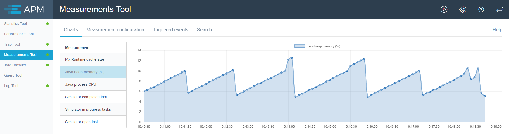
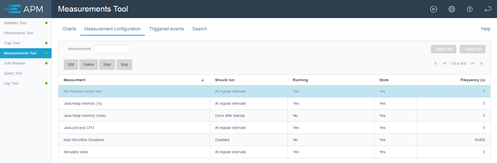
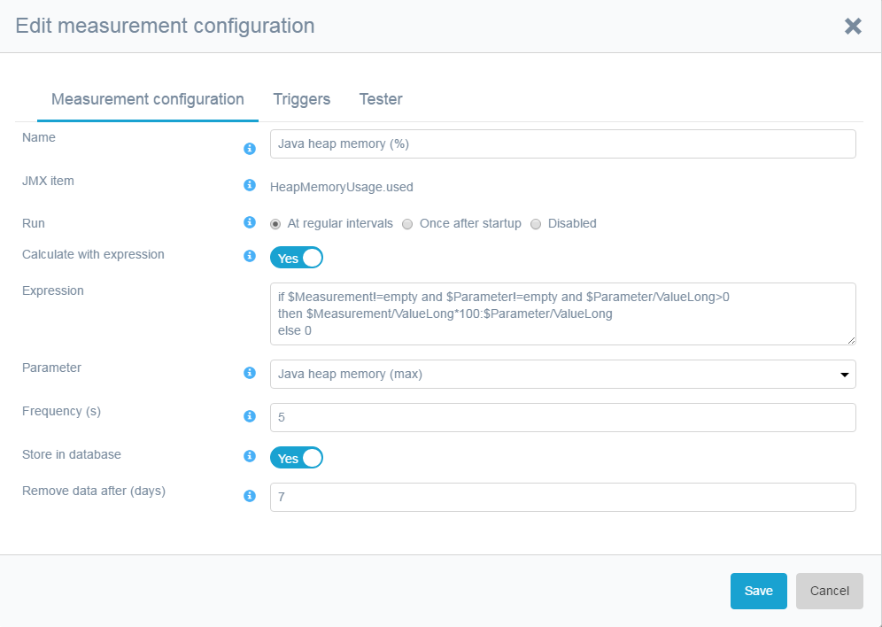
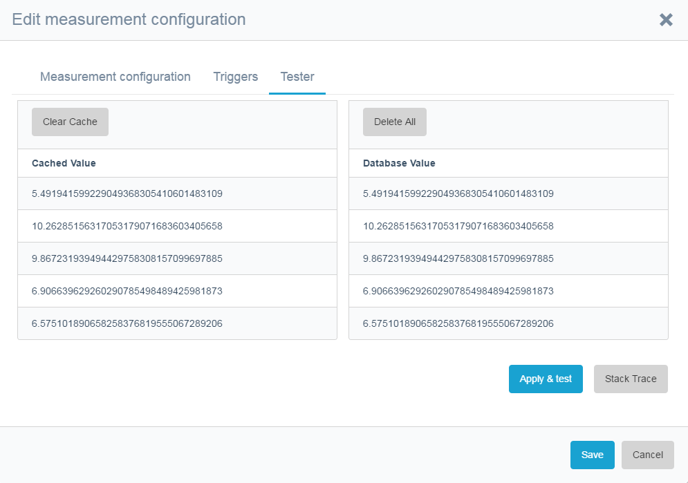

The measurements tool is meant to measure system resources and to trigger actions on thresholds. This allows 
you to monitor memory and save statistics or perform a trap when memory usage reaches, for example, 80%. 

Measurements are created via the **Collect in Measurements Tool** button in the JVM browser or in the query tool. The collected measurements can be stored in the database and used for generating graphs or for triggering events.

## Charts

The charts tab shows graphs of collected data in the measurements tool.

 

Double-clicking the measurement will open a read-only view of the measurement configuration.

## Measurement Configuration

Measurements can be configured on the **Measurement configuration** tab. If the measurement is running, you can only
view the measurement configuration. 

                       

Measurements can be started and stopped here. In the dialog behind the play-button, you can start or stop all 
measurements at once.

### Measurement Configuration Tab

Double-clicking or selecting and clicking the **Edit** button shows the measurement configuration dialog.  Here, the selected measurement can be configured:

 

The **Measurment configuration** tab allows you to do the folllowing:

*   Change the **Name**
*   Choose when to **Run**
     - At regular intervals
     - Once after startup
     - Disabled
*   **Calculate with expression**
     - If yes, the **Expression** field appears (see below for the expression details)
     - If yes, the **Parameter** field appears (this parameter can be used in the expression)
*   Set the **Frequency (s)** that the measurement is executed in seconds
*   **Store in database** stores the measurement in the database
 * You can only measure for triggers; for charts you need the database to be stored in the database
*   The **Remove data after (days)** configures the automatic cleanup (purge) of the data
 * Measurements will automatically be removed after a certain amount of days
*   For a query measurement, the **Expose query results to JMX** makes the query results visible in other Java management
 consoles – this is only useful for query measurements, since JVM Browser measurements are already available
  there
*   If a query has multiple results, you can configure using the first column a part of the name via **Use first 
result column in name**

### Triggers

Triggers are used to check measurements for a specific value. If the expression in a trigger is fulfilled, 
the configured action is taken. 

                  

#### Trigger Definition

You can configure the following fields on a trigger:

* **Description** to describe the trigger – this description can be used in log and trap message actions as {1}
* **Enabled** to enable or diable a trigger – triggers are automatically disabled if the continuation is 
set to **Stop**
* **Expression** to set the business rule that fires the action (see below for details)
* **Parameter** to define another measurement to be used in the expression as a parameter

#### Trigger Actions

These actions can be:

*   Running a microflow, see sample microflow APMAgent.SampleMetricTriggerMicroflow_LogMessage on how to
build this microflow
*   Creating a log message – you can use {1} for the trigger description, {2} for measurement name, 
{3} measurement value
*   Creating a trap message – you can use {1} for the trigger description, {2} for measurement name, 
{3} measurement value
*   Saving a statistics tool snapshot
 * The duration of this snapshot is configured in the global settings
 * The snapshot will by default have between 10 and 20 minutes of statistics
*   Generating a heap dump
 * You only see the create heap dump option if you have special permissions (**USE WITH CAUTION**: creating a heap dump pauses the system for a certain period of time depending on the amount of heap space assigned to the Java process running the Mendix server; this can freeze the app for many seconds)

#### Trigger Continuation

The continuation tab allows to configure what happens after the trigger has fired and the action has 
been executed. You can:

*  Do **Nothing** means keep on checking and executing the trigger
*  **Stop** means that the trigger will fire once and then disable itself
*  **Pause** means you can define a period in which the trigger will not fire again

This is to prevent, for example, a large amount of emails when the CPU usage is high.

### Expressions

Expressions for measurements and triggers are written the same as expressions are written in the 
Mendix Modeler expression editor. 

The `$Measurement` variables is available with columns:

* `ValueString`
* `ValueDate`
* `ValueLong`
* `ValueFloat`
* `ValueBoolean`
* `TimeStamp`

Also, the last **N** measurements are available as $Measurement_1 (the previous one) up to $Measurement_**N**. The 
amount of previous measurements (**N**) is configured in the app. The default is 5, but an admin can changed this. 

At startup, the last **N** measurements are empty, so handle the empty case!

When the measurement is run only once, the previous measurements are retrieved from the database and can be
 used as `$MeasurementDB_1` to `$MeasurementDB_N`. 

This is an example to calculate the difference between the current and the previous measurement:

$Measurement/ValueLong - $Measurement_1/ValueLong

### Tester

The tester will execute the measurement and test the trigger (if enabled) to verify the expressions.

If there is an error, the error message appears on **Apply & test**. You can view the stack trace as well.

In the tester, you can clear the cache and also remove all records from the database.

## Triggered Events

If a trigger fires, a record is created in the triggered events. The events are automatically deleted after a certain amount of days as configured in the **Remove triggered events after (days)** setting on the [More tab](/APM/dashboard#more). If you want to keep a event for future reference, you can keep the event using the keep-button above the triggered event grid.

If a trap is created with the trigger actions, you can open the trap.

If a statistics snapshot is created with the trigger actions, you can open the statistics snapshot.

If a heap dump is created with the trigger actions, you can download the heap dump. You only get this option 
if you have special permissions.

You can open the measurement configuration that contains the trigger with the **Show trigger** button.
