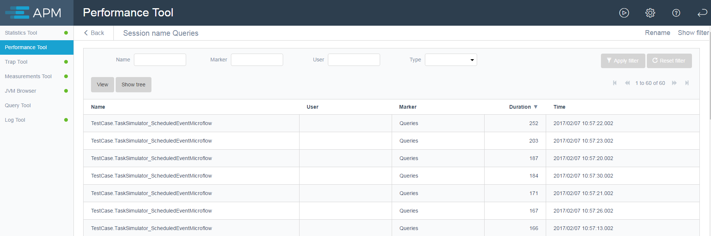
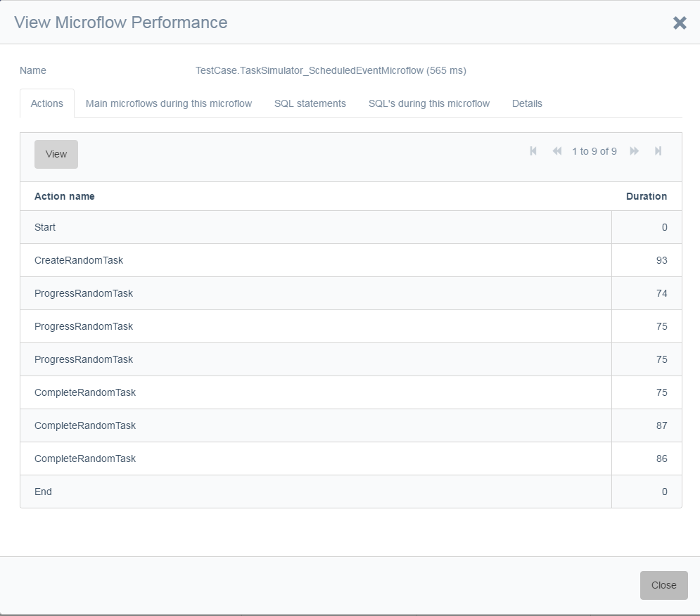
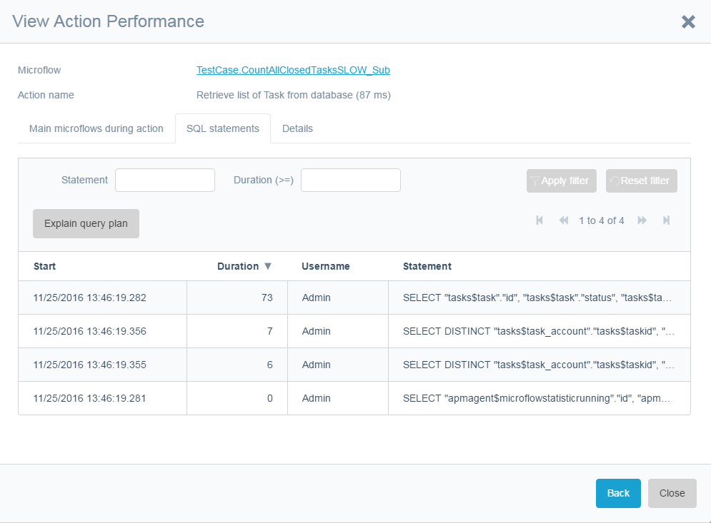
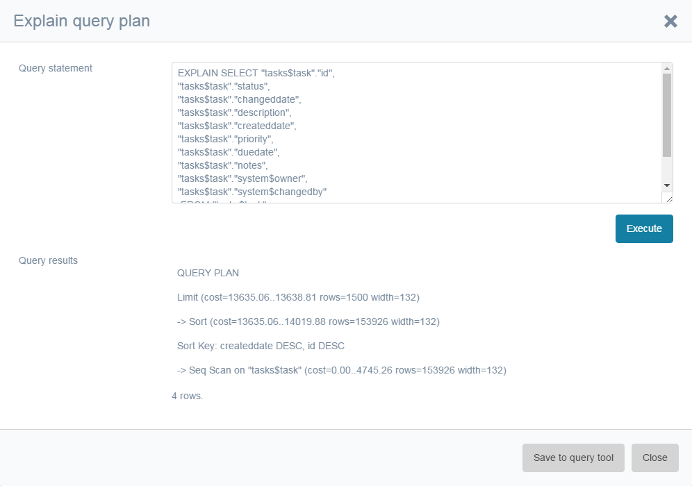
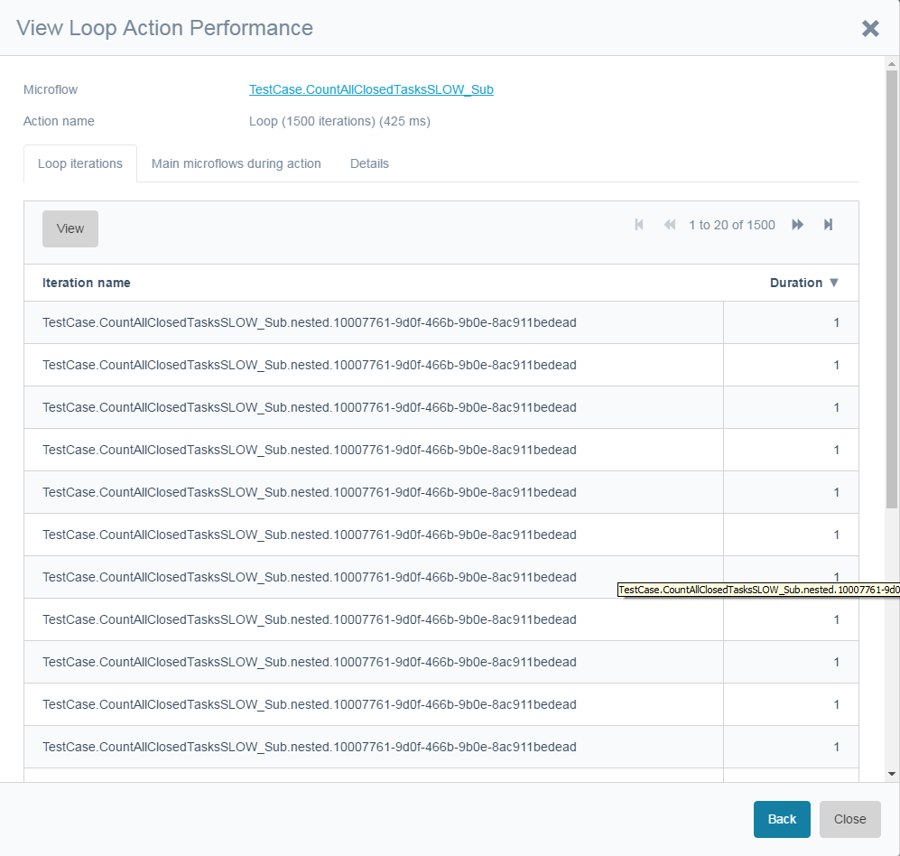
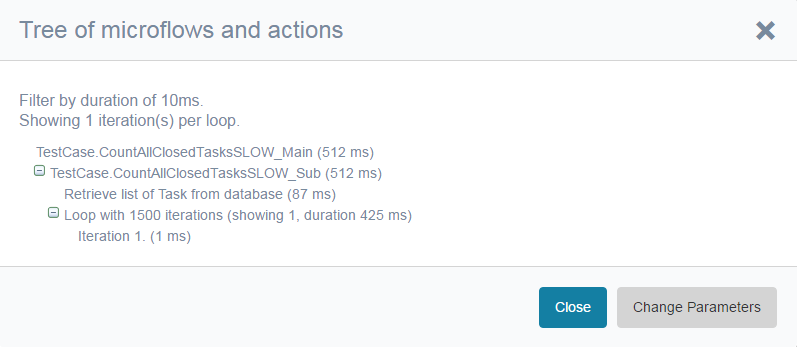

The performance tool results are saved per session. The results are displayed in a search grid with the ability to search the fields that are stored with a ‘microflow performance’ record. By default the grid only shows main microflows (Main? = Yes). These are microflows that were not called by other microflows during recording. By default the list is sorted on duration. 

Calculated attributes and domain model event microflows are also seen as main microflow since they cannot be linked to the microflow that is causing them other than the fact that they run inside the action start and stop times.

The user column is only populated for Client API messages and when the profiler was running for actions triggered by a user. Scheduled events and domain model microflows logically do not have a user.

When viewing or drilling down on called microflows. This will open a dialog beginning with the Action tab. In the Action tab, it is possible to drill down on sub microflows, loops, and other actions related to this microflow. 

The tab with the "main microflows during this microflow" shows domain model microflows and calculated attributes. Please note that other microflows occurring in the same interval might appear here as well.

The **SQL statements** tab shows the SQL statements of the currently viewed microflow. If the microflow is a main microflow—which consists of its own runtime request—all the SQL statements that are not linked to an individual action are linked here.

 

The explain plan button opens a query tool window with this query inside an explain plan statement. This explain plan can help in debugging how to tune SQL statements.

 

When a microflow does have a loop. This will also be visible in the Action grid. It is possible to drill down to the action with a special grid for each iteration. From there you can proceed to drill down.

To get a complete overview of a microflow or action, the **Show tree** button from the search grid can be used. Select a microflow from the grid and click on the **Show tree** button. This will give a tree view of the microflow and all related actions and sub microflows that were executed. The **Change parameters** button can be  used to filter the results.

In the parameters dialog, you can change the filter by duration, the number of iterations shown for a loop and some more advanced properties (show/hide actions, show/hide start/end actions, maximum depth and an option to include a warning in the node if the maximum depth has been reached).
