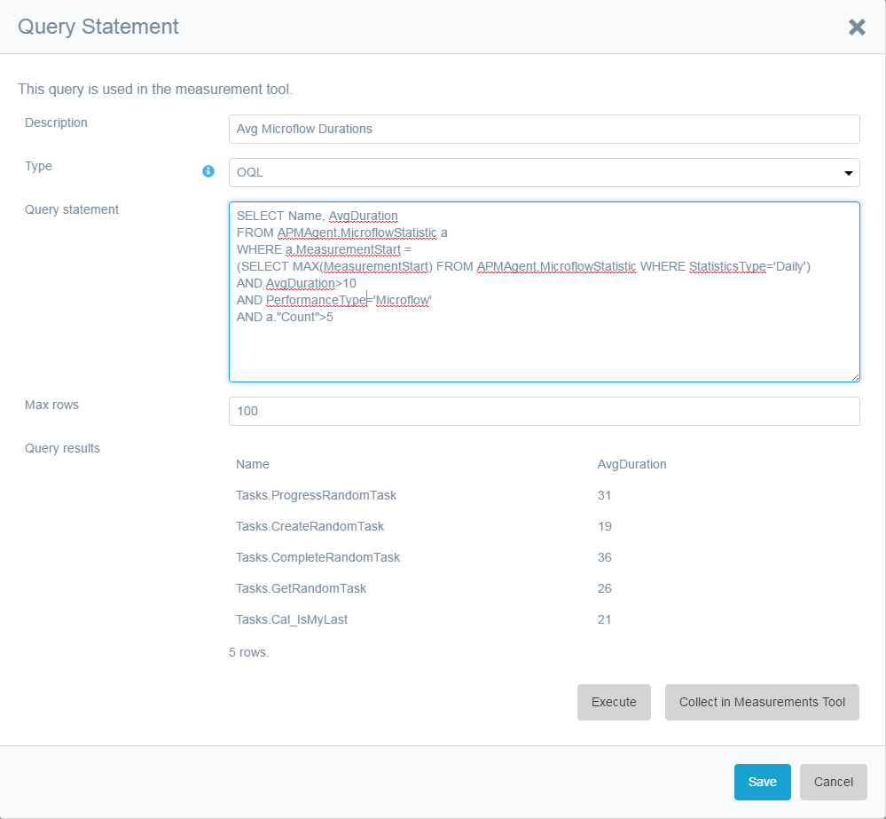
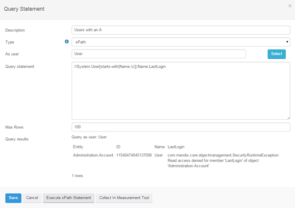
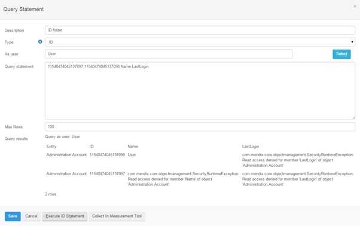
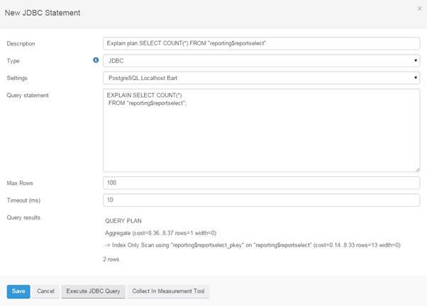
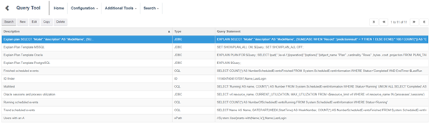

To collect database or application information the Query Tool has been introduced. 

The Query Tool allows you to perform OQL and XPath queries as depicted in the images below.

                       

You can perform XPath queries like

//System.User[starts-with(Name,'a')];Name,LastLogin

 

You can perform a query of type ID. This determines the Mendix entity related to the given ID. Additionally the ID query can specify columns specific to the entity related to the ID and show these as the query result.

 

Additionally its possible to perform JDBC(pure SQL) queries to get information from the database.

 

Opening the Query Tool shows an overview of all configured queries and allows for adding, modifying and deleting queries.

 

To use a query for measurements the query should either return 1 result or if a query results in multiple rows the first column is used as a unique identifier:

Under search ment option Search Query History you see all statements executed from the GUI. Collect measurement queries are not added to the history as they result into measurements.
