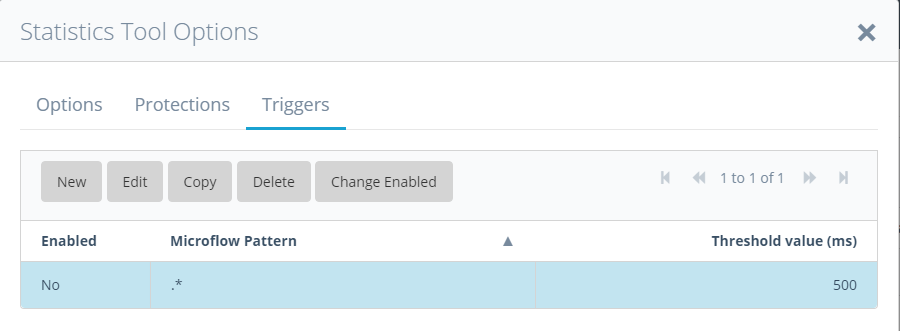

This chapter gives an overview of the Statistics Tool. The Statistics Tool measures 
durations of microflows and browser client requests and gathers statistics like number 
of executions, minimum-, maximum- and average duration. The Statistics Tool is used as 
the first step in gaining insight in what a system is doing when it doesn’t perform 
optimally. The Statistics Tool is also used to determine potential performance issues 
by looking at the trends.

## Statistics

The Statistics Tool screen is split into several sections as shown below.

 

Statistics are stored periodically to be able to determine potential trends. The 
**Periodic store frequency** can be changed in the [Options](#Options).   

## History chart
It is possible to select a microflow and press the history button to see a graph with history statistics:  

The statistics can be started or stopped using the Start/Stop buttons in the 
'start/stop dialog'. This dialog is accessible through the topbar start button.

## Manual statistics
   

In the manual statistics section it is possible to create a snapshot of statistics. This 
snapshot can be used to compare with other snapshots or to gain insight in statistics 
for a certain duration. By using the **Reset snapshot** button, the statistics  
will be reset. With the **Store snapshot** button the statistics will be saved to a stored
snapshot in the database.

***Note** By default the result is sorted by **Total (ms)**. This will give a overview of the actions and microflows were the
application spent to most time on. The average (**Avg**) is **Total (ms)** divided by **Count**. Sorted on Avg, the actions and
microflows with the longest average duration can be found. Sorted on **Count** the actions and microflows that
were executed the most can be found. The results can also be sorted on **Last run** to see what microflows
have been executed recently.*

## Running actions  
This section will give a real-time overview of running actions and microflows. This is 
the best place to start when there are performance complains. Running actions show a list 
of microflows that have been started but have not yet ended. The duration is the time 
between the start and the moment when the refresh button was hit.

***Note** When the server generates a lot of log messages and the server is running at a high CPU 
and all tools are running it can happen a queue builds up in the Mendix thread that sends 
the log messages to the subscribers. As a consequence, it can look like running 
microflows take 10 seconds and the maximum in the statistics is 1 second. This is caused 
by the fact that the running time is calculated on the refresh date and the duration of 
a microflow is calculated by the message date. When this happens the debug running 
counter for message delay shows a high number, say 10000 milliseconds. The Statistics 
Tool pauses collecting- and handling messages if the processing delay is above the 
configured **Max Processing Delay (ms)**.*

## Stored snapshot
A stored snapshot is a collection of statistics saved to the database. This section will give a overview
 of all stored snapshots.

In stored snapshots you find all the statistics bundled per snapshot. These snapshots can have 
several types: 
* You can manually create snapshots. They have type **Manual**.
* A snapshot is taken periodically, by default daily. These snapshots have the type 
**Periodic**.
* **Measurement**
* A trigger can fire the creation of a snapshot. They have type **Measurement**. The source
of a trigger can be the measurements tool and also statistics triggers or message triggers.

You can prevent a snapshot from being deleted by cleanup when you select to keep it.

## Snapshot details

You can rename snapshots and view the details that will include filtering details when applied.

## Statistics Tool options

The following screenshot shows the options of the Statistics Tool:

 

The statistics tool will measure all microflow statistics all the time. The statistics 
tool can exclude certain microflows while presenting from memory or storing to the 
database.

You can configure the frequency of the statistics tool snapshots that are stored, for 
example daily or hourly. You also configure the top N statistics to be stored and an 
exclude pattern. The APM tools itself are excluded via a constant as configured by an 
administrator.

The top N is both for maximum duration and total duration, so between N and 2 times N 
records are presented or stored in the database. When the top N value is empty or 0 all 
microflows are retrieved.

The dashboard options include also a top N and an exclude pattern to interactively filter 
with these options.

### Statistics Tool options, protections tab
On the protections tab you see:

You can run the Statistics Tool for a fixed amount of time. The Statistics Tool is 
intended to always be running. This option is available if you want to measure statistics 
for short periods, say during busy hours and compare that to statistics during less busy 
hours.

The Statistics Tool is also protected with a **Max Processing Delay (ms)**. The statistics 
tool acts differently when the processing delay is too large. It will pause handling 
messages until the processing delay is below 50ms. Therefore, choosing a value below 
100ms is not allowed. The reason each tool has its own max processing delay is that you 
might want the log tool to stop first, then the performance tool and last the trap or 
statistics tool.

The data is cleanup automatically after a certain amount of days.

### Statistics Tool options, triggers tab

On the trigger tab you can define triggers that fire on a certain microflow duration. For 
details regarding triggers see the measurements tool.

### Save & apply
Changes to the options are applied to the currently running Statistics Tool session if the button
**Save & apply** is used.
