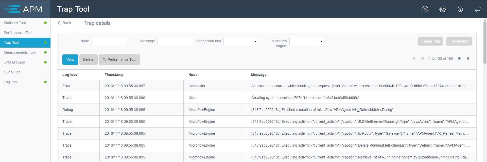

This chapter gives an overview of the trap tool. The Trap Tool can be used to always collect the latest 
series of messages before an error, a warning or a critical message occurs and when they occur 
store those messages in the database. No more asking the customer to turn on logging, waiting for things 
to happen, turn on even more logging, generating huge files and spending a lot of time catching the event. 
Simply use the trap tool.

## Traps

The Trap Tool shows the traps that are stored.

 

When you select a trap you get to see all the messages in that trap.

 

The search parameters to include or exclude **Connection Bus** messages and 
**Microflow Engine** messages are available to show or hide the most occurring messages.

Also a list of selected records can be sent to the Performance Tool. 
If the performance tool is already running running you get a warning that you can only send a
 trap to the performance tool if it is not running.

## Manual trap
You can manually send a trap and get logging output. This can be useful when there might be a microflow 
hanging or if an issue occurs but no error is generated.

There is the **Output Queue Size** counter. 

When a trap occurs all messages to be written to disk are stored in a queue. A separate thread handles this queue. The trap tool has a counter to indicate the number of messages in the output queue. When the Trap Tool is disabled or stopped the output is interrupted and cancelled in the middle of processing the output queue.

## Trap Tool Options

The following screenshot shows the Trap Tool options:

You can define which traps are excluded to avoid highly repetitive messages which are not useful for analysis. You can exclude a complete node or filter out trap messages by regular expressions. Exclusions can be added manually but also by selecting an error, a warning or a critical message in either the Log Tool or the Trap Tool, viewing their details and pressing the **Exclude** button.

The regular expression can be tested against the trap messages in the database, so if the tool currently 
recorded a message that needs to be excluded the next time it occurs then the test button should give a
 result.

The Trap Tool can be configured to trap on Warning-, Error- and Critical messages.

The Trap Tool can be configured to remember messages recorded during a certain amount of time that precedes a trap. So in the screenshot-example of the options dialog you store per   trap at most 15.000 records and at most messages from 10.000ms (10 seconds) before the trap.

If you define a **Max messages to store** the system will either stop when the maximum is reached or delete the oldest trap messages. This is determined by the setting **On max stop?**. The oldest messages  are deleted when a new trap arrives after the new messages have been added to the database.

You can run the Trap Tool for a fixed amount of time. The Trap Tool is intended to run always, but when
 using the Trap Tool for the first time and not knowing which errors or warnings to exclude you might want
  to limit the duration the Trap Tool is running.

The Trap Tool has a **Max Processing Delay (ms)** protection to stop the Trap Tool if the system generates too many log messages which causes queueing inside Mendix. This off course depends on any other tools that might be running and other factors that might generate additional messages.

Changes to the options are applied to the Trap Tool if the button **Save & apply** is used.