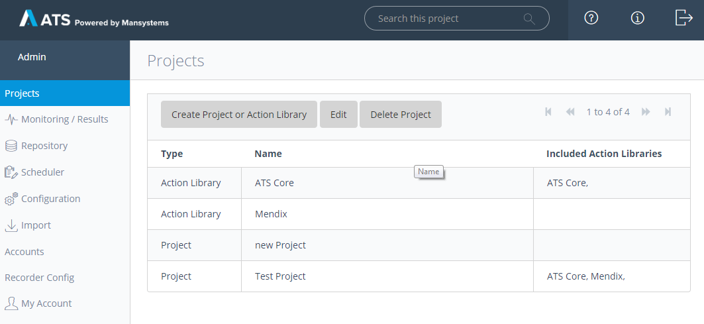
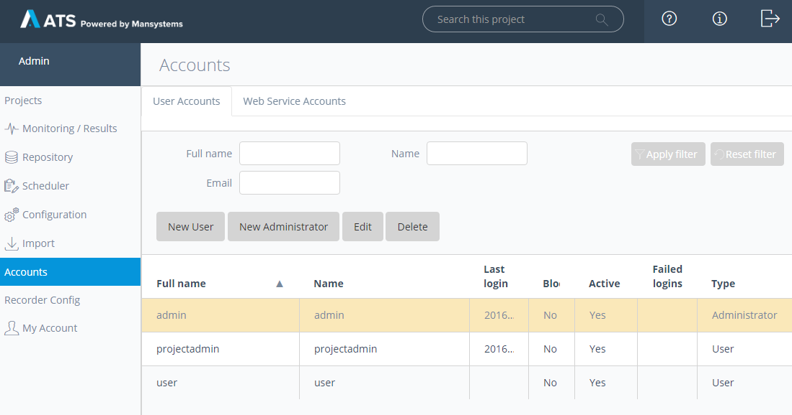
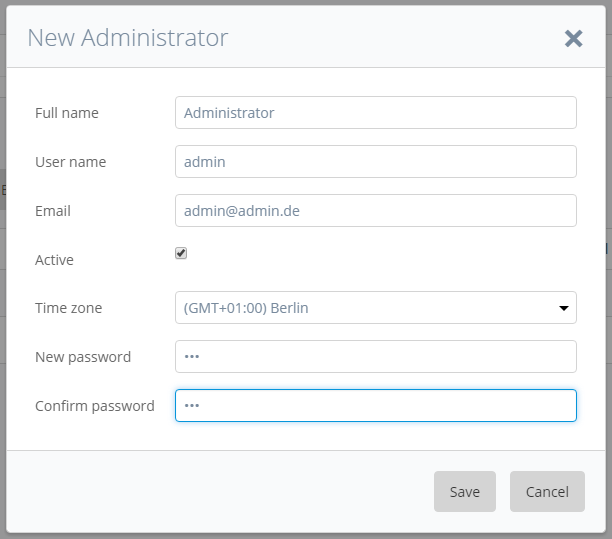
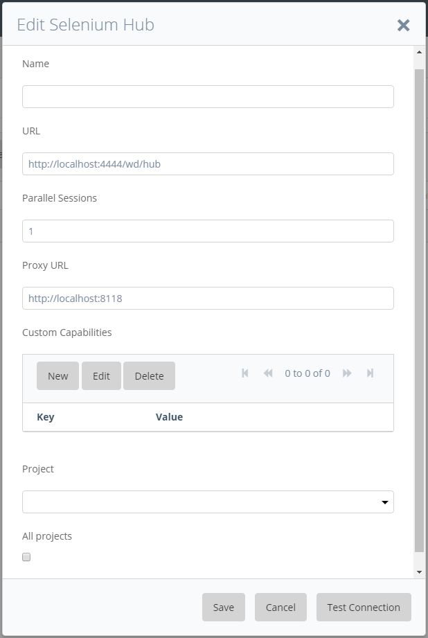

As an administrator in the ATS you have access to additional functionality:

*   Manage Projects system wide
*   Create new user/administrator accounts
*   Configure Selenium hubs for all projects
*   Change Recorder configuration

## Manage Projects

When you log in as an administrator the _Projects_ page is shown:

On this page you can see all the projects that exist on this ATS instance. Here you can create new _Projects_ and _Action Libraries_. Also as an admin user you have the rights to delete projects and libraries from the system. When creating a new library you can choose to _Include by default in new projects_ , so this library is included by default in any project that is created on the system. For more information on project/library creation see the ReferenceGuide_Projects page of the reference guide.



When creating a new library on the _Projects_ page, the created library is empty at first and you can import action libraries into it or include available libraries.



## Create Accounts

On the _Accounts_ page you can create new users and administrators for the system. Administrators only have access to the administration part of ATS. They can see test cases and test results, but they can't create new test cases or run them.

When editing accounts you can set accounts to inactive or block them, which will both deactivate the account.

It doesn't matter if you create an administrator or a normal user the options for both are the same:

**Full Name**

The full name of the user

**User Name**

The name the user logs in with

**Email**

Email adress of the user

**Active**

Set the account to active/inactive

**Time Zone**

Set the timezone the user works in

**Password**

The initial password of the user

The initial password of the user should be changed by the user when logging in.

## Configure Selenium Hubs

As an admin user you can configure Selenium hubs as you normally would, see ref-SeleniumHub for more information.

Additionally as an administrator you can assign a Selenium hub to a specific project or make the hub available for all projects on the ATS instance. You can do this by creating a new or editing an existing Selenium hub.

## Recorder Config

Admin users have access to the _Recorder Config_ page where recorder setting can be changed.



Recorder settings should not be changed under normal circumstances



