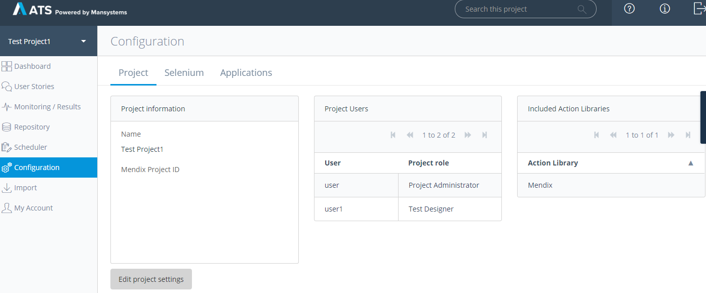
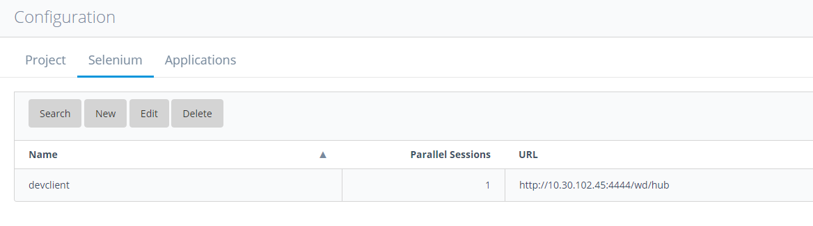
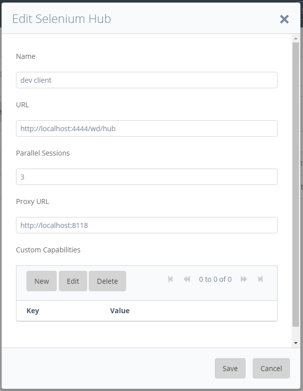
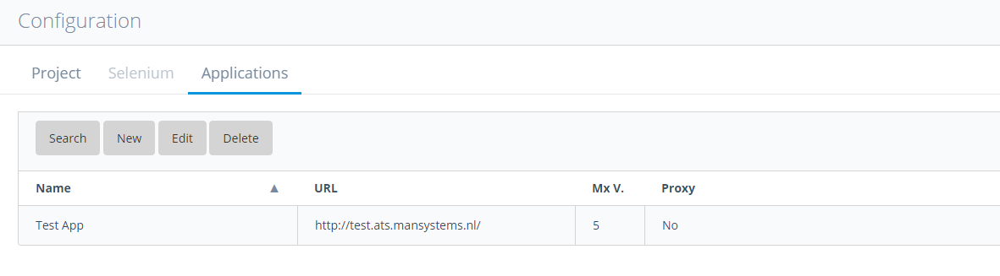
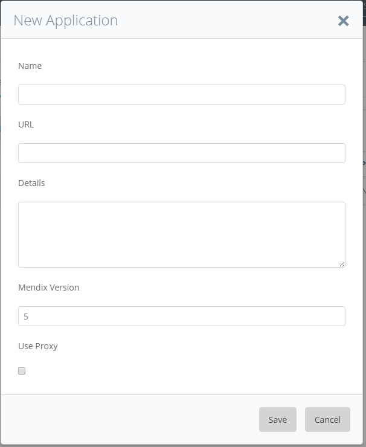


Only a user with the _Project Administrator_ role in the current project can access the configuration page.



On the configuration page under the _Project_ tab you can see the current project settings. You can change the settings and add users or libraries to your project by clicking the _Edit Project Settings_ button.

## Configure Selenium hubs 

Under the _Selenium_ tab you can see a list of Selenium hubs that are configured for this project. Project users can run tests on the listed hubs.

To add a new Selenium hub click the _New_ button in the top bar.

In the Selenium hub dialog you can set the following parameters:

Name

Name of the Selenium hub

**URL**

URL of the Selenium server

**Parallel Sessions**

Number of tests that can run in parallel on the Selenium hub

**Proxy URL**

URL of an optional proxy server. Normally there should be no need to use a proxy server

**Custom Capabilities**

Set Selenium DesiredCapabilities, see Selenium documentation for mor info

## Configure Test Applications 

Under the _Applications_ tab you see a list of test applications that are configured for the current project.

You can edit, create and delete applications by pressing the buttons in the top bar.

When creating a new Application you can set the following parameters:

**Name**

The name of the Application

**URL**

URL under which the Mendix application to test is running

**Details**

You can put a description of the application here

**Mendix Version**

Mendix Version of the Application.

**Use Proxy**

Check if a proxy should be used. Should be off in most cases
