Welcome to the custom action creation tutorial. You will learn how to create a custom action for a widget from scratch.
Before you start with this tutorial, you should know how to navigate through the HTML source code of a Mendix application inside a Browser and how to inspect the CSS properties.
You should also know, how to use CSS/JavaScript/ATS selectors. For more informations on selectors, visit the [selectors section](Selectors) of the ATS Reference.


## Table of Contents
*  [Introduction](Custom+Action+Creation+Tutorial#introduction)
*  [Widget Inspection](Custom+Action+Creation+Tutorial#widget-inspection)
*  [Create the custom action](Custom+Action+Creation+Tutorial#create-the-custom-action)
  *  [Basic Settings](Custom+Action+Creation+Tutorial#basic-settings)
    *  [Setting input parameters](Custom+Action+Creation+Tutorial#setting-input-parameters)
    *  [Setting the output parameter](Custom+Action+Creation+Tutorial#setting-the-output-parameter)
  *  [Implementation](Custom+Action+Creation+Tutorial#implementation)
  *  [Set return value](Custom+Action+Creation+Tutorial#set-return-value)
*  [Testing the custom action](Custom+Action+Creation+Tutorial#testing-the-custom-action)

## Introduction

There are several reason for creating custom actions in ATS. Maybe you're using a appstore widget, that is not yet supported by ATS. Or you've created your own widget that you want to test. If thats the case, you will have to create a custom action for your widget.

Before you start with developing your own custom action, you should check if there is a standard action that does the job. Sometimes the standard actions work with unsupported widgets. If that is not the case, you should determine what your custom action should do and how the action should do it.   

In this tutorial, we want to get the current value of the booleanSlider Appstore widget. If we would use the [Get Checkbox Value action](Mendix+Actions/Input/Get+Checkbox+Value), it would only return *true* or *false* for the current state of the boolean slider. We have to develop our own custom action. The action shall retrieve the current value of the booleanSlider as a string, in this case *Sure* or *No*. We have to determine, where the string is stored inside the HTML code and how we can get the current value from it. The following image shows the widget inside a simple mendix application.

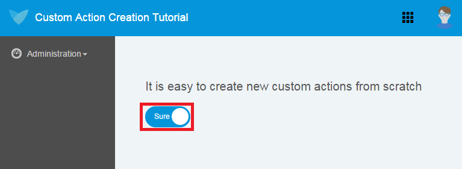

## Widget Inspection

Before we start with creating actions, we have to prepare our widget. Therefore we will build a prototype application, with only the widget we want to test in it. After that is done, we will run the application and inspect the HTML source code of the application with the browser development tools. You can open the development tools in **Mozilla Firefox** and **Google Chrome** by pressing <kbd>F12</kbd> or <kbd>Ctrl</kbd>+<kbd>Shift</kbd>+<kbd>I</kbd> on your keyboard. Your browser should now look similar to this.

**Chrome Development Tools**
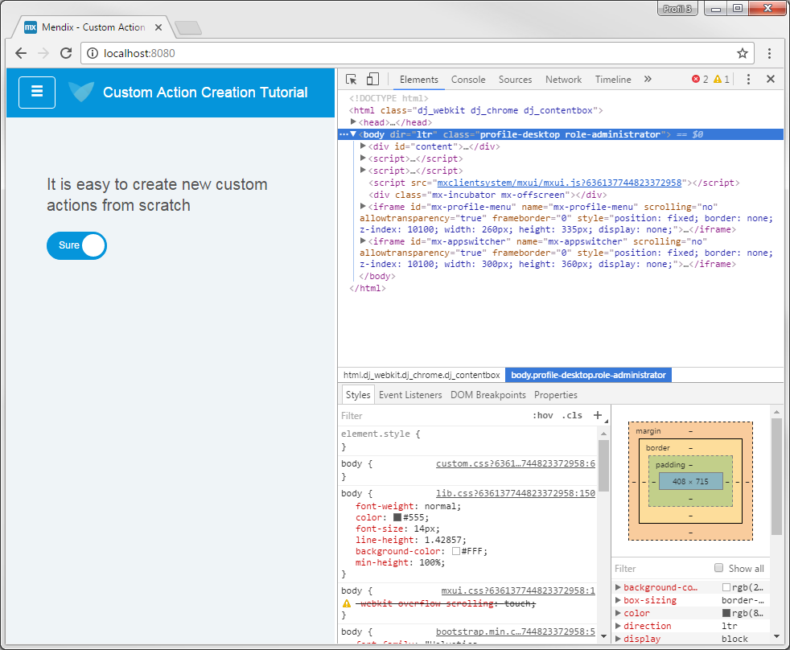   

**Firefox Development Tools**
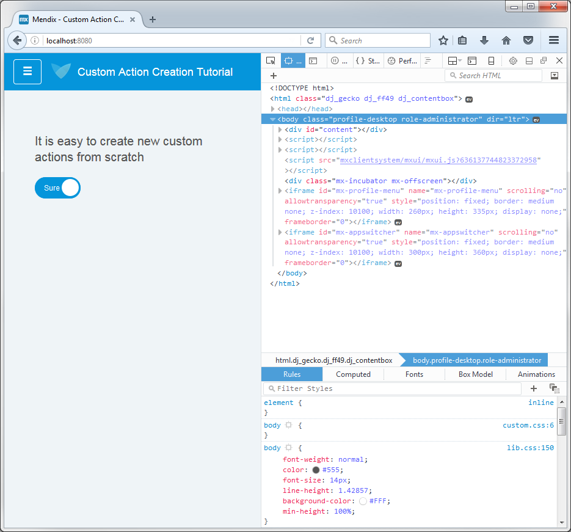   

In the upper right part of the development tools, you will find the page inspector [Firefox] or elements view[Chrome] respectively. With the page inspector or elements view you can examine or modify the HTML and CSS of your application. Search for the booleanSlider widget in the HTML source code by entering the widget name in the searchfield (If the searchfield is not visible, press <kbd>Ctrl</kbd>+<kbd>F</kbd> on your keyboard to open it). In our case, the name of the booleanSlider widget is *booleanSlider1*. Your browser should now highlight the widget in the HTML code of the application.Open all container nodes inside the widget. The code should now look like this.

```HTML
<div class="wgt-BooleanSlider mx-name-booleanSlider1" id="BooleanSlider_widget_BooleanSlider_0" data-mendix-id="27_3" focusindex="0" widgetid="BooleanSlider_widget_BooleanSlider_0" style="display: block;">
    <div class="wgt-BooleanSlider_control form-control btn btn-primary" data-dojo-attach-point="controlNode">
        <input type="checkbox" class="wgt-BooleanSlider__input" data-dojo-attach-point="inputNode" checked="">
        <div class="wgt-BooleanSlider__toggle">
            <span class="wgt-BooleanSlider__toggletrue" data-dojo-attach-point="trueNode">Sure</span>
            <span class="wgt-BooleanSlider__togglefalse" data-dojo-attach-point="falseNode">No</span>
        </div>
    </div>
</div>
```
We see, that the two possible string values of the boolean slider (*Sure* and *No*) are located inside two ``<span>-elements`` of the widget. But from the HTML code we cannot tell, which of them is the current active/visible one. If we inspect the CSS of the two ``<span>-elements``, we will see, that for the current active ``<span>`` the CSS **visibility property** is set to **visible**. For the other one it is set to **hidden**.

```CSS
.wgt-BooleanSlider__input:checked + .wgt-BooleanSlider__toggle > .wgt-BooleanSlider__toggletrue {
    visibility: visible;
}

.wgt-BooleanSlider__input:checked + .wgt-BooleanSlider__toggle > .wgt-BooleanSlider__togglefalse {
    visibility: hidden;
}
```
To get the current value of the booleanSlider widget, we will use the ATS sepecific [:clickable-Selector](Selectors#ats-selectors), which will select an element, whose visibility property is set to visible.

## Create the Custom Action

Now that we know, where the value we want to retrive, is located in the HTML code, we can go on with the custom action creation. Open **ATS** and go to **Repository**, switch to the **All Objects** tab and create a new action by clicking **Add Item**. A popup window will appear.

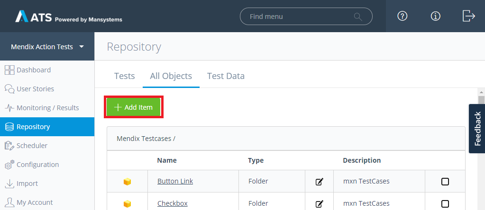

In that window you can choose wich type of item you want to create.
Choose **Action** and give it the name **"Get booleanSlider value"** and set **"Returns the current value of the booleanSlider as String"** as description. As best practice, you should always use desciptive names for your actions and give them a description. (For more informations read the [Best Practices](Best+Practices)). You can change the name and the description later on if you want. Now click on **Create**.

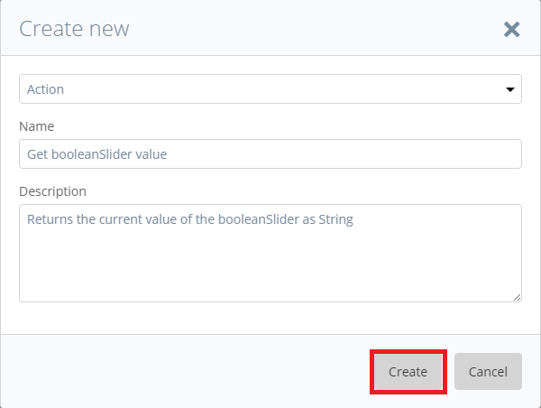

The **Edit Action** page should have openend, where you can edit your newly created **Get booleanSlider value** action.

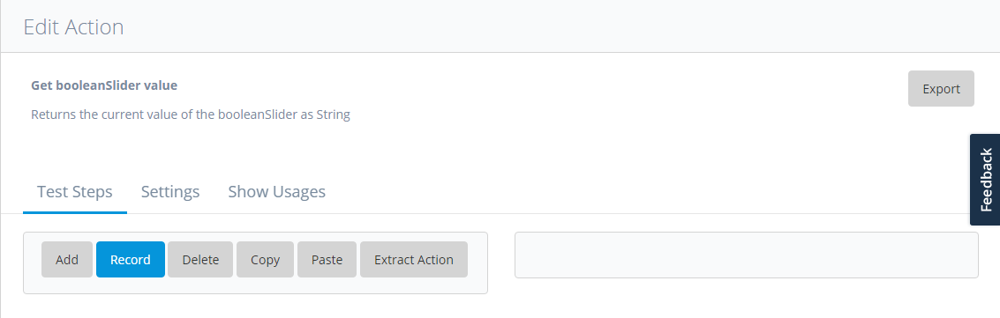

## Basic settings
It is good practice to start the development of a custom action with the basic input and output settings and go to the processing of those parameters from there. We will first determine which input parameters we will need and how we will return the result of our action, before we add subactions to our custom action.

### Setting Input parameters
Switch to the **Settings** tab.

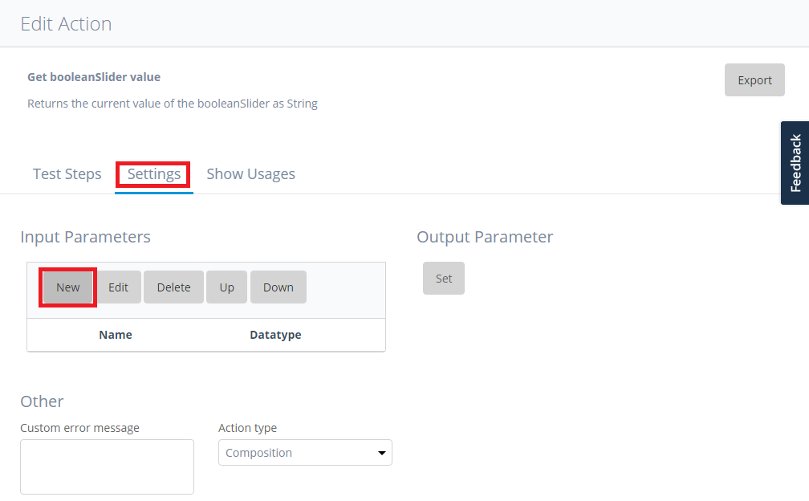

Now click on **New** in the **Input Parameters** section. The **Edit Input Parameter** dialog will open.
Set **Widget Name** as name of the input parameter and add the description **"The name of the booleanSlider widget"**.
Set **Datatype** to **String**, **Show as Password** to **No**, **Required/Optional** to **Required** and **Type** to **Default**. Click on **Save**.

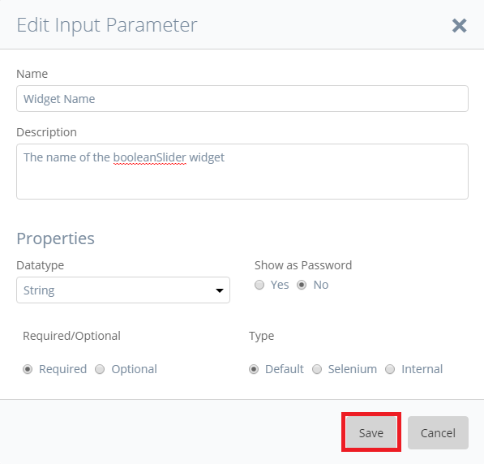

We have successfully added the Widget Name as input parameter for our action.

### Setting the Output parameter
We're not done yet. We have to add an output parameter to our action, to make the string value of the booleanSlider widget available to other actions. Click on **Set** in the **Output Parameter** section.

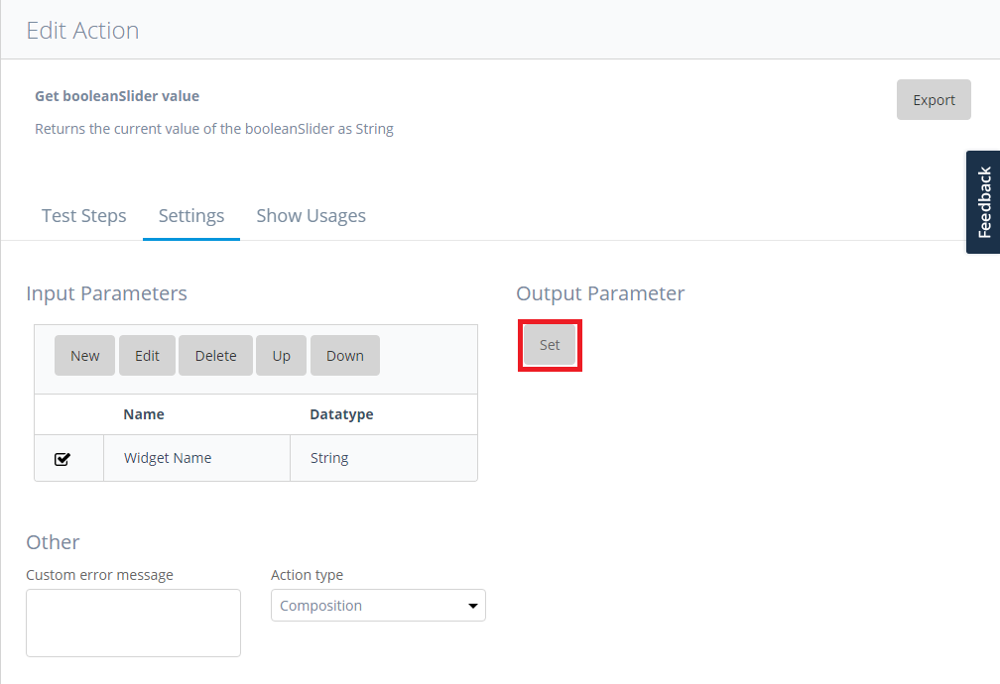

Input areas for the output parameter settings will appear. Now enter **Value** as name and **The current string value of the booleanSlider** as **Description** for the output parameter. Set the **datatype** to **String** and select the **Required** radiobutton.  

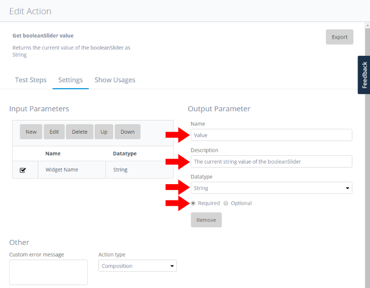

ATS will automatically save your changes as new settings for the output parameter of the action.

## Implementation
Now that we have completed the groundwork, we can add subactions to our custom action. Switch back to the **Test Steps** tab and click **Add**.

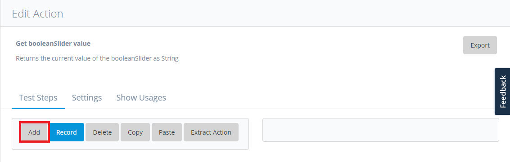  

The **Test Step Setup** dialog will open. Enter **"Select active span"** as description for the action in textfield 1 and **"Find Widget Child Node"**in textfield 2. Now press **Search**. The [Find Widget Child Node](Mendix+Actions/System/Find+Widget+Child+Node) action will appear in the search results table. Select the action, by clicking the corresponding row in the table and press **Save**. We have succesfully added the [Find Widget Child Node](Mendix+Actions/System/Find+Widget+Child+Node) action as subaction.

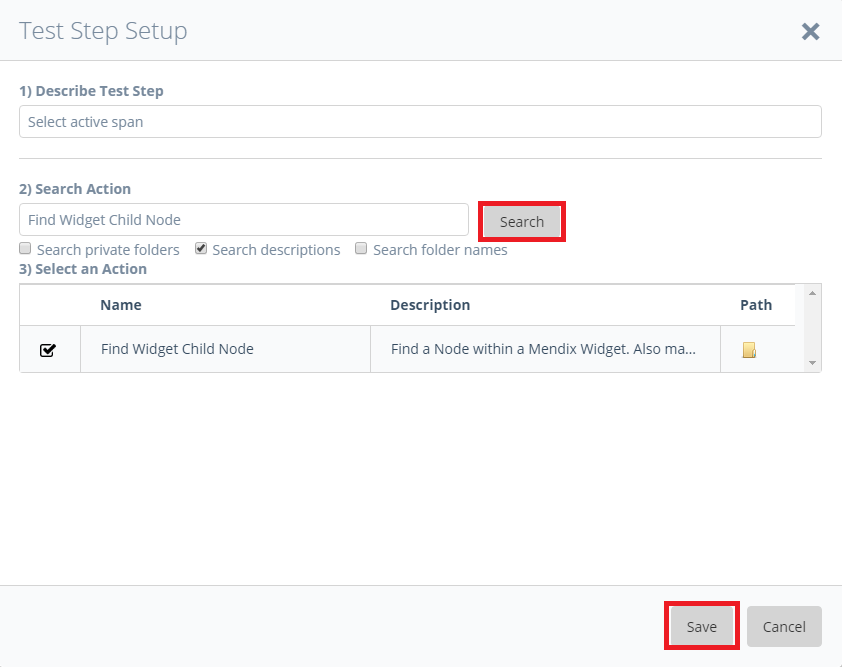

Next, we have to configure the Find Widget Child node subaction. Make sure that the subaction, we have just added, is highlighted in the step order table. On the right side of the page you will see the **Test Step Settings** section for the Find Widget Child Node action. Double click the **Widget Name** row in the **Input Values** table.

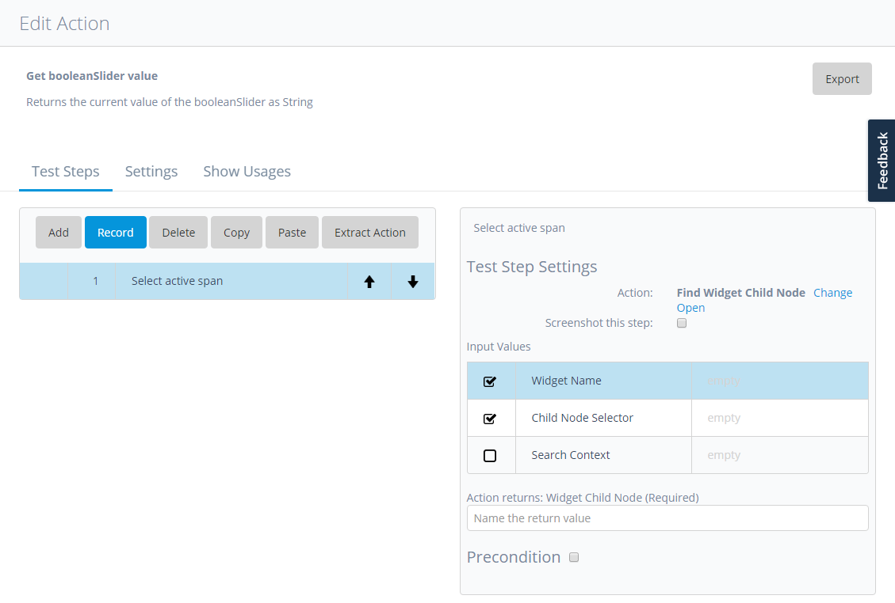

The **Edit Input Value** dialog will open. Select the **Action Input Parameter** category. Make sure that **Widget Name** is selected as Action Input parameter. Now click **Save**.

<div class="alert alert-info">
In the <b>Action Input Parameter</b> category you will find all of the input parameters you have created for the custom action.
</div>

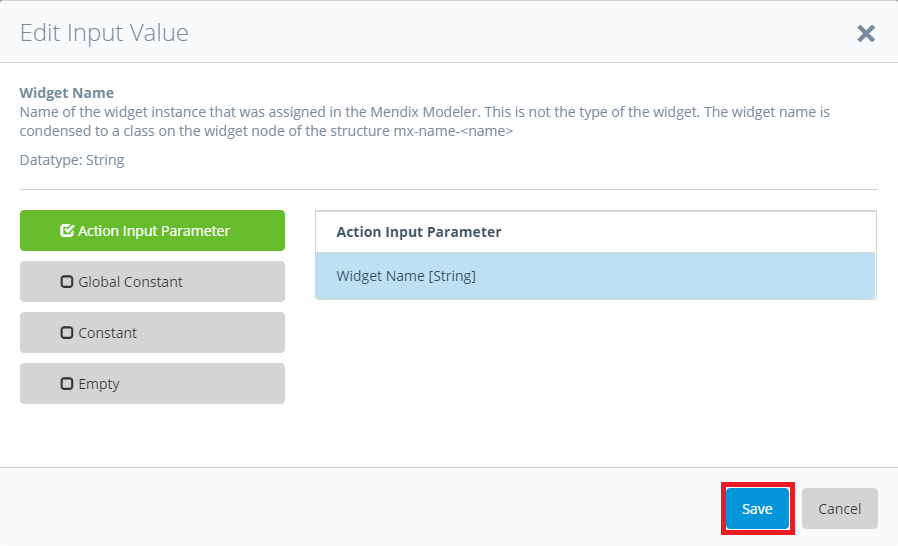

Next we have to add the selector for the current active span child node. To select the current active ``<span>-element`` of the booleanSlider widget, we will use the ATS *:clickable* pseudo-class selector. This selector will select a visible and clickable user interface element. Doubleclick the **Child Node Selector** row in the **Input Values** table. Just as for the widget name, the **Edit Input Value** dialog will open for the **Child Node Selector** parameter. Select the category **Constant** and enter **"span:clickable"** in the textarea on the right side. Now click **Save**.   


The [Find Widget Child Node](Mendix+Actions/System/Find+Widget+Child+Node) action will now select the first active ``<span>-element``, which is a child node of the widget with the name "Widget Name". To get the text inside of the ``<span>-element`` we will use the [Get Text](Selenium+Actions/Get/Get+Text) action. Click **Add** on the **Test Steps** tab and in the openend **Test Step Setup** dialog type **"Get Text"** in textfeld 2. Make sure, that **Search private folders** is checked. Select the **Get Text** row in the search results tab and click **Save**.

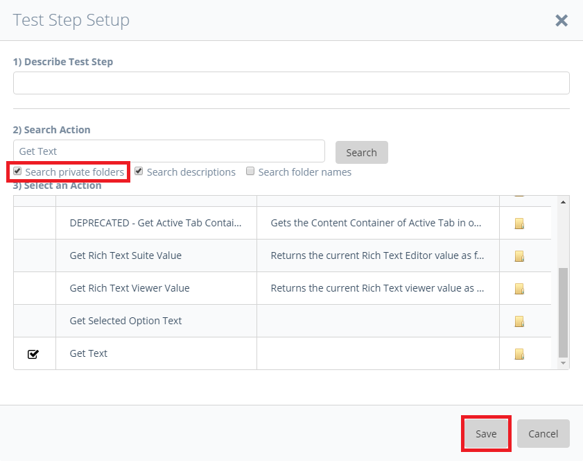

The output of the [Find Widget Child Node](Mendix+Actions/System/Find+Widget+Child+Node) action will automatically be set as input value for the [Get Text](Selenium+Actions/Get/Get+Text) action.

## Set Return Value
Next we have to set the output value of the [Get Text](Selenium+Actions/Get/Get+Text) action as return value for our custom action.
Click **Add** and search for **"Set Return Value"**. Add the corresponding action as subaction. After you have added the [Set Return Value](ATS+Core+Actions/Set+Return+Value) action, doubleclick the **"Value"** row in **Input Values** table. In the **Edit Input Value** dialog, click on the category **Test Step Output** and select **"#2 Value [String]"**. Click **Save**.
<div class="alert alert-info">
The <b>Test Step Output</b> category contains all output values of your test/action steps. You can identify the number of the test/action step by the number with the leading #      
</div>
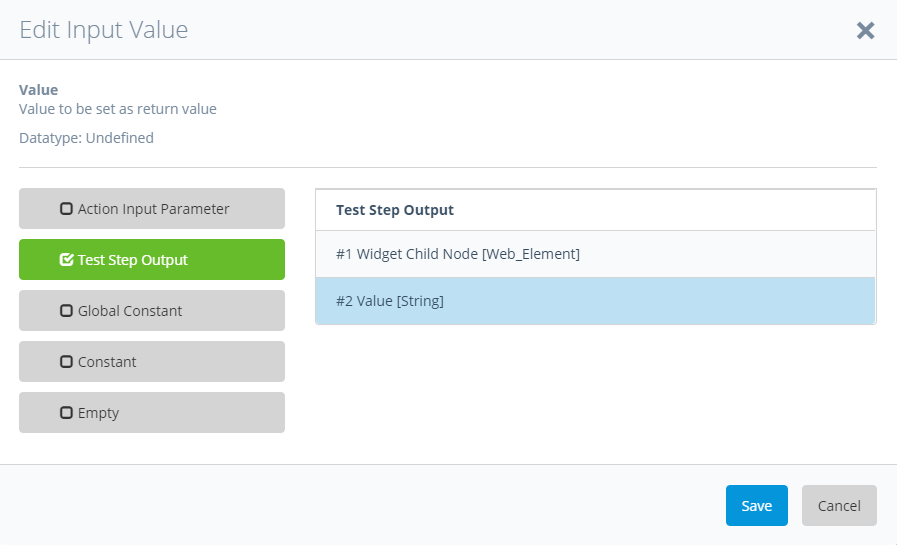

Now, that the return value is set, our **Get booleanSlider Value** action is done. But we have to test, if the value the action returns, is actually the right one, before we use the action in test cases for a real application.

## Testing the custom action

To test the custom action we've developed for the booleanSlider widget, we will use our prototype application and ATS standard actions.
Set the prototype application as *test application* in ATS (Read the [configuration section](Configuration#configure-test-applications) for more informations about setting applications as test applications). Now create a new test case. Let the test case open the prototype application and add our custom action to it. After that add [Assert Equals action](ATS+Core+Actions/Assert+Equals) and use the test step output of our action as input parameter 1 for the [Assert Equals action](ATS+Core+Actions/Assert+Equals). As input parameter 2, we will use the default value of the widget after launching the application, in our case *Sure*.

Always try to test your custom actions with ATS standard actions or JavaScript code. If you use other custom actions to evaluate the outcome of your new custom action, it is possible that you recieve false-positive results due to misbehaving custom actions.
