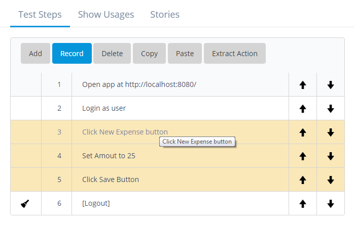
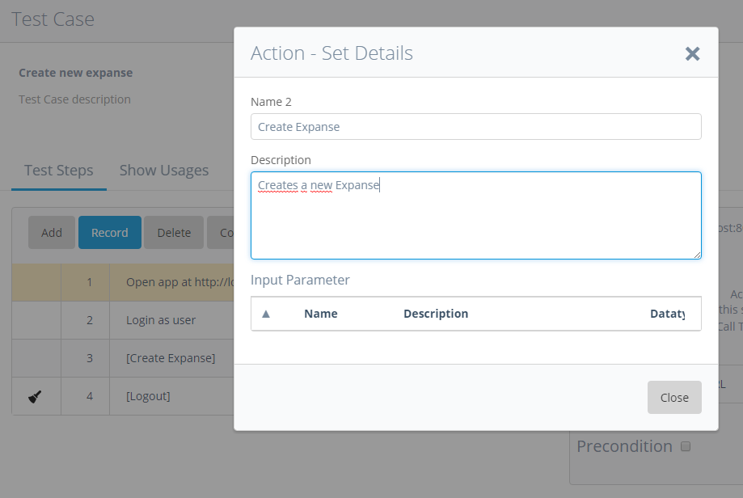
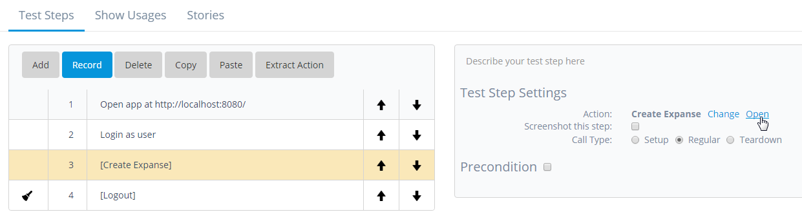
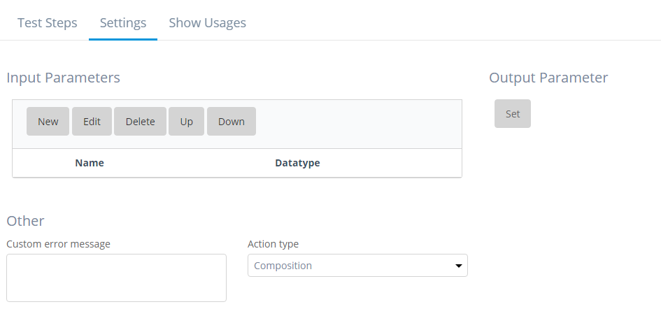
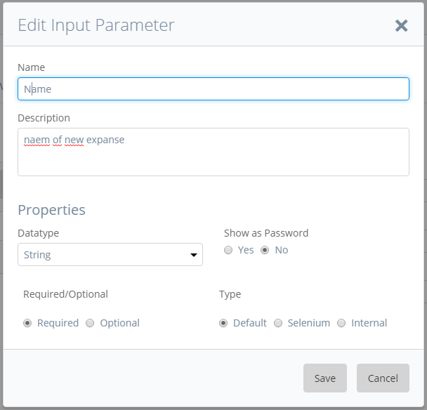
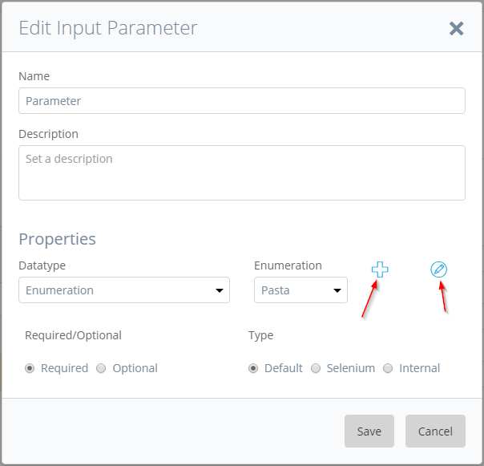
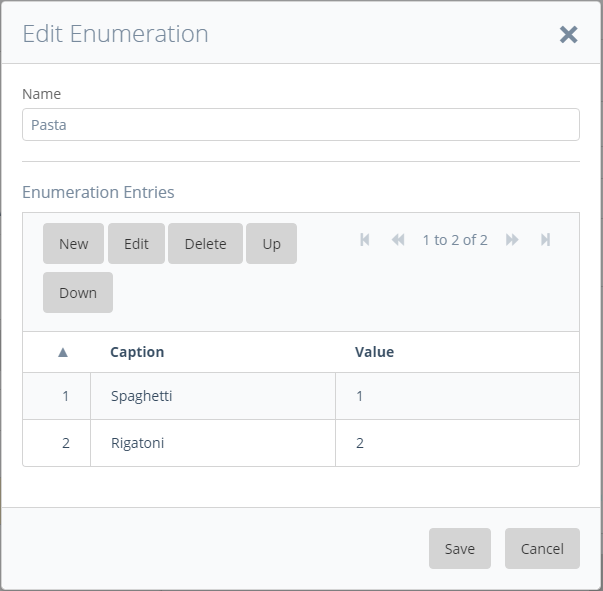
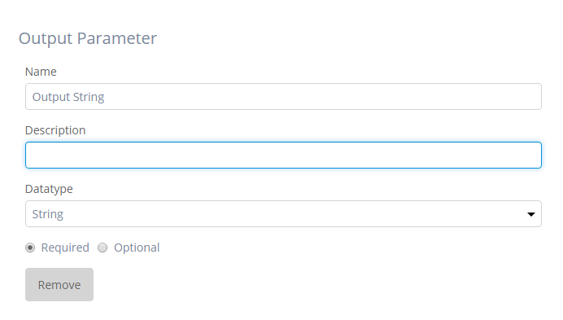
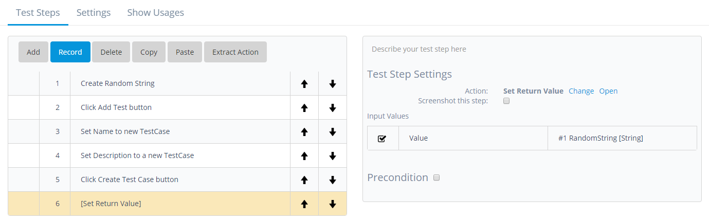

Based on the existing actions, you can build up your own actions (custom action). Also if you are fluent in JavaScript, you can add a whole variety of functionalities by using the generic “Execute JavaScript” action.

To create a custom action you have to first select the test steps you need to achieve your desired action in your test case:

Then extract the actions into one test step which contains your selected actions using the _Extract Action_ button.

Here you can give your new custom action a _Name_ and a _Description_. Click the _Close_ button to finish. You can now add your action to any test case like you would with any other action.

### **Changing Custom Actions**

When selecting a custom action you can click on the _Open_ button under the _Test Step Settings_ to go inside the custom action.

While inside your custom action, you can change the action just like you would in a test case. Additionally, you can set input and a output parameters for your action under the settings tab.

### Setting Input Parameters

By clicking _New_ under _Input Parameters_ you open the _Edit Input Parameter_ dialog where you set the properties of your new input parameter

When adding a new input parameter you have the following options:

**Name**

Sets the name of the input parameter

**Description**

Give a description of your input parameter

**Datatype**

Sets the datatype of the parameter

**Required/Optional**

Set if parameter is required or can be left open

**Show as Password**

Set if the parameter is readable in cleartext or hidden

**Type**

Set if parameter is used as an input for a selenium or internal function, should normally be **Default**

### **Enumerations**

When creating a new input parameter you can choose the datatype enumeration. An enumeration is a predefined list of values. When using an enumeration as an input parameter you can choose which value of the enumeration to use.

To create a new enumeration choose enumeration as datatype when creating a new input parameter and click the new button:

On the _Edit Enumeration_ dialog you can add new _Enumeration Entries_ to your enumeration.

Enumeration entries have two attributes:

**Caption**

The name of the entry that is shown when selecting an entry

**Value**

The actual value of the entry that is used in the test execution

### Setting an Output Parameter

Setting an output parameter works similar to setting an input parameter, the difference is that you can only have one output parameter per action. To set an output parameter click the _Set_ button under _Output Parameter_

For an output parameter you can set:

**Name**

Set the name of the output parameter

**Description**

Set the description of the output parameter

**Datatype**

Set the datatype of the output parameter

**Required/Optional**

Set if parameter is required to be set

After an output parameter has been set, this parameter needs to be returned manually by using the _Set Return Value_ action.



To return a value from an action you need use the _Set Return Value in a test step._



