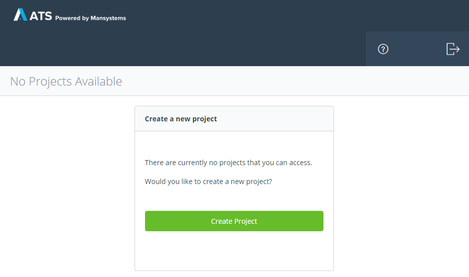
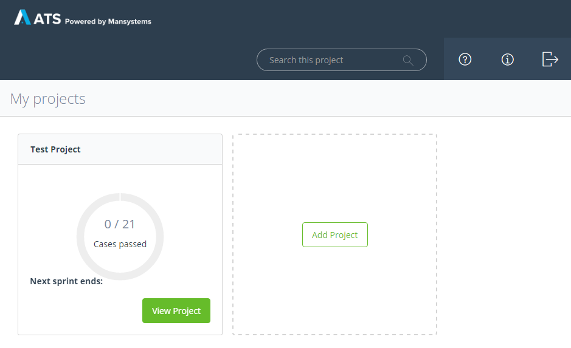
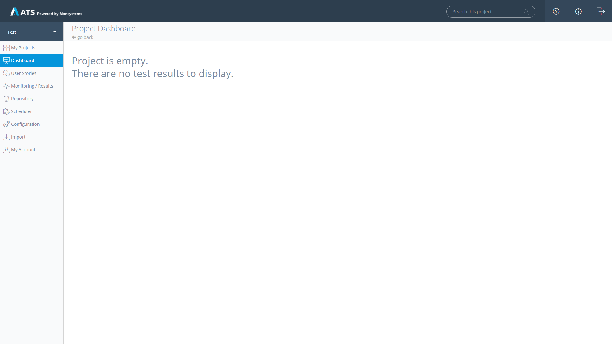
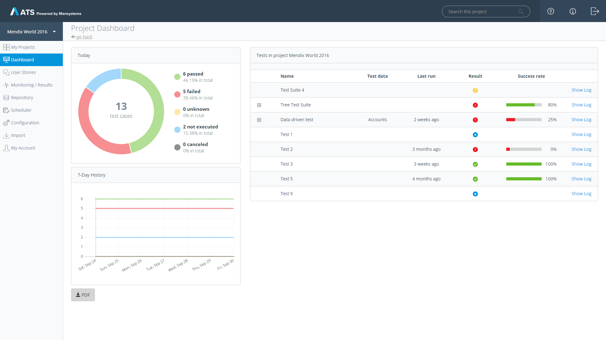
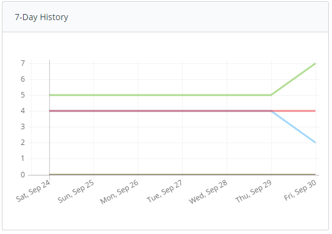
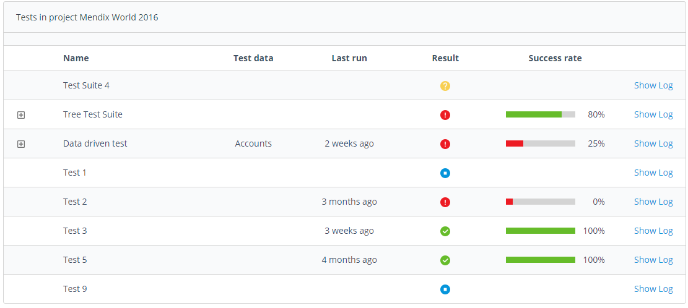
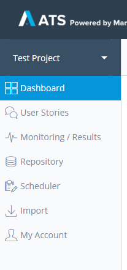

## Startpage

When you login to the ATS as a user you see the _My Projects_ page. If there are no projects on your account yet, you are prompted to create a new Project. For project creation see the ReferenceGuide_Projects page of the documentation.

If you already have active projects you can see directly how many test cases have passed in every project. You can now view a specific project or create a new one.

## Dashboard
When you open an empty project for the first time, the _Dashboard_ will look like this:

If you already have some active test cases in your **ATS project**, the _Dashboard_ will give you a summarized overview of the current state of your project at a glance.

The _Dashboard_ can be devided into four parts:
* Current state chart
* 7-Day history
* Test case treeview
* PDF export

The **current state chart** will show you the total number of test cases in your project. Furthermore it will present you the state of your test cases as numeral and as percentage.

The **7-Day history**

## Navigation

You can navigate your project using the navigation sidebar to the left of the screen.

Over the sidebar you can navigate to different pages of the ATS:

**Change current Project**

At the top of the sidebar you can switch between projects which are available on your account

**My Projects**

This button will bring you back to the startpage.

**Dashboard**

Gives an overview over the selected project

**User Stories**

Shows the user stories of the Mendix sprintr project connected to your ATS project

**Monitoring / Results**

Gives an overview over recent test runs and shows results

**Repository**

In the _Repository_ you can create new test cases, test suites and organize your objects in folders

**Scheduler**

On the _Scheduler_ page you can schedule test cases to run in regular intervals

**Configuration**

Change project settings, add Selenium hubs and add applications to test

**Import**

Import new/updated actions, test cases or test suites into your project

**My Account**

Change your username, email and password

## Different User Roles

ATS has a role concept that is applied on two different levels, the application and specific projects. There are two roles of users outside of projects:

**Administrators**

Administrators manage users and manage projects, see ReferenceGuide_Administration for more information

**Users**

Users work in projects, they create and run test cases

On the project level there are the roles of Project Administrator and Test Designer. The difference between the two is, that the Project Administrator can change the project settings and configure Selenium hbs and test applications. See ReferenceGuide_Configuration for mor info.
