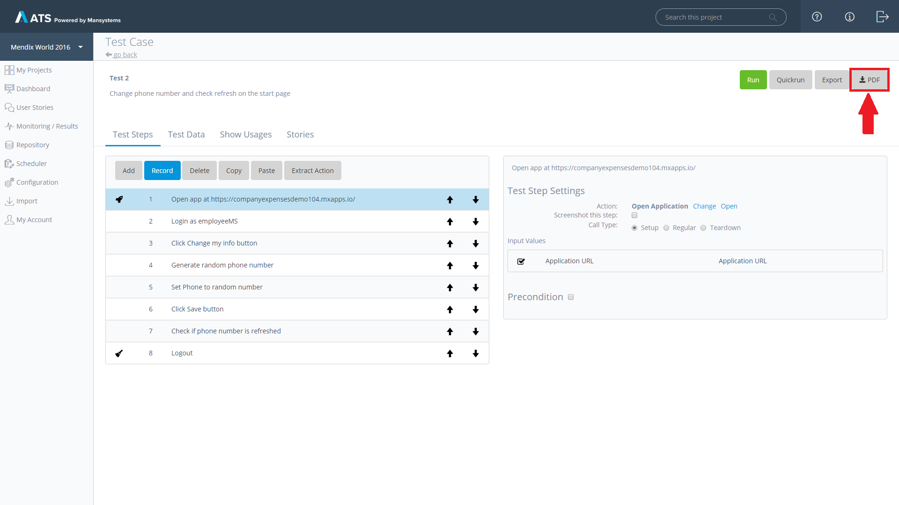
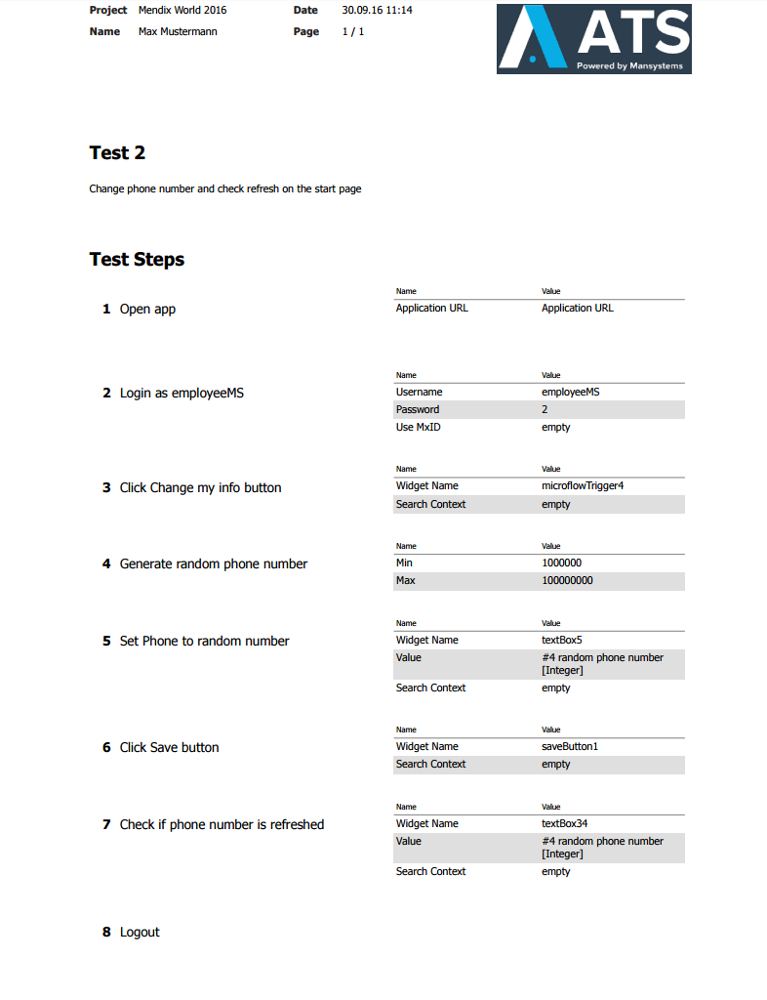

You can export the structure of your test case by pressing the *PDF*-button.

This will generate a detailed test case documentation, with all test steps in order and their input values.
The generated pdf document will look similar to this:

