## 1 Introduction

There are several reason for creating custom actions in ATS. Maybe you're using an App Store widget that is not yet supported by ATS, or you've created your own widget that you want to test. If that's the case, you will have to create a custom action for your widget.

Before you start with developing your own custom action, you should check if there is a standard action that does the job. Sometimes the standard actions work with unsupported widgets. If that is not the case, you should determine what your custom action should do and how the action should accomplish this.

In this how-to, you want to get the current value of the Boolean Slider App Store widget. If you use the [Get Checkbox Value action](../refguide-ats-1/get-checkbox-value), it only returns true or false for the current state of the Boolean Slider, so you have to develop your own custom action. The action shall retrieve the current value of the Boolean Slider as a string, in this case *Sure* or *No*. You have to determine, where the string is stored inside the HTML code and how you can get the current value from it. This image shows the widget inside a simple Mendix application:

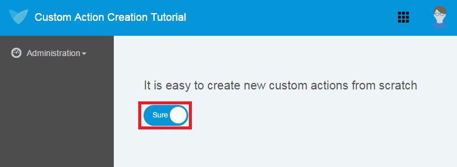

**This how-to will teach you how to do the following:**

* Create a custom action for a widget from scratch

## 2 Prerequisites

Before starting this how-to, make sure you have completed the following prerequisites:

* Know how to navigate through the HTML source code of a Mendix app inside a browser and how to inspect the CSS properties
* Know how to use CSS/JavaScript/ATS selectors (for more informations on selectors, see [Selectors](/ATS/refguide-ats-1/selectors) in the ATS Reference Guide)

## 3 Inspecting the Widget

Before you start with creating actions, you have to prepare the widget. Therefore, you will build a prototype application with only the widget you want to test in it. After that is done, you will run the application and inspect the HTML source code of the application with the browser development tools. You can open the development tools in **Mozilla Firefox** and **Google Chrome** by pressing <kbd>F12</kbd> or <kbd>Ctrl</kbd>+<kbd>Shift</kbd>+<kbd>I</kbd>. Your browser should look similar to these:

* Chrome Developer Tools:

    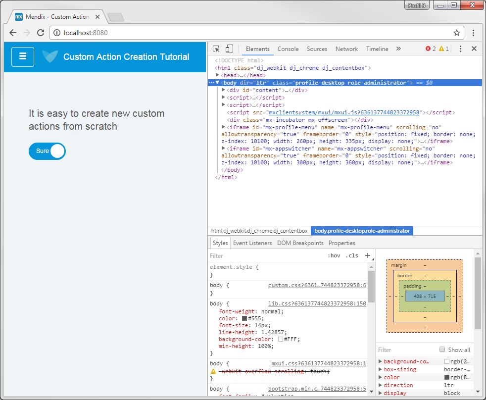   

* Firefox Developer Tools:

    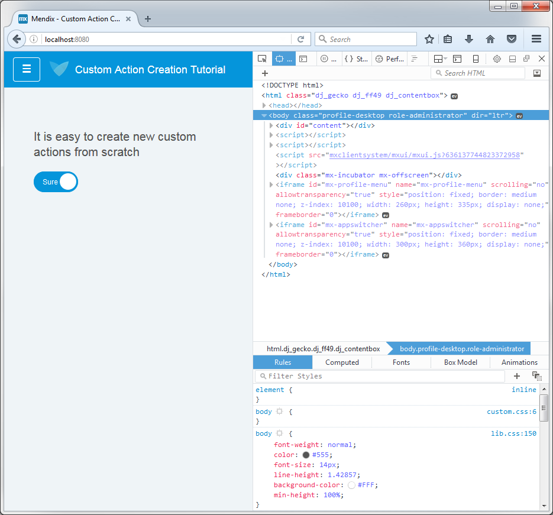   

In the upper-right corner of the developer tools, you will find the elements view in Chrome or the page inspector in Firefox. With the page inspector or elements view, you can examine or modify the HTML and CSS of your application.

Search for the Boolean Slider widget in the HTML source code by entering the widget name in the search field (if the search field is not visible, press <kbd>Ctrl</kbd>+<kbd>F</kbd> to open it). In this case, the name of the Boolean Slider widget is **booleanSlider1**. Your browser should highlight the widget in the HTML code of the application.

Open all the container nodes inside the widget. The code should look like this:

```HTML
<div class="wgt-BooleanSlider mx-name-booleanSlider1" id="BooleanSlider_widget_BooleanSlider_0" data-mendix-id="27_3" focusindex="0" widgetid="BooleanSlider_widget_BooleanSlider_0" style="display: block;">
    <div class="wgt-BooleanSlider_control form-control btn btn-primary" data-dojo-attach-point="controlNode">
        <input type="checkbox" class="wgt-BooleanSlider__input" data-dojo-attach-point="inputNode" checked="">
        <div class="wgt-BooleanSlider__toggle">
            <span class="wgt-BooleanSlider__toggletrue" data-dojo-attach-point="trueNode">Sure</span>
            <span class="wgt-BooleanSlider__togglefalse" data-dojo-attach-point="falseNode">No</span>
        </div>
    </div>
</div>
```

You can see that the two possible string values of the Boolean Slider (*Sure* and *No*) are located inside the two ``<span>-elements`` of the widget. However, from the HTML code you cannot tell which of them is currently active or visible. If you inspect the CSS of the two ``<span>-elements``, you will see that for the currently active ``<span>``, the CSS `visibility` property is set to `visible`, and for the other one, it is set to `hidden`:

```CSS
.wgt-BooleanSlider__input:checked + .wgt-BooleanSlider__toggle > .wgt-BooleanSlider__toggletrue {
    visibility: visible;
}

.wgt-BooleanSlider__input:checked + .wgt-BooleanSlider__toggle > .wgt-BooleanSlider__togglefalse {
    visibility: hidden;
}
```

To get the current value of the Boolean Slider widget, use the ATS sepecific [:clickable-Selector](/ATS/refguide-ats-1/selectors#ats-selectors), which will select an element whose visibility property is set to visible.

## 4 Creating a Custom Action

Now that you know where the value we want to retrive is located in the HTML code, you can go on with the custom action creation. 

Open ATS and go to **Repository** and the **All Objects** tab. Create a new action by clicking **Add Item**. A pop-up window will appear:

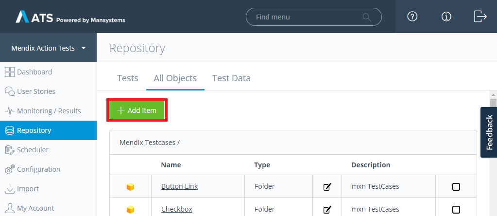

In this window, you can choose the type of item you want to create. Choose **Action**, give it the name *Get booleanSlider value*, and set *Returns the current value of the booleanSlider as String* as a description. As a best practice, always use desciptive names for your actions and give them a description (for more informations, see [Best Practices](/ATS/refguide-ats-1/best-practices)). You can change the name and the description later on if you want. Now click **Create**:

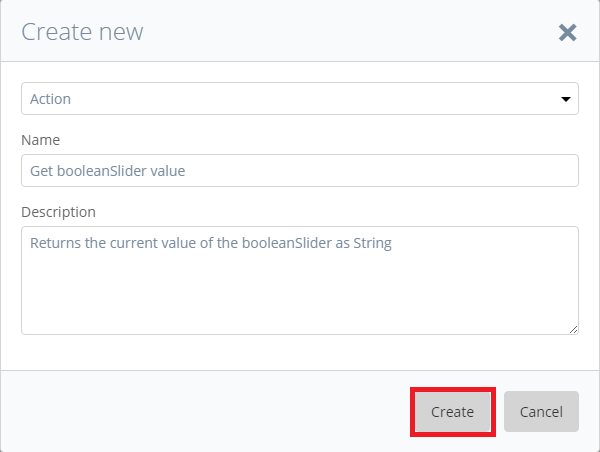

The **Edit Action** page should open, where you can edit your newly created **Get booleanSlider value** action:

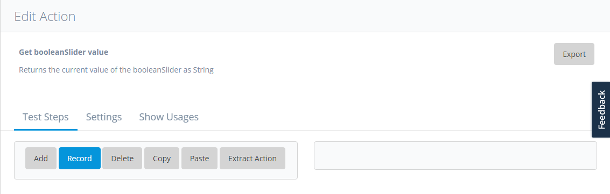

## 5 Basic Settings

It is good practice to start the development of a custom action with the basic input and output settings and go to the processing of those parameters from there. You will first determine which input parameters you will need and how you will return the result of your action before you add sub-actions to your custom action.

### 5.1 Setting Input Psarameters

Open the **Settings** tab:

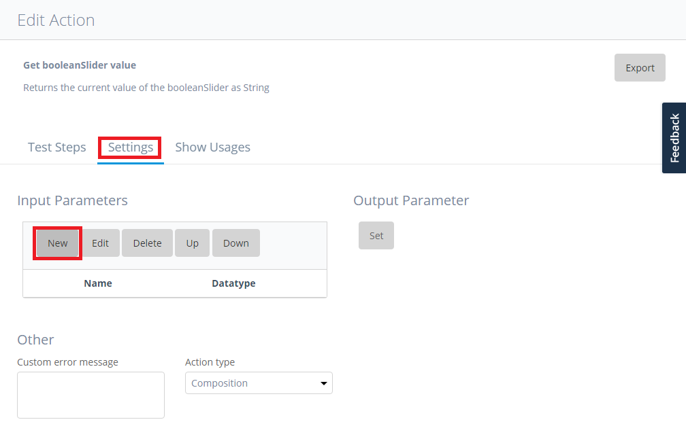

Click **New** in the **Input Parameters** section, and the **Edit Input Parameter** dialog box will open. Set *Widget Name* as name of the input parameter, and add the description *The name of the booleanSlider widget*.

Set **Datatype** to *String*, **Show as Password** to *No*, **Required/Optional** to *Required*, and **Type** to *Default*. Click **Save**.

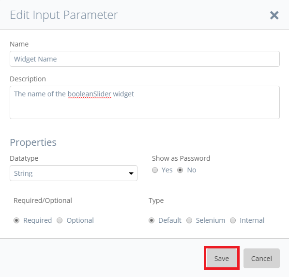

We have successfully added the widget Name as input parameter for our action.

### 5.2 Setting the Output Parameter

You now have to add an output parameter to your action to make the string value of the Boolean Slider widget available to other actions. Click *Set* in the **Output Parameter** section:

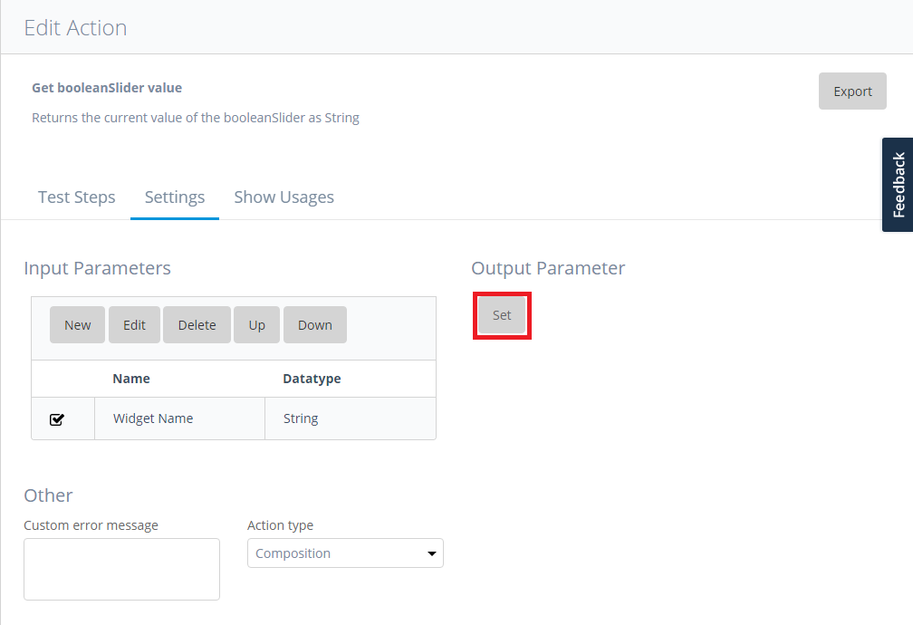

The input areas for the output parameter settings will appear. Enter *Value* as the name and *The current string value of the booleanSlider* as the **Description** for the output parameter. 

Set **Datatype** to *String* and select the **Required** radio button.

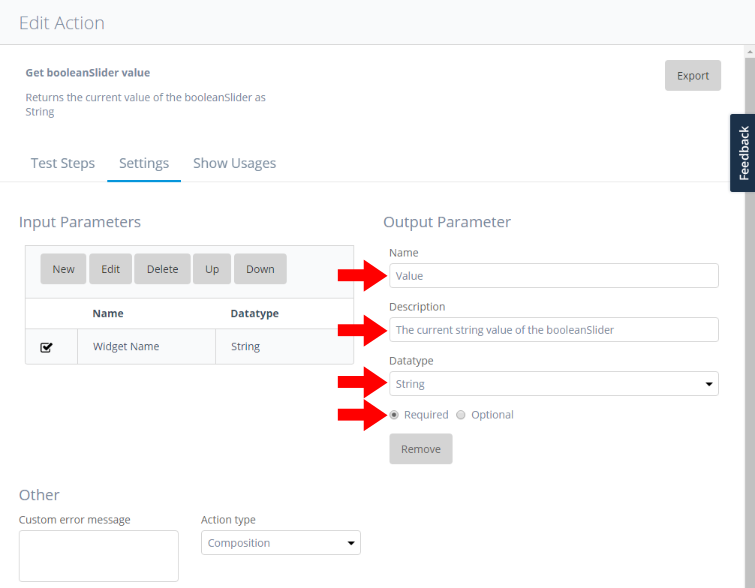

ATS will automatically save your changes as new settings for the output parameter of the action.

## 6 Implementation

Now that you have completed the groundwork, you can add sub-actions to your custom action. Switch back to the **Test Steps** tab and click **Add**:

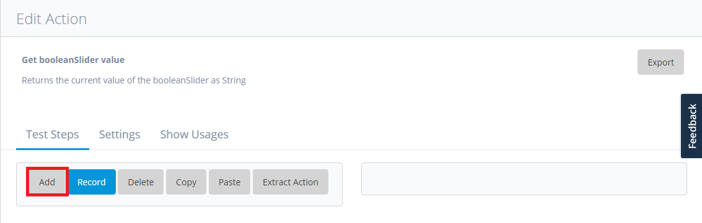  

The **Test Step Setup** dialog box will open. Enter *Select active span* for **Describe Test Step** and *Find Widget Child Node* for **Secarch Action**, then press **Search**. The [Find Widget Child Node](/ATS/refguide-ats-1/find-widget-child-node) action will appear in the search results table. Select the action by clicking the corresponding row in the table and click **Save**. You have now succesfully added the Find Widget Child Node action as a sub-action.

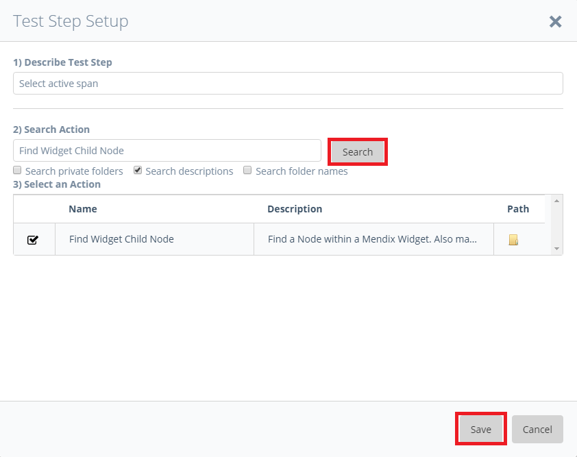

Next, you have to configure the Find Widget Child node sub-action. Make sure that the sub-action you have just added is highlighted in the step order table. On the right side of the page, you will see the **Test Step Settings** section for the Find Widget Child Node action. Double-click the **Widget Name** row in the **Input Values** table.

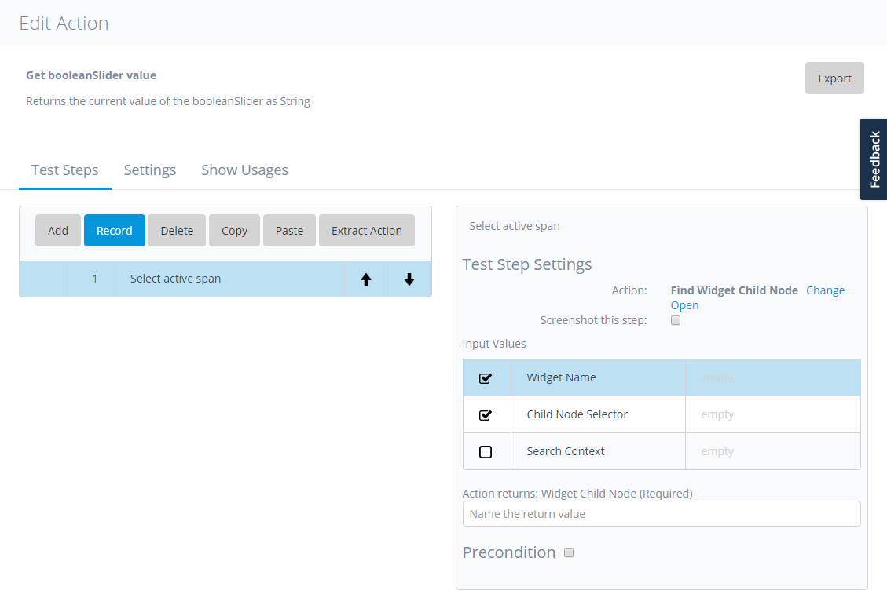

The **Edit Input Value** dialog will open. Select the **Action Input Parameter** category. Make sure that **Widget Name** is selected as the **Action Input Parameter**. Now click **Save**.

<div class="alert alert-info">

In the **Action Input Parameter** category, you will find all of the input parameters you have created for the custom action.

</div>

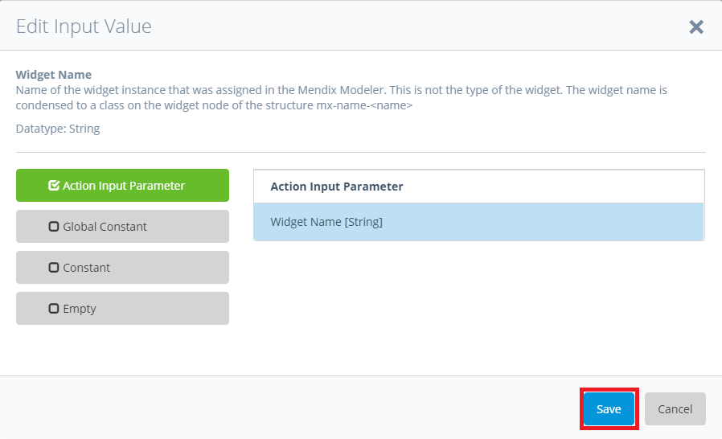

Next, you have to add the selector for the current active span child node. To select the current active ``<span>-element`` of the Boolean Slider widget, use the ATS `:clickable` pseudo-class selector. This selector will select a visible and clickable user interface element. Double-click the **Child Node Selector** row in the **Input Values** table. Just as for the widget name, the **Edit Input Value** dialog box will open for the **Child Node Selector** parameter. Select the category **Constant**, enter *span:clickable* in the text area on the right side of the screen, and click **Save**.

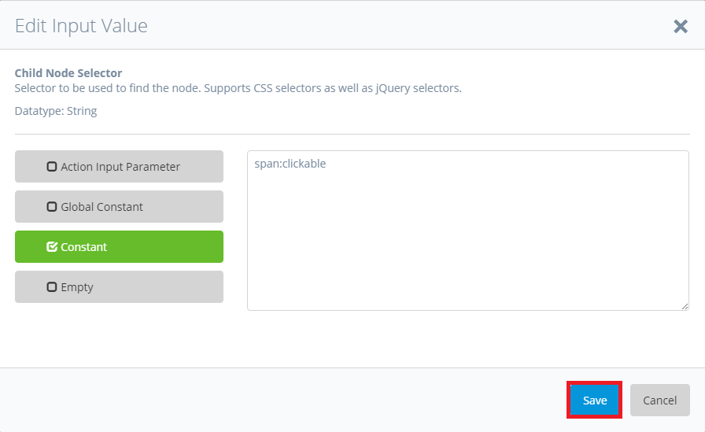

The Find Widget Child Node action will now select the first active ``<span>-element``, which is a child node of the widget with the name "Widget Name." To get the text inside the ``<span>-element``, you will use the [Get Text](/ATS/refguide-ats-1/get-text) action. Click **Add** on the **Test Steps** tab, and in the openend **Test Step Setup** dialog box, enter *Get Text* in the second text field.  Make sure that **Search private folders** is checked. Select the **Get Text** row in the search results tab, and click **Save**.

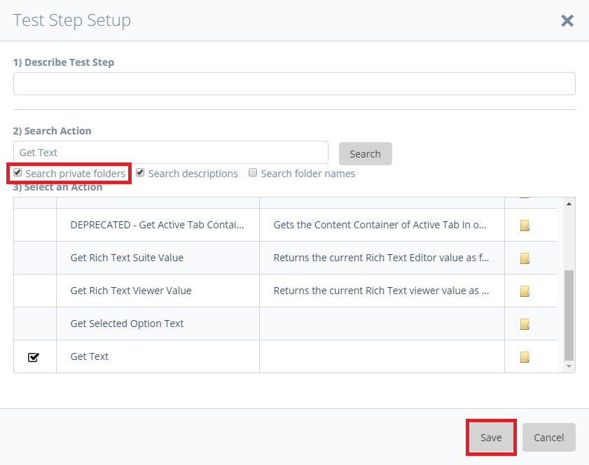

The output of the Find Widget Child Node action will automatically be set as input value for the Get Text action.

## 7 Setting the Return Value

Next, you have to set the output value of the Get Text action as a return value for the custom action.

Click **Add** and search for *Set Return Value*. Add the corresponding action as sub-action. After you have added the [Set Return Value](/ATS/refguide-ats-1/set-return-value) action, double-click the **"Value"** row in **Input Values** table. In the **Edit Input Value** dialog box, click the category **Test Step Output** and select **#2 Value [String]**. Click **Save**.

<div class="alert alert-info">

The **Test Step Output** category contains all output values of your test/action steps. You can identify the number of the test/action step by the number with the leading `#`.

</div>

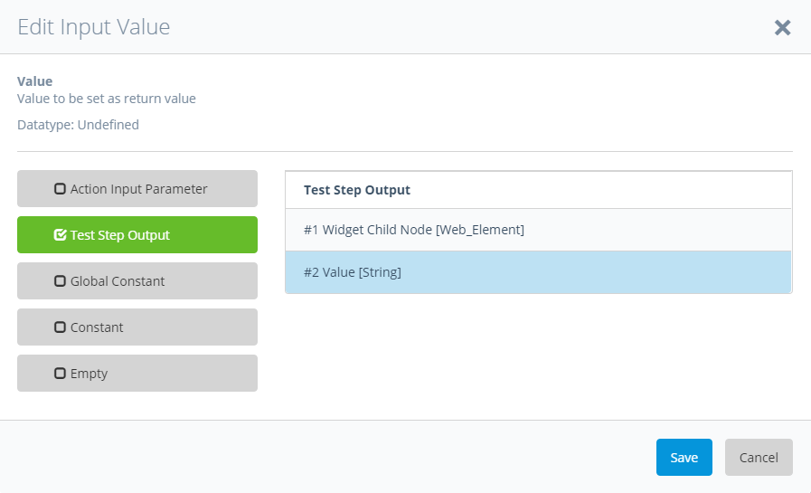

Now that the return value is set, your **Get booleanSlider Value** action is done. But you have to test if the value the action returns is actually the right one before you use the action in test cases for a real application.

## 8 Testing the Custom Action

To test the custom action you've developed for the Boolean Slider widget, you will use your prototype app and ATS standard actions.

Set the prototype app as **test application** in ATS (for details about setting applications as test applications, see [Configuration](/ATS/refguide-ats-1/configuration#configure-test-applications)). 

Now create a new test case. Let the test case open the prototype application and add the custom action to it. After that, add [Assert Equals action](/ATS/refguide-ats-1/assert-equals) and use the test step output of the action as input parameter 1 for the Assert Equals action. As input parameter 2, you will use the default value of the widget after launching the application (which in this case *Sure*).

Always try to test your custom actions with ATS standard actions or JavaScript code. If you use other custom actions to evaluate the outcome of your new custom action, it is possible that you will recieve false-positive results due to misbehaving custom actions.

