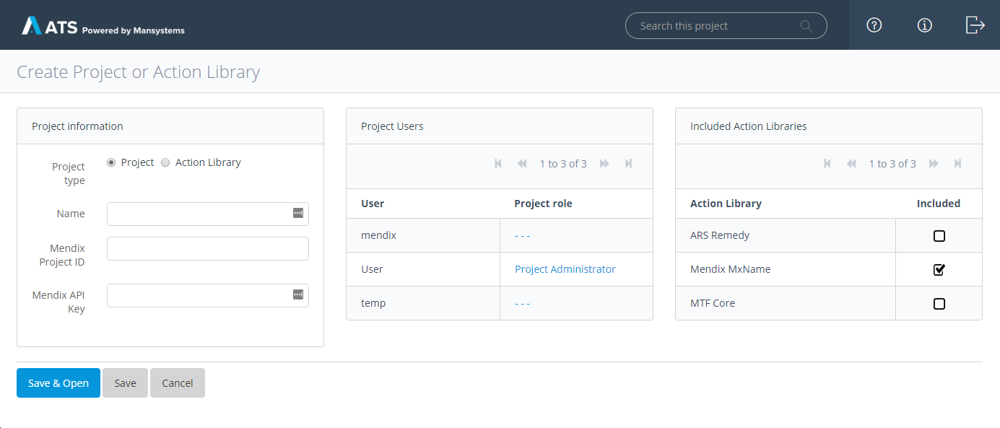
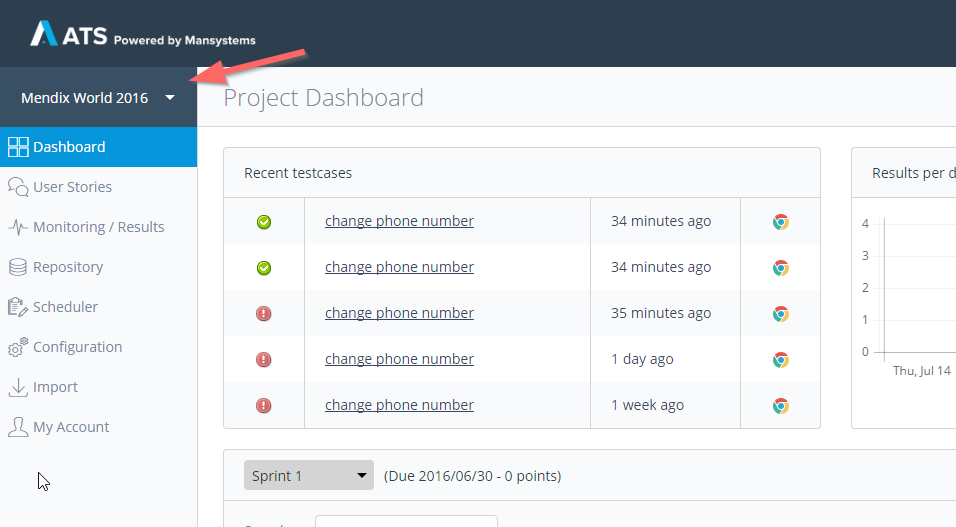
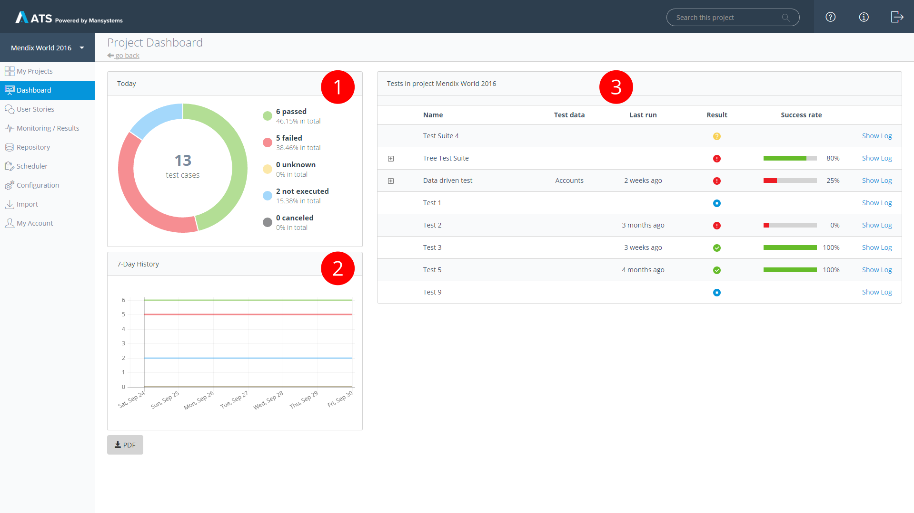

Creating new test cases – especially with recording – is a simple activity, so you can quickly end up with a lot. Especially when you test multiple applications or even have different teams, you don't want all data in one place. Eventually, you want to separate, structure and protect the data.

As of version 1.5 ATS supports projects and libraries as a layer on top of all data. All data – may it be test cases, test suites or actions – is enclosed in a project. This provides clear separation between data of different applications. Every user can create a new project and as its owner manage other user’s access to it.

## Action Libraries

There’s also a special type of project, the Action Library. Action Libraries are limited in that they can only contain actions. These actions can be shared with projects without the need to duplicate. Every project can include one or more Action Libraries and gets read access to all their actions. Thus, you can use them to create test cases in these projects. Your actions can be reused, but are still maintainable in a single place and are protected against unintentional modifications.

## Creation and Setup

Projects and Action Libraries can be created by users and administrators. A user clicks the _Add Project_ button on the application starting screen. Administrators create new projects/libraries from the project overview page they see after login. Users are automatically added as project administrators when they create a new project/library.

**Project type**

Determines whether you create a project or Action Library. The type cannot be changed after creation.

**Name**

The name of the project/library.

**Mendix Project ID**

The project ID of the Mendix sprintr project that you want to get your stories from.

**Mendix API Key**

The API key that you created in your sprintr project for ATS.

**Project Users**

The users that have access to your project and their role within. '---' means no access. The difference between the _Test Designer_ and _Project Administrator_ role is that the latter can change all settings on this setup screen.

**Included Action Libraries**

Check Action Libraries here to make their actions available to be used within your project.

## Switching between Projects

Since data is separated into projects, your work always happens inside a project. You cannot work in multiple projects at the same time. However, you can switch between all your projects at any time. To switch between projects you can use the project selector which you find above the navigation menu on the left.

## Project Dashboard

The **Project Dashboard** is the first page you see when you open a project.

There are three sections on the dashboard. The top-left section (1) shows you the number of all the test cases and their results. The lower-left section (2) shows a condensed view of the test results from the last seven days. The right section (3) shows you a detailed view of all the test cases and test suites. For more information, see [ATS](index).

## Sprintr integration

Projects in ATS can be connected to sprintr projects by Mendix. If done so, ATS will fetch all sprints and user stories from the project. This allows you to connect your test cases to user stories.
