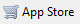
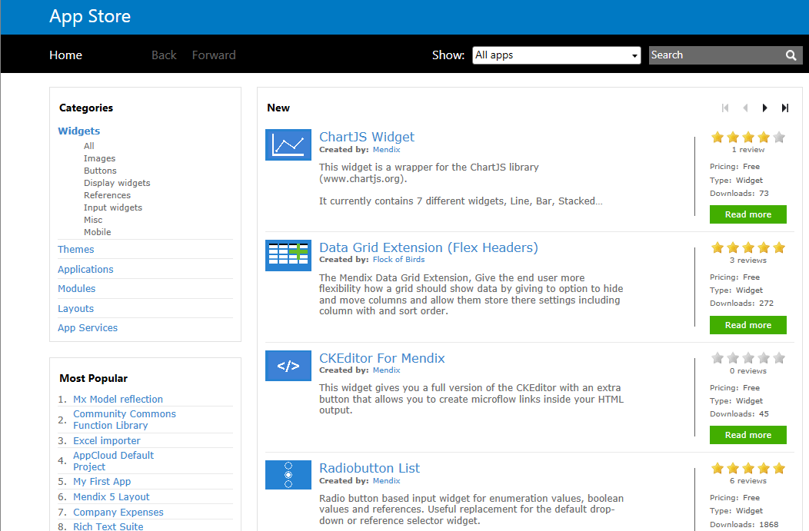
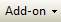

This section describes how to download an item from the Mendix App Store and add it to your project using the Mendix Modeler.

## 1. What type of content can you download with the Business Modeler?

Using the App Store from the Business Modeler enables you can download:

*   ready-to-use projects like examples or layouts.
*   components to enrich your project like modules, widgets or themes.

## 2\. How to install content from the App Store

1.  Open the **Mendix Modeler** and make sure you are logged in with your Mendix account credentials.
2.  Open the **project** in which you would like to install a component.
3.  Open the **App Store** in the Business Modeler by clicking the   icon in the menu bar.

    When viewing the App Store overview page you can browse through the content and search for a project or component you want to user in your project. You can use the search bar to find a specific project or component. It's also possible to browse App Store content using categories in order to get a general view of what is available to download. You can press the "Read more" button to view the item details and download option.
    
4.  Once you have found a project to download, or a component you would like to download into your project, you can click the "Download" button which you can find on the detail page of an item. By clicking the download button a project will be created instantly on your disk and opened in the Business Modeler. A module or widget will be downloaded directly into your project.

## 3\. Where did my download go?

What happens with your download depends on the type of content you download.

### Project/layout

Downloading a **project or layout** will create a new project structure on your disk at the location you enter. When pressing the download button a pop-window will appear, where you can specify how the project should be created.



You can't create a new project in an existing repository that is not empty.



### Widget

A **widget** downloaded from the App Store will be placed in the **widgets folder** in your project structure on disk. By adding the widget to the widgets folder it becomes available to your project in the Business Modeler. You can find and use the widget in your project by clicking the 'Add-On' icon in the toolbar. 
Deleting a widget should be done by removing the widget(mpk file) from your project's widgets folder on disk.

### Theme

Downloading a **theme** doesn't differ much from downloading a widget. Like a widget, a theme is added to the project structure on disk, this time in the **theme** **folder** of your project. A theme downloaded from the App Store will immediately be set as the active theme for your project. You can find out which theme is active for your project in the 'Settings' of your project.
Deleting a theme should be done manually by removing the theme(zip file) from your project's theme folder on disk.

### Module

A **module** downloaded from the App Store will store files on disk if the module contains files, e.g. userlib or resource files. Additionaly, the model part of the module will be added to your project file(mpr file) and will become visible in the project navigation window in the Business Modeler.
Before the Business Modeler starts downloading you have to specify if you want to add the module as a new or as an existing module. The difference is that for a new module, new entities will be created in your project. When overriding an existing module, the Business Modeler matches up the entities and their attributes with existing entities and their attributes by name. This prevents data from being lost when updating a module.

When a module contains entities or attributes of which the name is changed, the Business Modeler can't pick up these changes. This will result in new entities/attributes and deletion of renamed entities/attributes, and their respective tables/columns they represent in the database.

## 4\. Related content

*   [Install the SMTP email module](/howto6/Install+and+Configure+the+SMTP+Module)
*   [App Store Content Support](/appstore/App+Store+Content+Support)
*   [Install an App from the App Store](/appstore/Install+an+App+from+the+App+Store)
*   [App Store Approval Guidelines](/appstore/App+Store+Approval+Guidelines)
*   [App Store Content Support](/appstore/App+Store+Content+Support)
*   [Adding App Store content to your app](/appstore/Adding+App+Store+content+to+your+app)
*   [Adding App Store content to your app](/appstore/Adding+App+Store+content+to+your+app)
*   [Restoring a SQL Server database](/howto6/Restoring+a+SQL+Server+database)
*   [Mendix SQL Maintenance Plans](/howto6/Mendix+SQL+Maintenance+Plans)
*   [Setting up a new SQL Server database](/howto6/Setting+up+a+new+SQL+Server+database)
