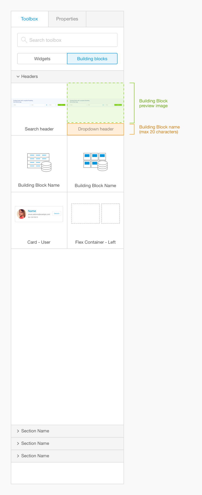
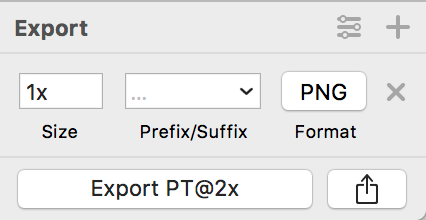
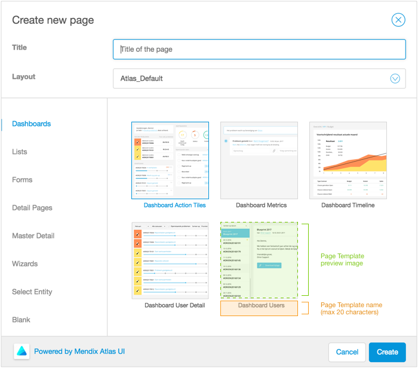
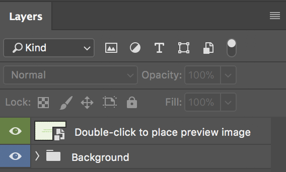

## Creating Custom Preview Images for Your Building Blocks and Page Templates

To make your custom UI resources easy to browse, be sure to create custom preview images for your Building Blocks and Page Templates. We’ve provided downloadable templates in ```.sketch``` and ```.psd``` formats, available on [https://atlas.mendix.com](atlas.mendix.com).


### Creating Your Own Building Blocks Preview Images



#### Creating a Preview Image in Sketch
Download the [Atlas UI image templates resources pack](https://atlas.mendix.com/p/resources/7881299347899269). Open the Sketch file ```BB_previewimage.sketch```. This file contains two artboards. The first artboard shows an example of how custom preview images look in the Web Modeler's toolbox. The second artboard is where you place your image. Hide the layer called "Template" and insert your preview image into the "Building Block preview” folder.

When you are happy with your image, select your artboard. In the Export dialogue that appears in the bottom right of your screen, make sure the preferences are set to size: 1x, format: PNG. Export your image.



#### Creating a Preview Image in Photoshop
Download the [Atlas UI image templates resources pack](https://atlas.mendix.com/p/resources/7881299347899269). Open the Photoshop file ```BB_previewimage.psd```. Double click on the smart object in your layers panel. Replace the contents of the folder with your Building Block preview image. Save your changes and navigate back to your template file. If you are happy with your image, export your file as a ```.png``` file.


__Creating a Preview Image in Another Image Editor__
You can also create your preview image in a different image editor of your choice. Building Blocks preview images should be 280px wide and 216px tall. Save the image as a ```.png``` file.

### Creating Your Own Page Templates Preview Images



#### Creating a Preview Image in Sketch
Download the [Atlas UI image templates resources pack](https://atlas.mendix.com/p/resources/7881299347899269). Open the Sketch file ```PT_previewimage.sketch```. This file contains three artboards. The first two artboards show examples of how Page Template preview images look in the Web Modeler. The third artboard is where you place your image. Hide the layer called "Template" and insert your preview image into the "Building Block preview” folder.

When you are happy with your image, select your artboard. In the Export dialogue that appears in the bottom right of your screen, make sure the preferences are set to size: 1x, format: PNG. Export your image.


#### Creating a Preview Image in Photoshop
Download the [Atlas UI image templates resources pack](https://atlas.mendix.com/p/resources/7881299347899269). Open the Photoshop file ```PT_previewimage.psd```. Double click on the smart object in your layers panel. Replace the contents of the folder with your Page Template preview image. Save your changes and navigate back to your template file. If you are happy with your image, export your file as a .png file.



__Creating a Preview Image in Another Image Editor__
You can also create your preview image in a different image editor of your choice. Page Template preview images should be 255px wide and 255px tall. Save the image as a ```.png``` file.
