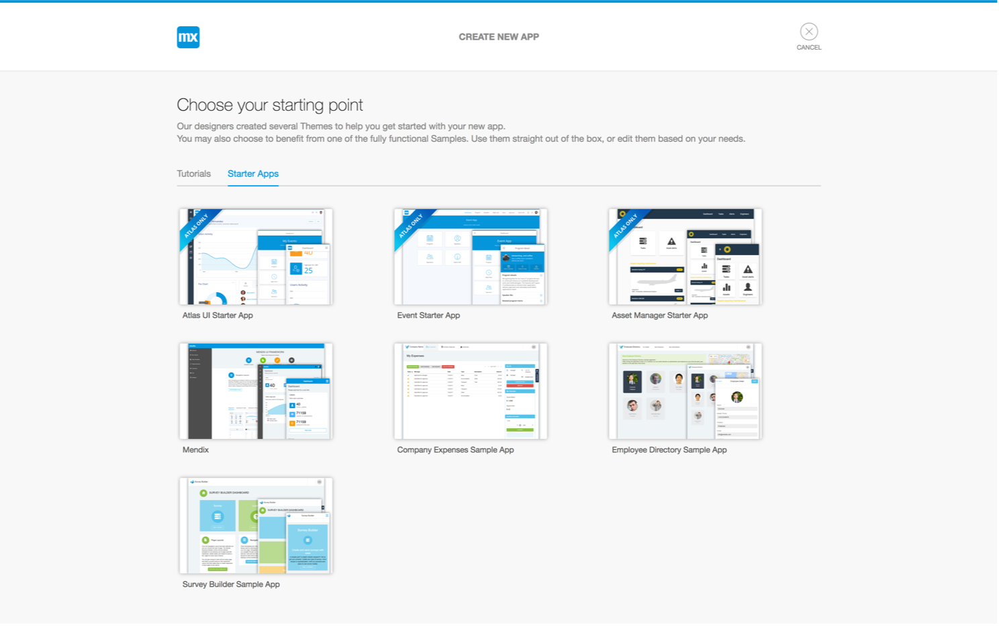
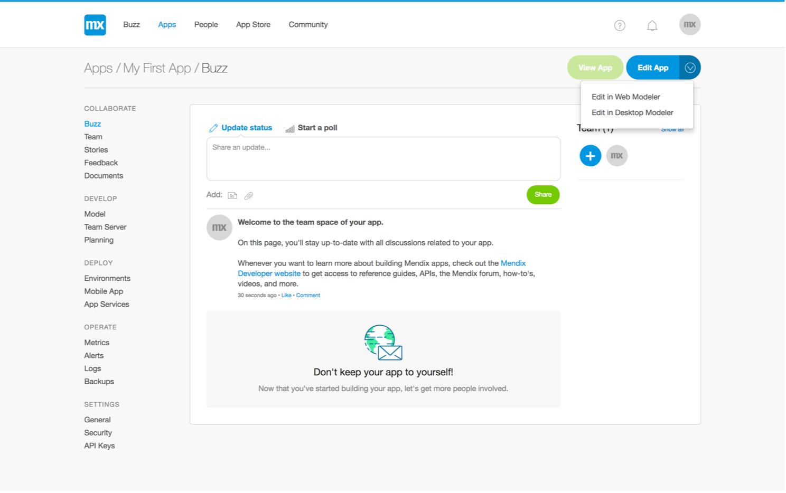
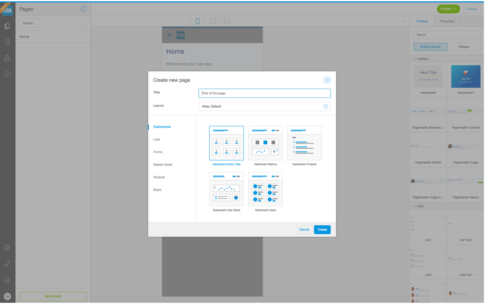
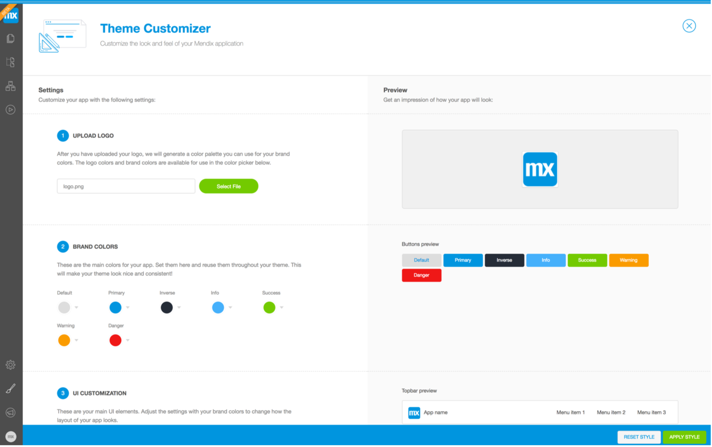

## 1 How to's

# 1.1 The Basics

1. Choose your starter app

There are a number of apps that are Atlas ready - select your favorite to get started.

2. Edit your app in the web modeler

You now have access to your App Buzz. From here you can open the web modeler.

3. Explore the web modeler

Your app is ready to be built. In your toolbox, you will find all the building blocks and widgets you need to customize your app.

4. Choose a page template

A good way to get started is to create a new page. Click on the Pages icon in the left navigation bar, press the New Page button, and choose a suitable page template. You can customize this template however you want.

5. Customize your theme

Click on the Theme Customizer icon in the left navigation bar. Style your app with custom branding, colors, and typography.

