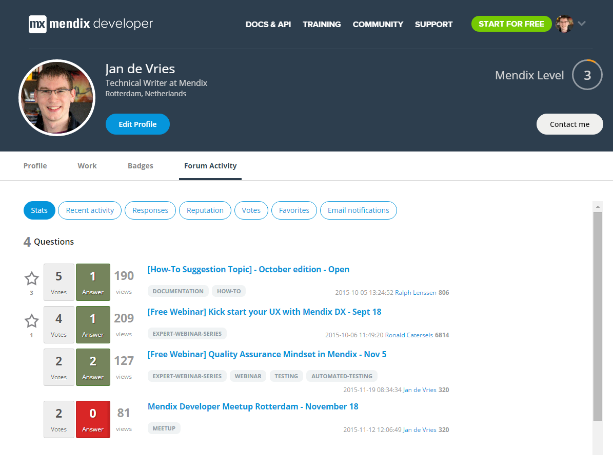

How to set up your profile

So you’ve decided to check out your new Mendix profile page, and found it suspiciously empty. Don’t worry, I’m here to help you set up your profile, so you can show the world what a real Mendix Developer looks like!

## My Profile

The first thing you want to check out is the [My Profile](https://developer.mendixcloud.com/link/profile) page. To get there, mouse over your picture in the navigation bar and click **My Profile**. This overview page shows a summary of your profile, including your summary, your skills, industry experience, and badges.

When you access your profile page through the My Profile link it is automatically in edit mode, so you can easily update your profile. Click the Edit button  to add a summary, new skills, industry experience, or add new social profiles on the right.

If you access your profile through the Leaderboards or Developers page, it will display your public profile. Click the Edit Profile button to go into edit mode.

## Merge your accounts

Since the release of My Community Profile you can merge your old Mendix account(s) into your current Mendix account. This action will combine all your hard-earned points, certifications and achievements in your efforts to climb the leaderboards.

How can I merge my accounts? With three quick and easy steps!

1.  Go to [your profile](https://developer.mendixcloud.com/link/ownprofile/)
2.  Make your profile public.
3.  Click the feedback button and add the text: I would like to merge the accounts with email address XXX, XXX and XXX to the account which I provided this feedback item.

We’ll take things from there and notify you when the accounts have been merged.

Note: with this action we only combine the accounts. We don’t deactivate the old account(s). This should be done by that company’s administrator.

## My Work

Add your Mendix project experience on this page by clicking on New Project and filling out the form. You can add a screenshot that will be shown on the My Work page, and will be visible to other developers when they visit your Work page.

## My Badges

You can’t actually change anything on this page, but you can view your earned badges, and which ones you can still earn.

 [Learn how to earn badges](https://developer.mendixcloud.com/link/faq)

## Make your profile public

When you’re done setting up your profile, click the big blue **Make my profile public** button.

Make sure you meet all the requirements before making your profile public:

*   You entered a summary
*   You added at least 1 skill
*   You added at least 1 industry experience item
*   You have 100 or more points

## My Forum Activity

This page shows your forum questions, answers, points, and labels. You can also view your recent activity, responses, reputation, votes, favorites, and email notification (topics you’re subscribed to).

 [Visit the Mendix Forum](https://mxforum.mendix.com/)
