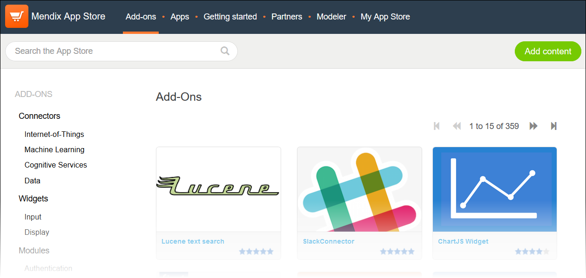
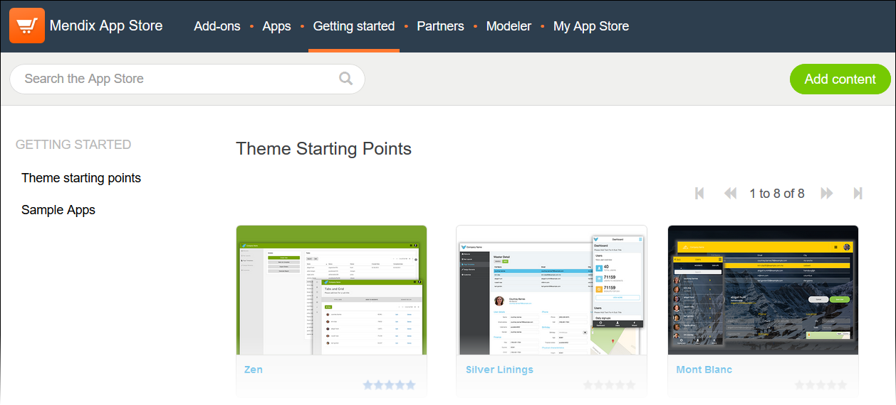
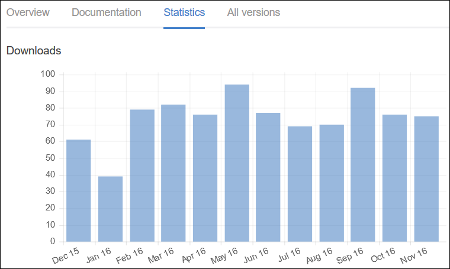
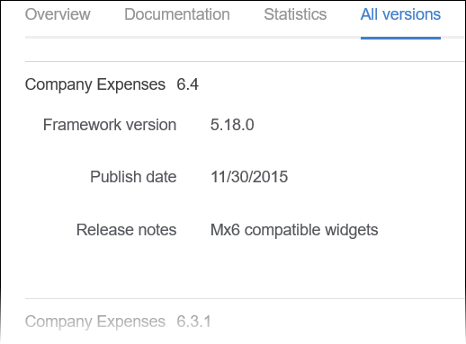
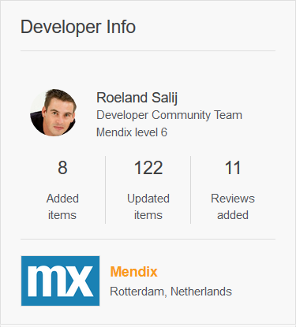
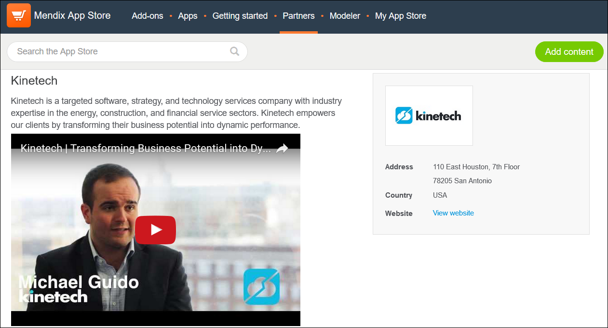
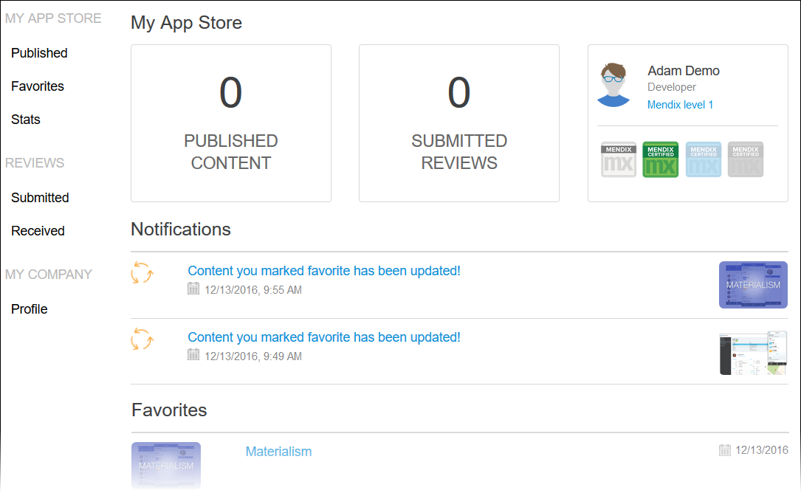

## 1 Introduction

The [Mendix App Store](https://appstore.home.mendix.com/index3.html) is a vibrant marketplace containing complete apps that can be used right away as well as components (such as widgets and modules) that can be used to build custom apps more quickly. In the App Store, you can browse all the content, get what you need, and share the content you have created.

This document describes all the different sections of the App Store.

## 2 App Store Home Page

The home page of the Mendix App Store presents various content categories:

Category | Description 
--- | ---
**Featured** | Presents some of the most important and useful App Store content as determined by Mendix (think of it as a "staff picks" section).
**Connectors**, **Modules**, **Widgets** | These are some of the add-on categories and sub-categories (for example, Internet of things and Authentication) that are included on the **Add-ons** tab.
**New content** | Lists the most recent content uploaded to the App Store.
**Recent updates** | Lists the most recently updated App Store content.
**Most popular** | Lists the App Store content that has been downloaded the most in the past seven days.
**Reviews** | Lists the most recent reviews of App Store content along with the author and date of the review. Clicking the name of the review author will bring you to his or her Community Profile. Clicking the title of the content will allow you to see the details of what was reviewed.
**Top App Store contributors** | Lists the top 10 App Store contributors of the last 30 days. Clicking the name of the developer will bring you to his or her Community Profile. Clicking **View full leaderboard** will take you to the leaderboard site, where you can learn more about the Mendix Community point and badge system.

To see a detail page for each category, click **View more** (or **View full leaderboard**).

## 3 Content Tabs

### 3.1 Add-Ons and Apps Tabs

Much of the App Store content is located on the **Add-ons** and **Apps** tabs. You can browse the **Add-ons** tab for connectors, widgets, modules, themes, app services, and add-on examples:

You can browse the **Apps** tab for various solutions:

Clicking an add-on or an app will bring you to the content item's information page (for more information, see [4 Item Information Page](#ContentDetailsPage)).

### 3.2 Getting Started Tab

On the **Getting started** tab of the App Store, there are the **Theme starting points** and **Sample apps** content sections:

In the **Theme starting points** section, you can browse the different themes you can use as starting points for your app design.

In the **Sample apps** section, you can browse different project and app starting pioints for your development.

Clicking a theme or a sample app will bring you to the content item's information page (for more information, see [4 Item Information Page](#ContentDetailsPage)).

## 4 Item Information Page

For each piece of App Store content, there is an information page with the sections described below.

### 4.1 Item Details Section

The top of the information page for each add-on and app presents the following item details:

* The **Name** and **Category** of the item
* The review average (in stars) and the number of reviews
* The number of times the item has been downloaded
* A heart for favoriting the item (so it will appear in your list of favorites on the [My App Store tab](#MyAppStore))
* The following buttons (depending on the type of item and what the developer added to share):
    * **Preview** – click this to preview more information or a demo about the content
        * This is only available if the developer has included a demo URL when sharing the content (for details on sharing content, see [How to Share App Store Content](share-app-store-content))
    * **Open in Modeler** – click this to open the content directly in the Modeler
        * This is only available for **Theme starting points** (available on the [Getting Started tab](#GettingStartedTab))
    * **Download** – click this to download the content 
        * This is only available for content that has a file attached (meaning, all shared Modeler content, but not promotions; for details on sharing Modeler content, see [How to Share App Store Content](share-app-store-content))
        * For details on how to import downloaded App Store content into the Modeler, see [How to Import and Export Objects](/howto6/importing-and-exporting-objects)
        * Please note that the best practice is to download content from the App Store that is accessible in the Modeler, because it then downloads directly into the Modeler (for details, see [How to Use App Store Content in the Modeler](use-app-store-content-in-the-modeler))

### 4.2 Item Details Tabs

The details page for each add-on and app presents the following item information tabs:

* The **Overview** tab, with the following sections:
    * **Description** – a description of the item
    * **Screenshots** – screenshots of the item
    * **User Reviews** – user reviews of the item
        * To leave a review for the item, click **Add Review** – a section will open up where you can add text, rate the content, and submit the review (your reviews will be listed on the [My App Store tab](#MyAppStore))

    

* The **Documentation** tab, which can include sections such as a **Description**, **Typical usage scenario** description, **Features and limitations**, **Depdencies**, **Installation** details, **Configuration** details, **Known bugs**, and **Frequently Asked Questions**:

    

* The **Statistics** tab, which charts the downloads of the item over time:

    

* The **All versions** tab, which lists all the versions (updates) of the item:

    

### 4.3 Additional Info Section

In the **Additional Info** section, you can see the following information (depending the type of content):

* The **Latest version** number of the item
* The Modeler version that the item **Requires** to work 
* When the item was **Published**
* The type of **License** for the item
* The type of support Mendix offers for the item
    * For details on support, see [App Store Content Support](app-store-content-support) (clicking the support type will also take you to this document)
* The **URL** for the item page that you can copy and share
* A **View on GitHub** link, which will take you to the GitHub source files of the content
* A link to documentation that describes how to install App Store content

### 4.4 Developer Info Section

In the **Developer Info** section, you can see the following information:

* The name, job title, and Mendix level of the App Store content developer
    * Clicking the developer name will bring you to his or her Community Profile
* The numbers for **Added items**, **Updated items**, and **Reviews added** in the Mendix App Store
* The company for which the developer works
    * Clicking the company name will bring you to the company's Partner Profile

### 4.5 Compatability Section

In the **Compatability** section, you can leave feedback on the compatability of the item. To leave feedback, follow these steps:

1. Select the **Modeler** version on which you are using the item from the drop-down menu.
2. Select the **Module**, **Widget**, or **Project** item version you are using from the drop-down menu.
3. Click **It works!** or **Not working** to describe how the item works on your system.

Based on the responses from multiple users, the following compatability summaries are shown:

* **Works!** – this combination of versions works for this item!
* **Not working** – this combination of versions does not work for this item
* **Insufficient information...** – not enough people have responded yet for this combination of versions for this item

For further information on the content compatibility, you can see how many **people say it works** and how many **people say it doesn't work**.

## 5 Partners Tab

The **Partners** tab lists selected App Store partner companies:

Clicking a partner name will bring you to a information page for the partner company:

 

On the **Apps & Add-ons** tab at the bottom of the partner information page, you can browse the apps and add-ons that the company has contributed to the App Store:

On the **More info** tab, you can look at documents that provide more information on what the company does:

## 6 Modeler Tab

On the **Modeler** tab, you can download any version of the Modeler you need. You can browse all of the Modeler versions in the **Versions** menu on the right-side of the screen:

For each Modeler version, there are **Description** and **Related downloads** tabs on which you can get more information.

Click **Download** to download the installation file for that Modeler version.

## 7 My App Store

The **My App Store** tab presents all of your App Store activity:

* Your numbers for **PUBLISHED CONTENT** and **SUBMITTED REVIEWS**
* **Notifications** on content you favorited
* Your content **Favorites**

In the menu on the left-side of the screen, you can see the following:

* **MY  APP STORE**
    * **Published** – the content you have published as well as the content your company has published
    * **Favorites** – the content you have favorited
    * **Stats** – the content that has been downloaded the most in the previous month
* **REVIEWS**
    * **Submitted** – the reviews that you have submitted as well as the reviews your company has submitted
    * **Received** – the reviews that your content has received as well as the reviews that your company's content has received
* **MY COMPANY**
    * **Profile** – the profile of your company (the same profile that appears on the [Partners Tab](#PartnersTab) for your company)

## 8 Related Content

* [App Store Content Support](app-store-content-support)
* [How to Share App Store Content](share-app-store-content)
* [How to Use App Store Content in the Modeler](use-app-store-content-in-the-modeler)