## 1 Introduction

The purpose of the Partner Profile is to provide the Mendix Community and customers with a transparent overview of our partners' knowledge, skills, experience, reviews, and culture. The Partner Profile is a simple and clear way for each partner to present themselves through an aggregated view of the developers in the organization, including the number of certified developers and their average Mendix Level. In addition, it is possible to add projects, customer reviews, contact information, a corporate video, and a description to each profile.

**This how-to will teach you how to do the following:**

* Set up and edit the Partner Profile
* Add developers to the profile
* Add reference projects to the profile
* Explore the functionality of the partner overview page

## 2 Prerequisites

Before starting this how-to, make sure you have completed the following prerequisites:

* Have a Community Profile (register [here](https://www.mendix.com/try-now/?utm_source=documentation&utm_medium=community&utm_campaign=signup); for more information, see [How to Set Up Your Community Profile](how-to-set-up-your-profile))

## 3 Logging In to the Partner Profile

To log in to the Partner Profile, edit it, and make it public, follow these steps:

1. Log in to your own Community Profile profile [here](https://developer.mendixcloud.com/openid/login?immediate=true&continuation=link/ownprofile/). With this action, Mendix knows who your are and which company is attached to your account.
2. Navigate to the [Meet Our Partners page](https://developer.mendixcloud.com/openid/login?immediate=true&continuation=link/partneroverview). Your company will be shown at the top of the partners overview list.

    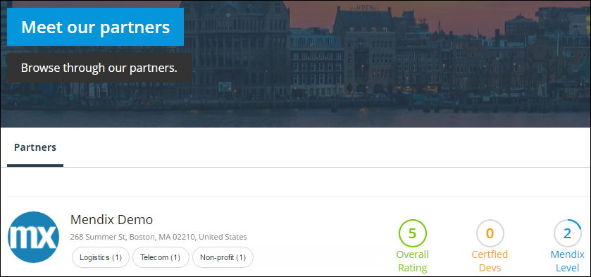

3. Click the name of your company to go to the public view of its Partner Profile.
4. Click **Edit Partner Profile** to edit the profile (for details about editing, see [4 Editing the Partner Profile](#EditingthePartnerProfile)):

    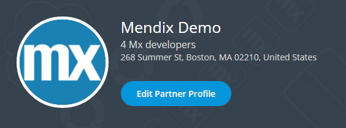
    
    If you are not authorized to edit the profile, but one or more of your colleagues are, a list with their email addresses is shown. Please contact them to gain access (for details about gaining access to colleagues, see [7 Make colleagues profile editor](#ProfileEditors)). If none of your colleagues is allowed, please submit a feedback item to gain access.

4. After you're done editing the profile, you can set the profile to public so that the Community and customers can view it. To do so, simply click **Make this profile public**:

    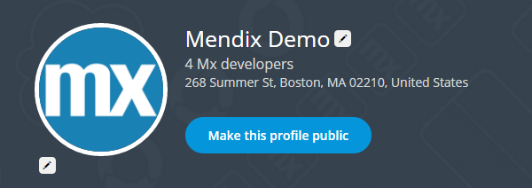

## 4 Editing the Partner Profile

On the Partner Profile details page, you can edit the elements by clicking . These are some of the most important elements you can edit:

* Below the company name at the top of the page, you can add the company's address (which will be displayed at the top of the profile) and/or email address (which will be used for the **Contact Us** button).
* On the **Profile** tab of the details page, you can add a company video (currently only YouTube videos are supported)

    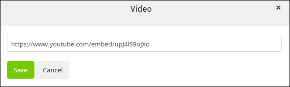

* In **Industries**, you can add your company's focus industries
    * This will be used in the filter option on the **Meet our partners** overview page so that Mendix customers can search for partners in a specific industry

    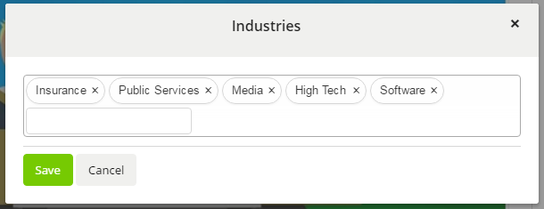

* In **Geographical Focus**, you can add the countries where your company is active and/or has coverage
    * This will be used in the filter option on the **Meet our partners** overview page so that Mendix customers can search for partners in a specific country

    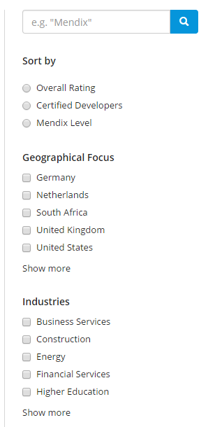

If you're missing an input option (for example, an industry), just send us a feedback message with the missing item using the Feedback button on the right side of the screen.

These elements are required before you can set your profile to public: Address, Email, Summary, Geographical Focus, Type of Services, and Support Capabilities.

## 5 Adding Developers to the Partner Profile

This section presents information on adding the biggest asset of your company: your employees. Before you can add a developer to the Partner Profile, their Community Profile needs to be set to public (for details, see [How to Set Up Your Community Profile](how-to-set-up-your-profile).

To add developers to the Partner Profile, follow these steps:

1. On the Partner Profile details page, go to the **Developers** tab. All the employees attached to your company are shown in this overview.

    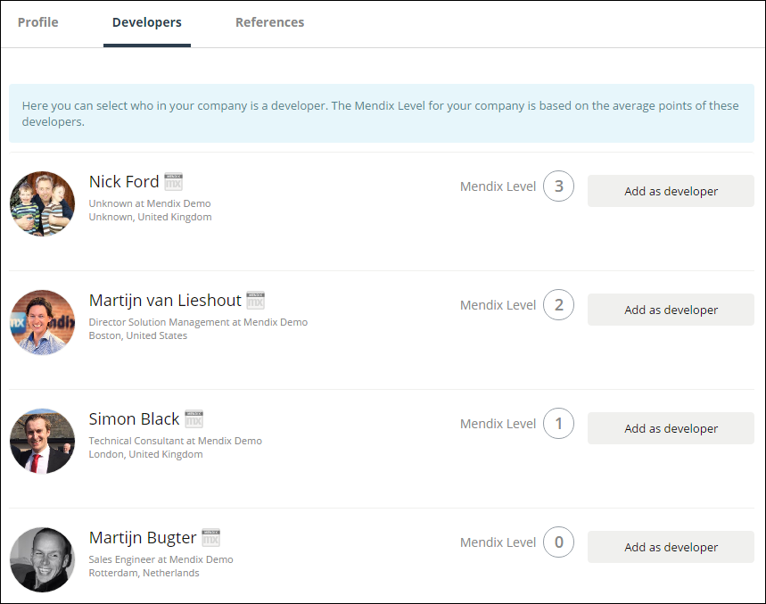

    Developers with public profiles are shown at the top of this overview. You can use the search and filter functionalities to search for a specific team member.

2. Select the active team members within your organization whose certifications you want to count for the total number of certifications by clicking **Add as developer**:

    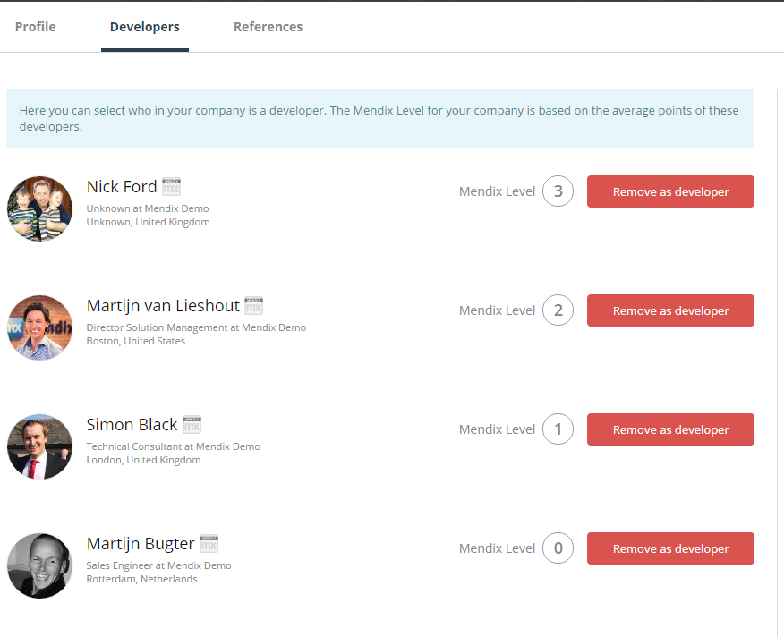

    Only the certifications and points of the added developers will be counted in the Partner Profile. The highest rank of certification will be added to the overview, and the points will be added to the average Mendix Level of all your developers.

Make sure you off-board the developers who no longer work at your company through the company administration in the Mendix platform. These former employees will still be visible in the overview. It is important that you deactivate these in the Developers Portal so that they don’t have access to projects.

## 6 Reference Cases

This section presents information on adding reference cases to the Partner Profile and boosting the overall rating.

To add a reference case to the Partner Profile, go to the **References** tab on the Partner Profile details page and click **Add Project**:

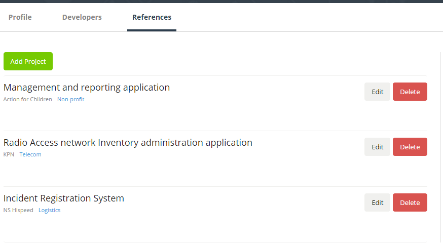

Please note that the customer is an open text field, so if the customer needs to stay anonymous, you can add "Bank in the US," for example.

The industry will be used on the **Meet our partners** overview page. The number that will be shown next to the label is the number of projects added to that Partner Profile for that industry:

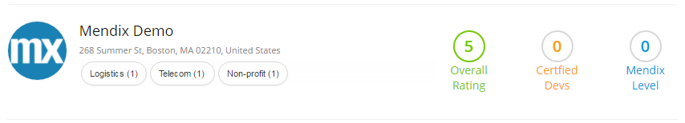

These fields are required before you can save a reference case: Project, Description, Customer, Industry, and Period.

Customer can add reviews of your reference case. The average rating of all the reviews of all the projects will be shown on the **Meet our partners** overview page and the Partner Profile detail page. The Mendix Partner Success managers will check and moderate the reviews.

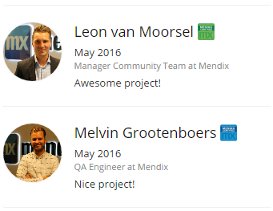

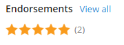

## 7 Make colleagues profile editor

To make colleagues profile editor, follow these steps:

1. On the Partner Profile details page, click **Profile editor(s)**. All the employees attached to your company are shown in this overview.
2. Select the employee you want to make profile editor.
3. Click **Make Profile Editor**.

## 8 Sorting of the Meet Our Partners Overview Page

The [Meet Our Partners overview page](https://developer.mendixcloud.com/openid/login?immediate=true&continuation=link/partneroverview) shows the Mendix Partner Community. The sorting is based on a combination of the following KPIs:

* Projects rating (PR) – the average rating of all the reviews on your reference cases

    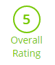

* Certified developers (CD) – the total amount of certified developers 
    * Please note that developers with multiple certifications count as one certified developer)

     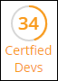

* Mendix Level (ML) – based on the average points of the developers added to the public Partner Profile
    * We use the average points instead of the Mendix Level because this will result in an more granulated sorting
    * For details on points and the Mendix Level, see [Become True Mendix Blue](https://developer.mendixcloud.com/link/faq)

    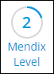

* The number of reference projects (RP) – the number of reference projects are also part of the sorting formula

For the sorting, Mendix normalizes the KPIs of all partners to a score between 0 and 1 by following this formula:

* *(Partner Value – Minimal Value) / (Maximum Value – Minimum Value) = New KPI Value*

For example, your company has 14 certified developers (CD). The biggest company has 40 certified developers (maximum value), and the smallest company has 1 certified developer (minimum value):

* CD of biggest company KPI value – *1*
* CD of smallest company KPI value – *0*
* CD of your company KPI value – *(14 - 1) / (40-1) = 0.33*

The following formula of the normalized KPI values of the company defines the sorting order between the partners:

* *PR + (2xCD) + (0.5xML) + RP*

## 9 Related Content

* [How to Set Up Your Community Profile](how-to-set-up-your-profile)
