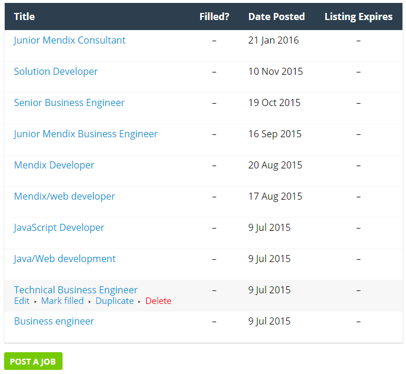

## Mendix Job Board Account

In additon to posting jobs on the [Mendix job board](https://developers.mendix.com/jobs/), you can now request an account to manage your job postings. This has several benefits:

* You can easily edit and update your job postings without contacting the Mendix Community
* You can mark jobs as **Filled**, which will grey out the job on the job board but not remove it
    * This way, the Community can see what the job offering was, even though the position has been filled
* You can delete old and obsolete jobs
    * Keep in mind that this is permanent and cannot be reversed!

## Getting a Job Dashboard account

If you are interested in a job dashboard account, please send your request to [community@mendix.com.](mailto:community@mendix.com.)

When you have an account you can log in at [https://developers.mendix.com/wp-login.php](https://developers.mendix.com/wp-login.php), and access your job dashboard at [https://developers.mendix.com/jobs/job-dashboard](https://developers.mendix.com/jobs/job-dashboard).

For further questions, please contact the Mendix Community Team at [community@mendix.com.](mailto:community@mendix.com.)
