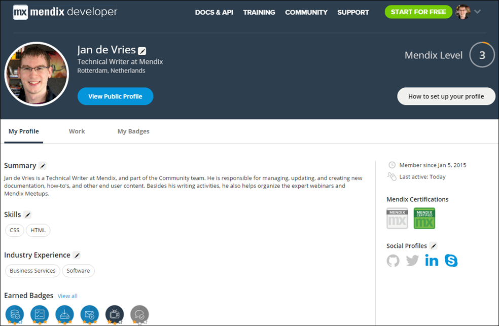
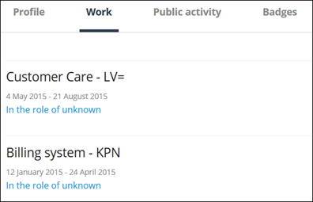
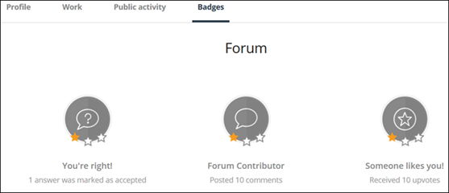
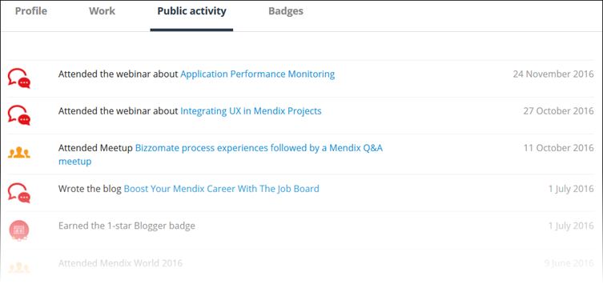
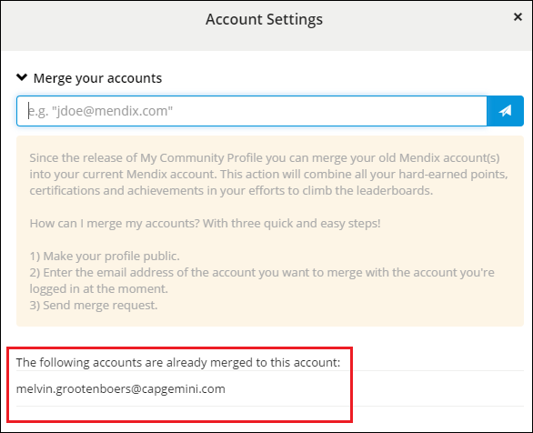

## 1 Introduction

So you’ve decided to check out your new Mendix Community Profile page, but you've found it suspiciously empty. Don’t worry, we're here to help you set up your profile so you can show the world what a real Mendix developer looks like!

**This how-to will teach you how to do the following:**

* Set up your Community Profile
* Merge your accounts
* Make your account public

## 2 Prerequisites

Before starting this how-to, make sure you have completed the following prerequisites:

* Have an account with Mendix (register [here](https://www.mendix.com/try-now/))

## 3 My Community Profile

The first thing you want to check out is your [Community Profile](https://developer.mendixcloud.com/link/profile) page. To get there, mouse over your picture in the navigation bar and click **My Community Profile**. This overview page shows the main page of your profile, including your summary, skills, industry experience, and badges.

When you access your profile page through the My Community Profile link, it is automatically in edit mode so that you can easily update your profile. To add a summary, new skills, industry experience, and links to your social media profiles, click this icon:

If you access your profile through the **Developers** or **Leaderboards** tabs of the [Our Community](https://developer.mendixcloud.com/link/community) page, your public profile will be displayed. Click **Edit Profile** to go into edit mode:

## 4 Work

You can add your Mendix project experience on this page by clicking **Add Project** and filling out the form (with the project name, a description, your role, other developers involved, skills involved, the customer, the industry, the period, and your visibility settings).

You can add a screenshot here that will be shown on the **Work** tab and that will be visible to other developers when they visit your Community Profile:

## 5 My Badges

You can view your earned badges on this tab, but you cannot actually change anything here:

For details on how to earn badges, see [Become True Mendix Blue](https://developer.mendixcloud.com/link/faq).

## 6 Making Your Profile Public

When you’re done setting up your Community Profile, click the big blue **Make my profile public** button:

Make sure you meet all the requirements before making your profile public:

* You added an avatar
* You entered a **Function**
* You entered a **Location**
* You entered a **Summary**
* You added at least 1 skill
* You added at least 1 industry experience item
* Confirm if you are looking for a job or project

## 7 Public Activity

After you make your profile public, a new tab will be available on your public profile called **Public Activity**:

This tab lists the following activities for which you can gain points:

* Presentation given
* Webinar attended
* Mendix World 2016 attended
* Meetup organized
* Meetup attended
* Hackathon winner
* Hackathon finalist
* Hackathon attended
* Blog post added
* App review added
* MVP status reached
* Expert course completed
* Advanced course completed
* Introduction course completed

## 8 Merging Your Accounts

Since the release of the Community Profile, you can merge your old Mendix account(s) into your current Mendix account. This action combines all your hard-earned points, certifications, and achievements in your efforts to climb the leaderboards.

There are five quick and easy steps to merge your accounts:

1. Go to your [Community Profile](https://developer.mendixcloud.com/link/ownprofile/).
2. Click **Make my profile public** to make your Community Profile public (for more information, see [6 Making Your Profile Public](#MakingYourProfilePublic)).
3. Click **Account Settings** on the right side of the screen.
4. Under **Merge your accounts**, enter the email address of the account you want to merge with your current account.
5. Click the send button to send a merge request.

We’ll take things from there, and the email address of the merged account will be shown in the list when the accounts have been merged:

With this action we only combine the accounts. We don’t deactivate the old account(s). This should be done by that company’s administrator.

