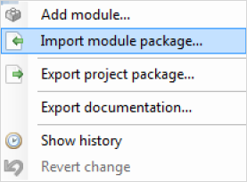
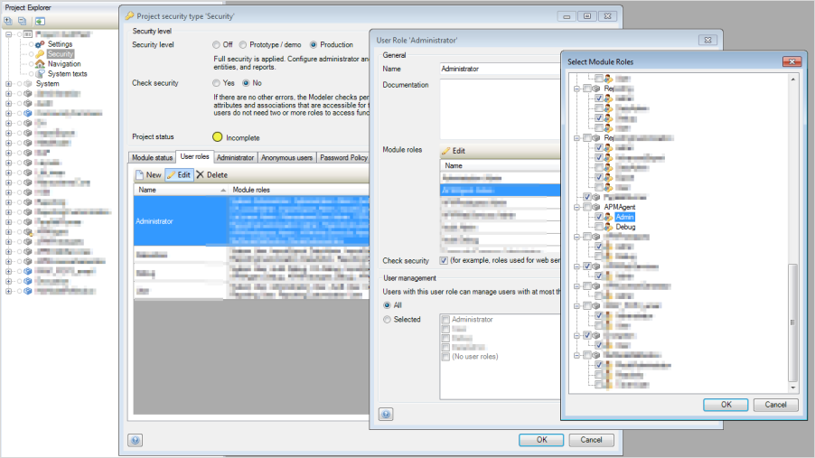
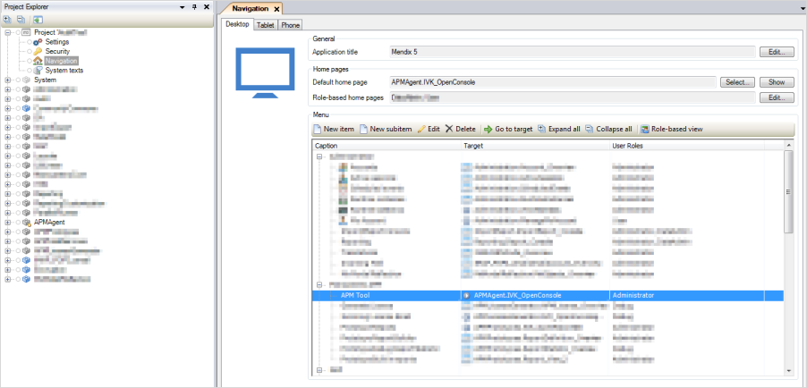
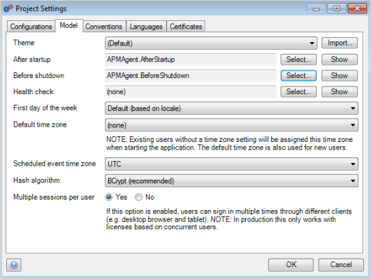
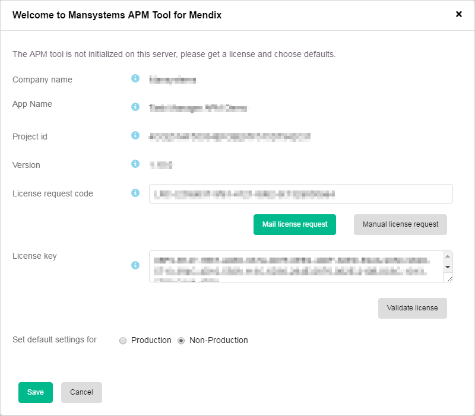

## 1 Introduction

This section describes the installation of the APM tool. For details on upgrading to a new version, see [Upgrade Steps](ig-one-upgrade-steps).

## 2 Backup

Did you commit your work to the team server? And did you make a database backup?

If you don't have an SVN client like Tortoise SVN installed, make a copy of the widgets folder in your project.

## 3 Import Module APMAgent

Import the module APMAgent in the Modeler.

Write down the widgets in the warning dialog that are overwritten to be able to revert these changes.

## 4 Copy the Language If a Language Other Than English US Is Used

If you are not using only **English, United States**, copy the **English, United States** language for the APMAgent module to all the languages using **Tools** > **Language Operations** in the Modeler:

## 5 Add Permissions

Add `APMAgent.Admin` permissions to the project **Security** > **User roles** tab for a selected administrator role.

**Note:** Do not use the Debug role. This is for developers of the APM tool to test certain features.

**Note:** You can choose to add the HeapDump role if you want to make heap dumps in Java. In the cloud you need additional permissions, which are to be requested at Mendix support.

**Note:** If you want to get rid of the warnings about security, introduce the Debug, HeapDump, Load test recorder, and OData user roles. Then give these roles the corresponding permissions from the APM module: APMAgent.Debug, APMAgent.HeapDump, APMAgent.OData, and APMAgent.LoadTestRecorder.

## 6 Add to Navigation

To use the APM tools, you need to call the APM tool UI. Use the **APMAgent/USE_ME/IVK_OpenConsole** microflow for this. Add a navigation menu item, for example.

## 7 Optional: Add to After Startup and Before Shutdown

{}

Using the AfterStartup and BeforeShutdown microflows is advised. If you do not use them and the tool is running, shutting down your Mendix application will take some time waiting for timeouts.

{}

Call `APMAgent\USE_ME\AfterStartup` from an after startup microflow. This feature is runtime-configurable and, by default, none of the tools are started.

Call `APMAgent\USE_ME\BeforeShutdown` from a before shutdown microflow.

You can find the AfterStartup and BeforeShutdown microflows in the project settings.

## 8 Configure APMAgent.CompanyName and APMAgent.AppName Constants

Set the name of your company and app in the constants. 

**Note:** Do not change the constants in the model. Use the Modeler settings or the runtime settings for constants. After an upgrade, a model constant gets overwritten.

## 9 Optionally Configure the APMAgent.NotifyMicroflowName Constant

This constant defines the microflow that is called on the trigger notify action. You can call a microflow that sends an e-mail. The microflow gets three string parameters:

* **To**
* **Subject**
* **Message**

See the sample microflow APMAgent.SampleNotifyMicroflow_LogMessage.

## 10 Start the Modeler or the Runtime

You can now start up.

If an error appears, see [After Startup Error](ig-one-after-startup-error).

Otherwise, log in as Admin and navigate to the APM tool.

## 11 Welcome Dialog

After startup for the first time, a small wizard is started:

*   If you have received a license request code for this app, you can enter this code in the license request code field.   
*   Use the **Mail license request** button to send a mail with the license request.
*   If a mail client does not open, is not configured, or fails otherwise, use the **Manual license request** button .This opens a dialog box so that you can copy-paste the text for the email to be sent to [apmtool@mansystems.nl](mailto:apmtool@mansystems.nl).
*   Upon receiving the license, copy-paste the license in the **License key** field.
*   Select **Production** or **Non-Production**.
*   Select **Save**.

Now the tools that are configured for after startup have been started, and the tool is ready to be used.
