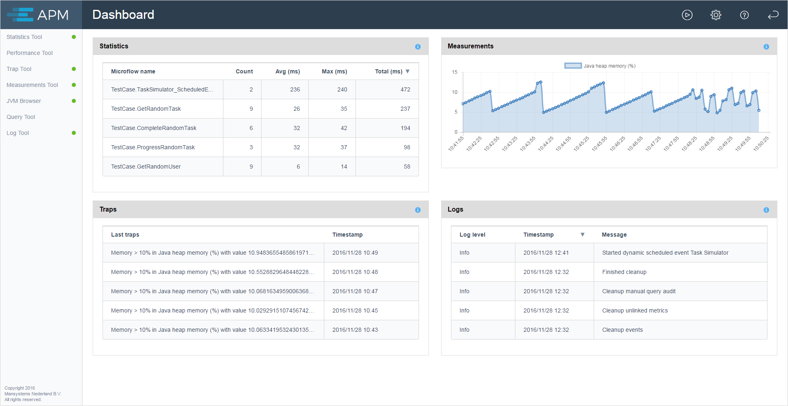

The Application Performance Monitor (APM) dashboard is the home screen of APM:

 

The dashboard shows recent information from the statistics tool, measurements tool, trap tool, and log tool.

The individual tools can be selected from the menu on the left side of the page.

These tools are described in separate chapters.
