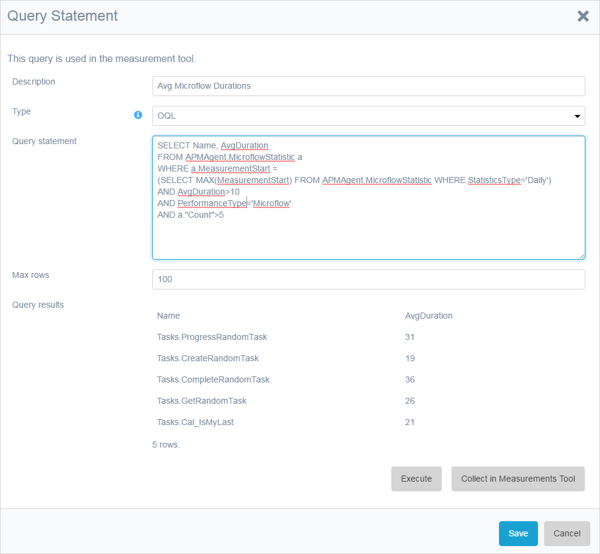

To collect database or application information the Query Tool has been introduced.

The Query Tool allows you to perform OQL, XPath and JDBC queries. Opening the Query Tool shows an overview of all configured queries and allows for adding, modifying and deleting queries.

If you open a query to edit you get a dialog where you can select give a description, select a type, enter a query and set the maximum number of rows to retrieve.

When you use the execute button you will see the results.

                       

If you open a query that is used in the measurements tool it is presented as read-only.

You can perform XPath queries like *//System.User[starts-with(Name,'a')];Name,LastLogin*. For XPath queries you can select a user to impersonate, so the query includes security.

You can perform a query of type ID. This determines the Mendix entity related to the given ID.
Additionally the ID query can specify columns specific to the entity related to the ID and show these as the query result.

Additionally its possible to perform JDBC(pure SQL) queries to get information from the database.

To use a query for measurements the query should either return 1 result or if a query results in multiple rows the first column is used as a unique identifier:

Under search ment option Search Query History you see all statements executed from the GUI. Collect measurement queries are not added to the history as they result into measurements.
