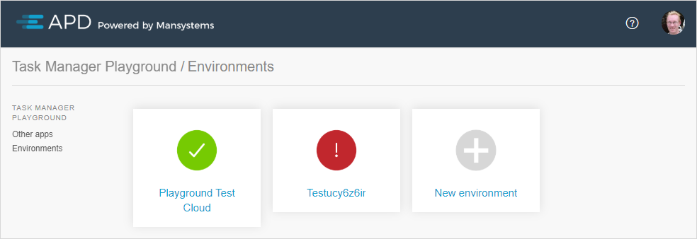
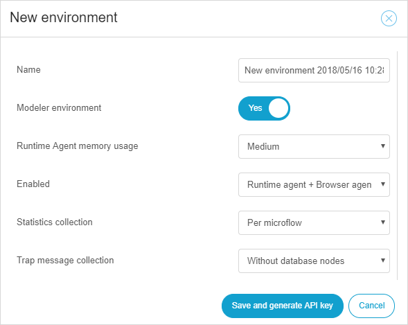

## 1 Environments Overview

After selecting an app from the [Apps Overview](rg-three-apps), an overview of available environments for that app is displayed. It is possible to select an existing environment or add a new environment.

When selecting an existing environment, the [Dashboard](rg-three-dashboard) of that environment will be shown.

When an environment is marked as red instead of green, that means the APD agent cannot reach the [APD Manager](https://apd.mendix.com/). This could be caused by one of the following reasons:

* The environment is down or not connected to the internet
* The APD agent is not (yet) installed
* The APD agent is not properly configured

## 2 Adding a New Environment

In order to add a new environment, click **New environment** in the **Environments** overview:

All the environments initially start as a Mendix Studio Pro environment. A Mendix Studio Pro environment is only visible for the user that creates it in APD.

For app project administrators (with the [Scrum Master](/developerportal/company-app-roles/manage-roles) role), an extra **Modeler environment** switch (for Mendix Studio Pro) is available to alter the type. After setting the switch to **No**, it is possible to change it to production, acceptance, or test.

Each environment must have a name. The name of an environment is only for display purposes in APD, and it does not have to match your host name or server name.
For descriptions of other settings, see [APD Settings](rg-three-settings).

Upon creating the environment, an API key for the APD agent configuration will be generated (it is possible to generate a new one at a later time in the environment settings). For more information about the API key and APD agent installation, see the [APD 3 Installation Guide](ig-three).
