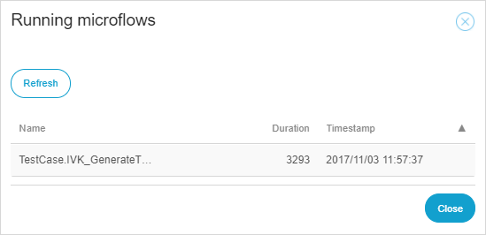

After clicking the **Long running microflow** indicator, a pop-up window with long-running microflows is displayed:

 

If the long-running action finishes before the pop-up window is shown, the pop-up window will show an empty grid.
