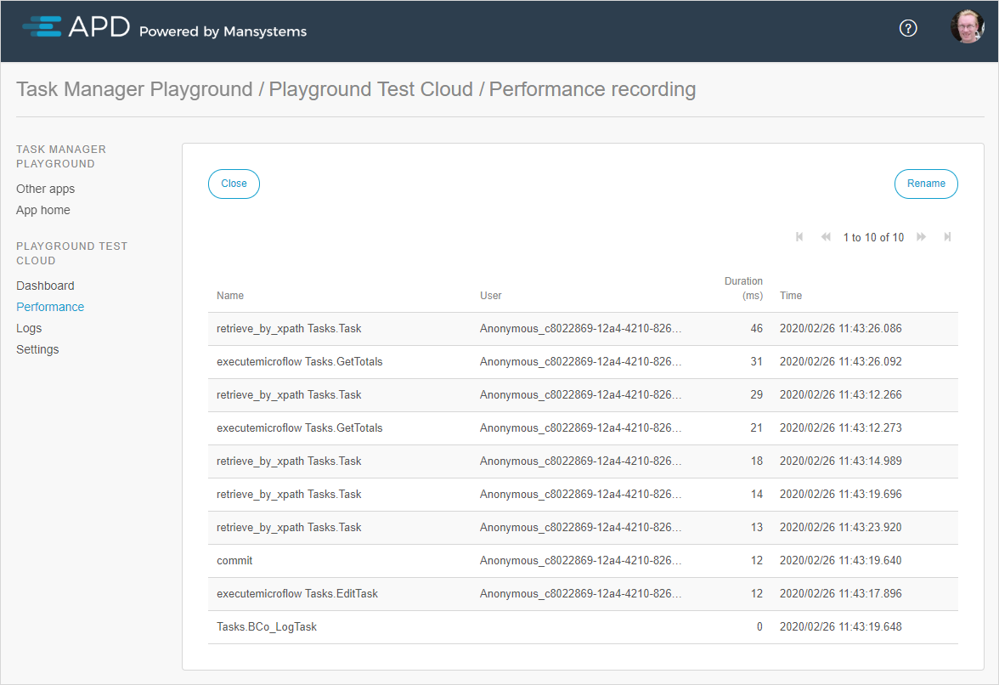
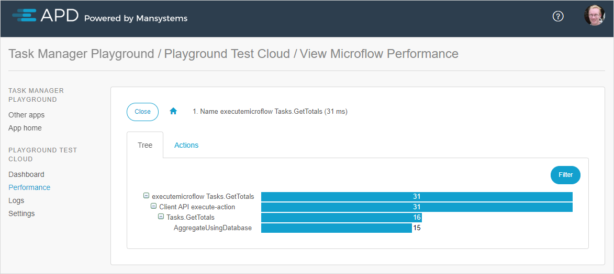
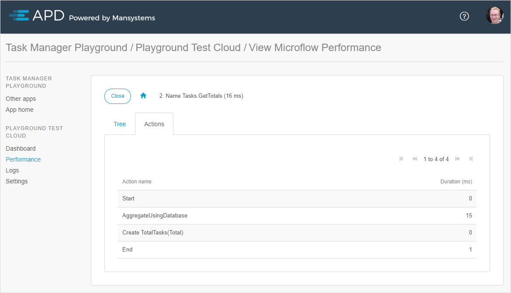
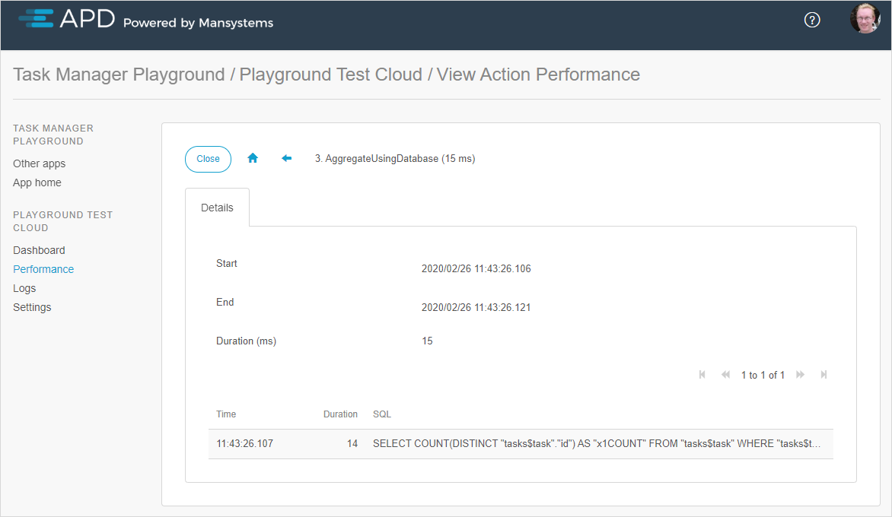

## 1 Introduction

When you open a runtime recording from the [recorded sessions overview](rg-three-recorder), the details of this runtime recording will be shown. The results are sorted by duration. All the recorded actions are clickable and show detailed information. By drilling down to an exact location, you can pinpoint where the time is spent in the application.

## 2 Tree View

The tree view provides an overview of the durations of microflows and actions:

## 3 Actions Tab

The **Actions** tab displays actions within the action:

When showing the details of an action, you can see SQL statements (if the action uses SQL):

