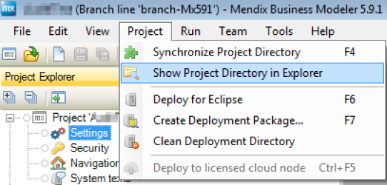
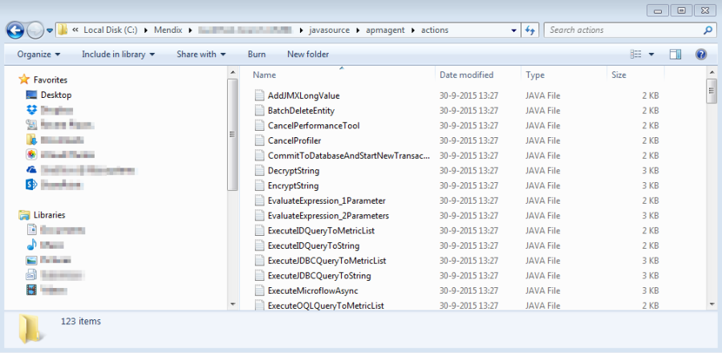
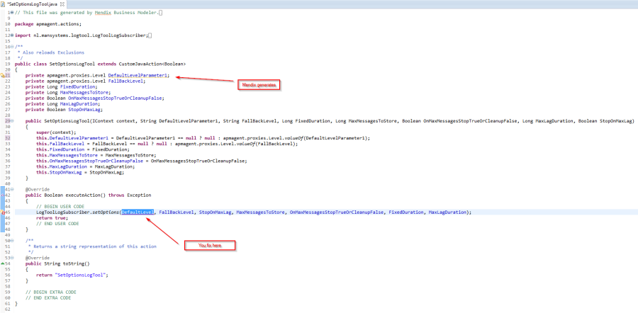

Sometimes after startup an error in java occurs when Mendix generates a different parameter name in a different Mendix version. If this happens, let me know via apmtool@mansystems.nl, so Mansystems can rename the java action parameter that causes this.
You can solve this the following way. First you open the project folder:

And search for the file in the javasource/ apmagent/actions folder

You have to change the old parameter name into the new parameter name in java in the code between the lines
// BEGIN USER CODE
and
// END USER CODE
.
Sample java file that Mendix generates with some fictive parameter mismatch:

