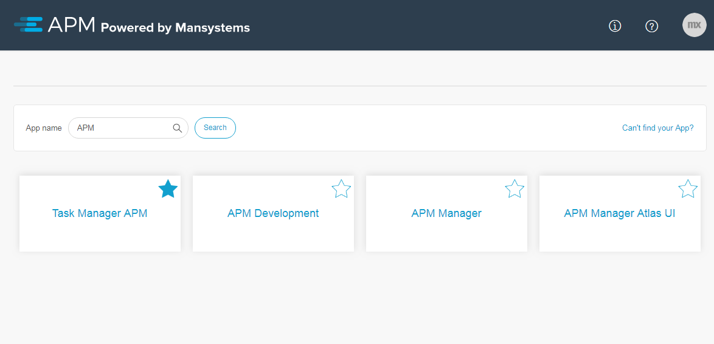
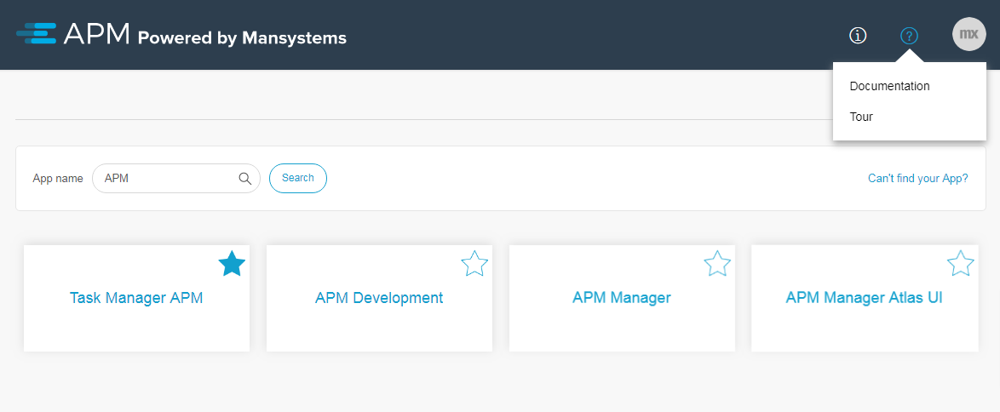
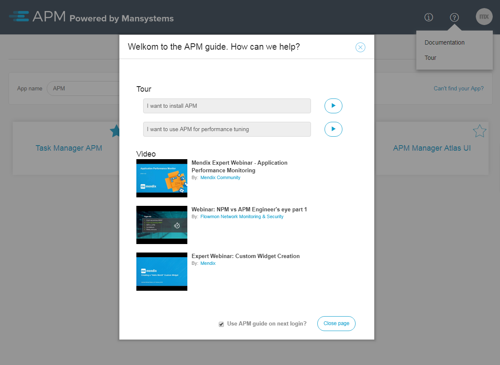
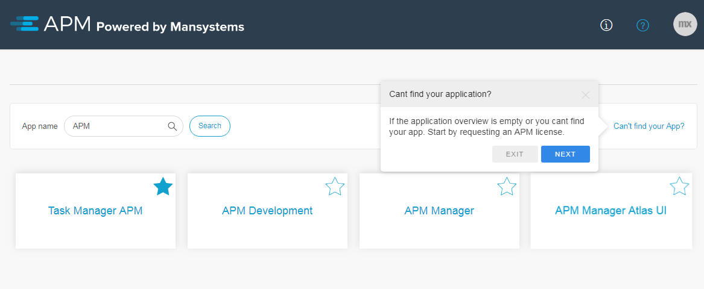

# Apps overview #

The homepage of APM displays the list of licensed applications from spintr in alphabetical order.

It is possible to search on an App name, or select one from the overview directly. 
Selecting an app in the overview displays the overview of [environments](environments) for that app.

In order to find a specific application faster, it is possible to mark these as a favorite by clicking on the star icon on the application tile. Favorite applications are shown first in the overview.

In case an application is not visible in this overview, click on the link *Can’t find your App?* in the upper right corner.

## Tour Guides and Videos ##

APM has several tour guides and videos to help navigate through APM to perform certain tasks. These can be accessed by clicking on the Documentation icon next to your profile image, and select the option "Tour".

Note: By default, APM dislays the tour guides and videos upon login for new users.

When started a tour, a tool tip will popup through out the APM application with instructions to perform.

