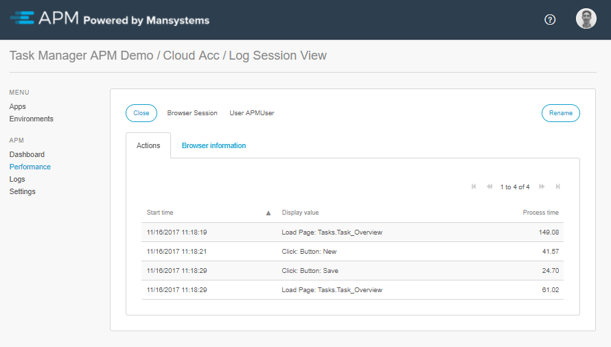
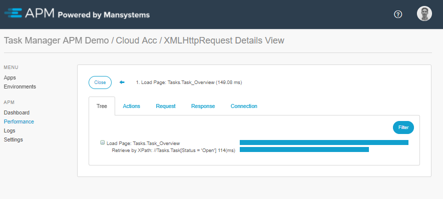
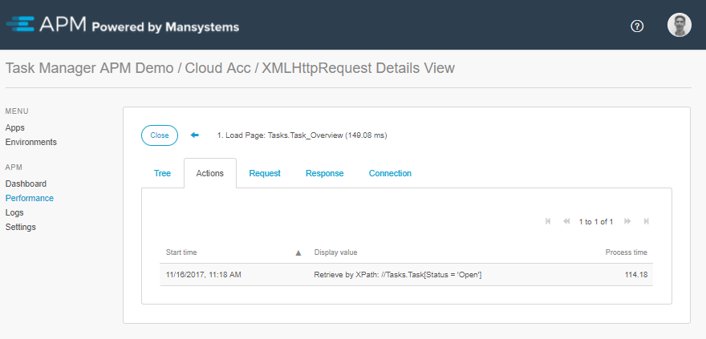
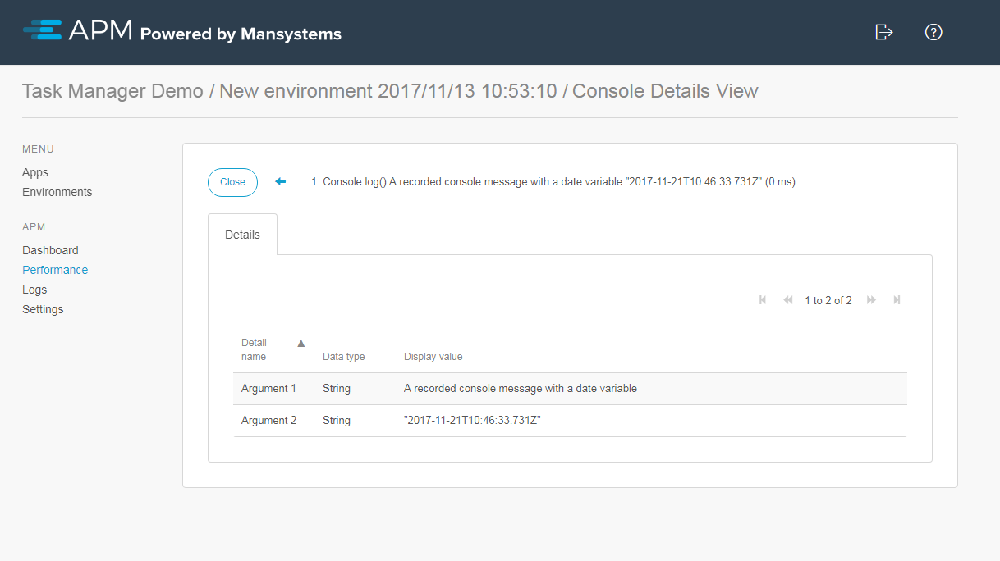
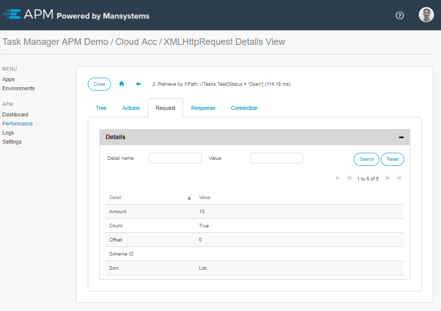
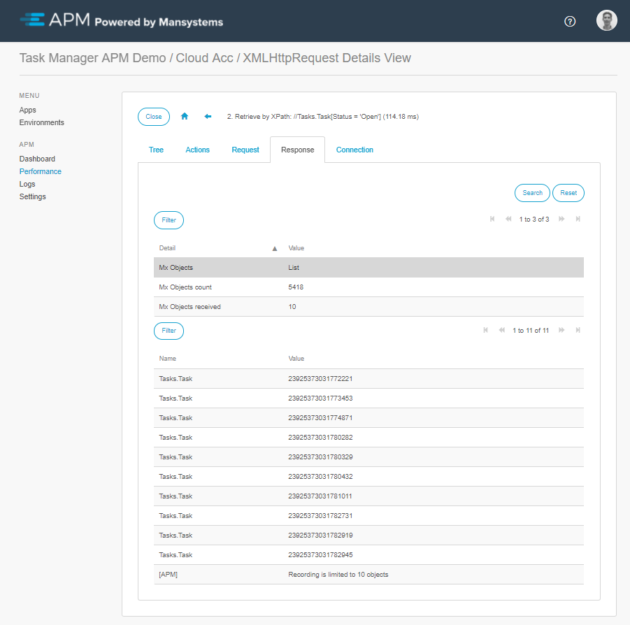
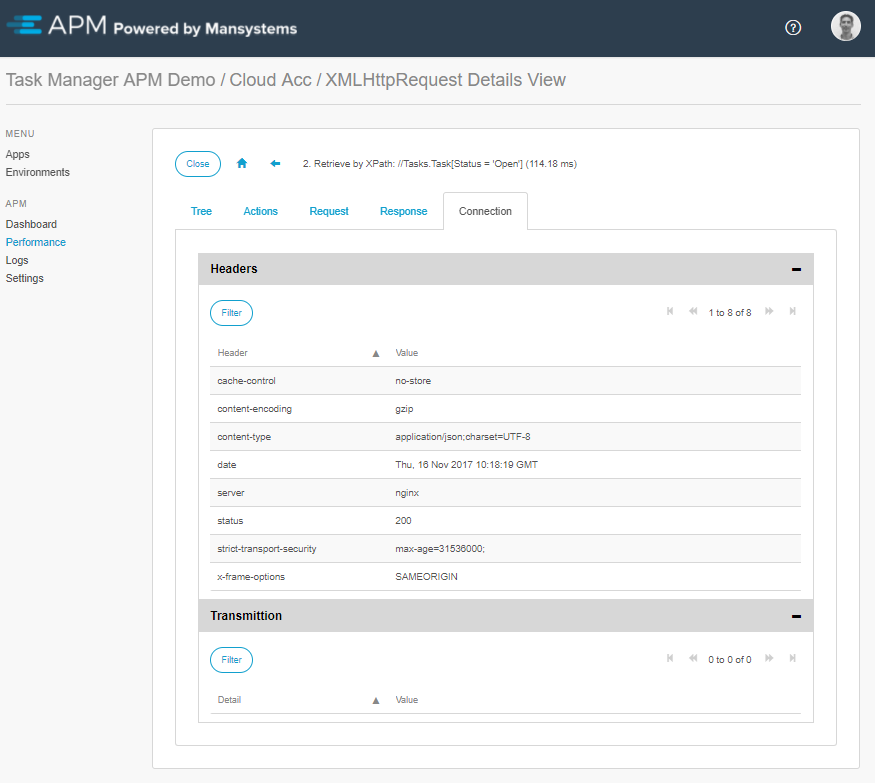
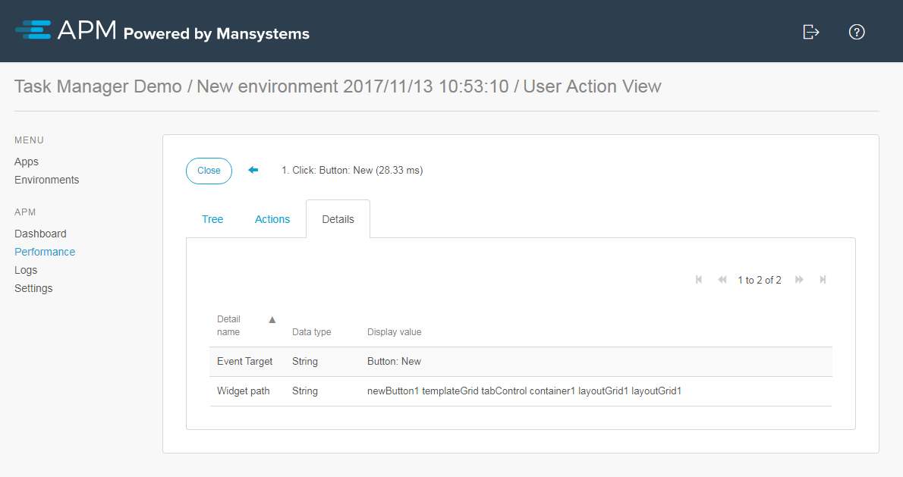

## Browser Recorder Results

A Browser Session contains the recording of one browser instance of one user.
The tab *Actions* displays a list of all the recorded actions, which  can be drilled down to display any detailed information of the action, and any possible subsequent actions. The tab *Browser Information* provides some information regarding the browser and version, and installed plugins.

## General

A Browser recording records a few types of actions:

- Browser Javascript Console messages
- Client – Server communication
- Page changes
- User actions

For all types, except Console messages, the detailed view displays a page holder with the tabs *Tree* and *Actions*.
The tree view will give a full oversight in duration of the action and subsequent actions. 
Similar to the Runtime recording results, it is possible to drill down in the tree by double clicking on a node.

The Actions tab will display only direct subsequent actions within this action. It is possible to drilldown and get more insight on those action.

For all types, except Client - Server communication, the detailed view has a tab *Details*, which will show a list of detailed information.

## Browser Javascript Console Messages

Recording the browsers Javascript Console messages can be enabled from the environment settings. The exception to this are errors thrown by Javascript. These are recorded as Console error messages at all times.

Console messages in Javascript may contain variables, which are stringified if possible. 

## Client-Server Communication

In case of a Client – Server communication action, all detail information is divided over three tabs instead of one, due to the amount of details. These tabs are labeled *Request*, *Response*, and *Connection*. 
On the tab *Request* it displays the request details. This is the request from the client (browser) to the (Mendix) server. The details vary depending on the request, for example  in case of retrieving data by XPath, the details will list the XPath, whether or not sorting is applied and using which attribute(s), possible offset and limit, and more.

The *Response* tab displays the response details. This is the response from the server to the client (browser) request. As the request details varies depending on the type of request made (XPath retrieval, or calling a microflow), the response details vary depending on the request made.
The response can include the number of objects retrieved, the count of an XPath, the size of the response to the browser, or instructions for the client as showing an INFO-message or opening a page. 

The *Connection* tab displays the header information, and the timings of the request. Timing of a request includes time needed to sent the response to the server, wait time due to server processing, and time needed to download the response from the server. 
(Request Timing information is not yet available for Mendix 7.6 or higher.)

## Page Changes

Page changes, like Console messages, are not recorded by default. Recording can be enabled from the environment settings. It records which element within the browser has changed, was added, or deleted.

## User Actions

A recorded User action has two details:

- *Event Target*: Location at which the user action took place. 
- *Widget path*: Path of the Mendix widget names from *Event Target* to the layout (inner to outer). This can be used to locate the exact widget in the Mendix Modeler.

