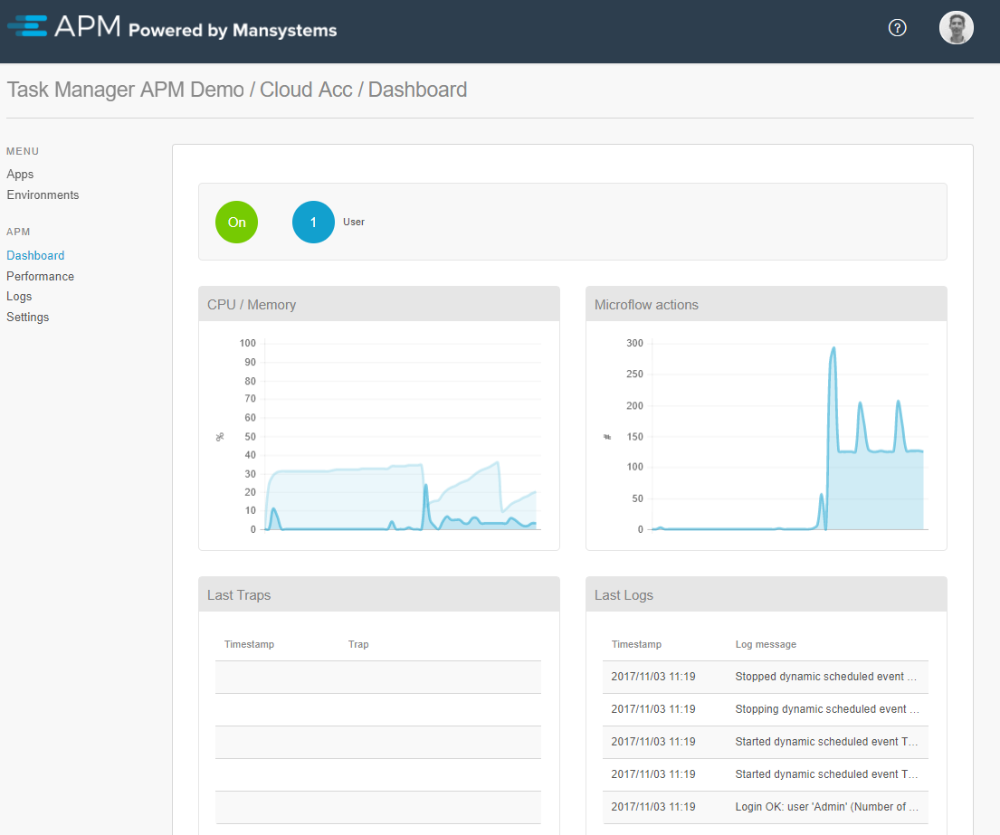

# Dashboard #

The dashboard of an environment shows real time information regarding:

* The number of users and runtimes
* If and when applicable, an clickable indicator for long running actions. For more information, see [Long running actions](long-running-actions)
* CPU/Memory percentage
* Number of actions per second
* Recent logs and traps

 

