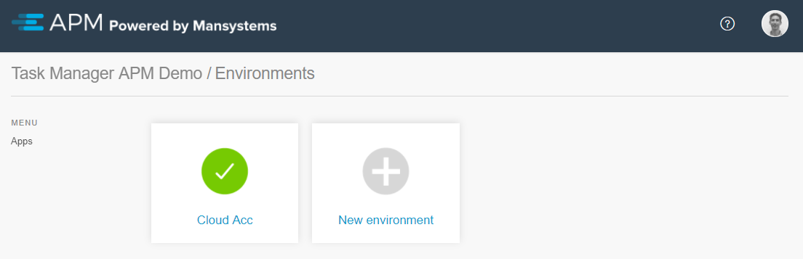
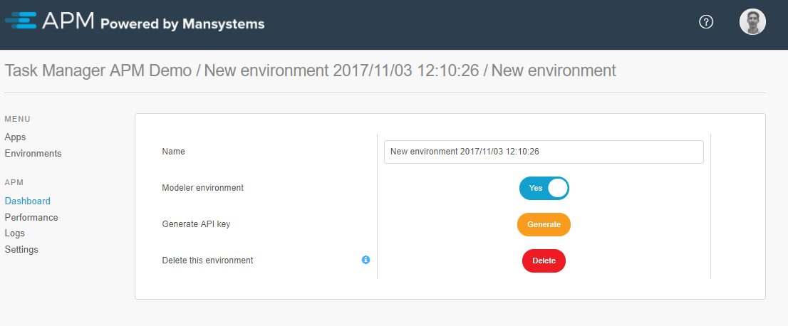

## 1 Environments Overview

After selecting an app from the [apps overview](apps), an overview of available environments for that app is displayed. It is possible to select an existing environment or add a new environment.

When selecting an existing environment, the [dashboard](dashboard) of that environment will be shown.

When an environment is marked as red instead of green, that means the APM agent cannot reach the APM Manager. This could be caused by one of the following reasons:

* The environment is down or not connected to the internet
* The APM agent is not (yet) installed
* The APM agent is not properly configured

## 2 Adding a New Environment

In order to add a new environment, click **New environment** in the **Environments** overview.

All the environments initially start as a Modeler environment. A Modeler environment is only visible for the user that creates it in APM.

For project administrators (with SCRUM Master role), an extra **Modeler environment** switch is available to alter the type. After setting the switch to false, it is possible to change it to production, acceptance, or test.

Each environment must have a name. The name of an environment is only for display purposes in APM, and it does not have to match your hostname/servername.

Upon creating the environment, it is possible to generate an API key for the APM Agent configuration (it is also possible to generate one at a later time in the environment settings). For more information about the API key and APM Agent installation, see the [APM 2 User Manual](installation).
