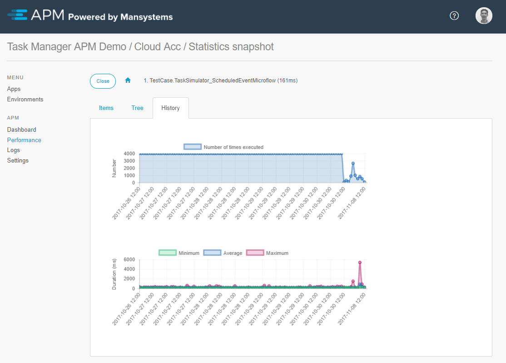

# Introduction

The Application Performance Monitor (APM) is a solution, which helps to analyse performance issues and in analysing runtime behaviour.

This introduction provides a short explanation about APM, its features, and possible uses.

## Definition of APM
Mansystems APM uses the Wikipedia's definition of [Application Performance Management](http://en.wikipedia.org/wiki/Application_performance_management).

- APM is the monitoring and management of performance and availability of software applications.
- APM strives to detect and diagnose application performance problems to maintain an expected level of service.
- APM is the translation of IT metrics into business meaning (value).
 
Of course you need the basic infrastructure probes to measure hardware parts like the CPU, memory and
disk, as well as components like the database and the web server. However, for higher quality support you should also look at the application and how it is performing, especially linking this to the user’s business perspective.
 
We all know software contains bugs, and of course we all test before we bring something into production. For users, an error is a sign that the application is not functioning. If the error appears unexpected, the user loses trust in the system. The standard reaction of support was always to ask questions, including whether the customer can reproduce the issue, to turn on logging and to ask for a database dump, so support can investigate the issue in a safe environment.

The APM tools provide valuable information for analysing the behaviour and performance of an application in production. This allows for direct analysis, without asking to customer to wait, reproduce or deliver technical information.
The same information is available during development as well too prevent issues before they appear in production.

## Performance statistics to see performance issues in advance

Performance in applications is difficult to test during the initial/developing stage. The data set is too small and the exact usage by users, for example their search behaviour, is unknown. Even when applying all performance best practices while building a Mendix application, then issues still appear in production. Usually they appear over time as the data set grows, so the question is how can you see them coming.

Mendix APM collects statistical data about microflows, client API requests and user click paths. These statistics are stored hourly and can be used to see trends before users sound the alarm. It is strongly advised for support to frequently check the longest and most frequently running microflows to see if they can be improved. These statistics can be drilled down to investigate a performance issue. It shows individual actions and loop iterations, and shows exactly where the obstacles are.

In development it is adviced to add checking in APM to the generic definition of done.

## The Performance recorder to collect individual traces
When support or DevOps wants to investigate a performance issue, they can use the APM Performance recorder. It shows individual actions and loop iterations, and shows exactly where the obstacles are.

## Your Flight Data Recorder
The runtime agent's Trap feature is always listening on all levels of logging, up to the TRACE-level. It is possible to configure an amount of seconds of logging it has to keep in memory. In case an error occurs, the logging in memory and the error is stored in the APM manager database, to provide information regarding what the runtime was proccessing at the time of the error. 

## Logs
The logs is used to collect Mendix Runtime log messages and store them in the APM manager database.
This gives remote access to log information, makes it available to consultants, and allows for easy searching and analysing.
